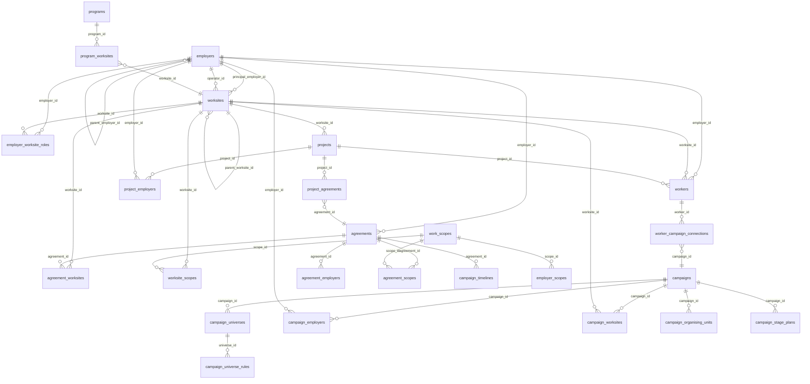

# STREAM3_1: Entity Relationships Analysis

## Executive Summary

This document maps the current entity relationships in the Offshore Alliance database, focusing on the confusion points between Projects, Programs, Campaign Universes, and hierarchical structures. The analysis reveals significant overlap, unused tables, and conceptual confusion that impacts data management and UI clarity.

---

## 1. Entity Relationship Diagram

### 1.1 Core Entity Relationships



### 1.2 Relationship Flow Summary

**Hierarchical Relationships:**
- `employers.parent_employer_id` → `employers.employer_id` (employer hierarchy)
- `worksites.parent_worksite_id` → `worksites.worksite_id` (worksite hierarchy - **currently all NULL**)

**Program-Level Relationships:**
- `programs.principal_employer_id` → `employers.employer_id`
- `program_worksites.program_id` → `programs.program_id`
- `program_worksites.worksite_id` → `worksites.worksite_id`

**Project-Level Relationships:**
- `projects.worksite_id` → `worksites.worksite_id` (**反向关系**: project belongs to worksite)
- `project_employers.project_id` → `projects.project_id`
- `project_employers.employer_id` → `employers.employer_id`
- `project_agreements.project_id` → `projects.project_id`

**Campaign-Level Relationships:**
- `campaign_universes.campaign_id` → `campaigns.campaign_id`
- `campaign_universe_rules.universe_id` → `campaign_universes.universe_id`
- `campaign_employers.campaign_id` → `campaigns.campaign_id`
- `campaign_worksites.campaign_id` → `campaigns.campaign_id`
- `campaign_organising_units.campaign_id` → `campaigns.campaign_id`

---

## 2. Table Descriptions and Purposes

### 2.1 Projects Table

**Schema Location:** `0010_organising_universe.sql`

**Purpose:** Site-level work phases with lifecycle tracking

**Columns:**
- `project_id` (SERIAL PRIMARY KEY)
- `project_name` (VARCHAR 200)
- `worksite_id` (INT, NOT NULL, REFERENCES worksites)
- `work_type` (VARCHAR 30) - production, construction, decommissioning, brownfields, service_provision, maintenance
- `project_status` (VARCHAR 30) - planning, active, commissioning, operational, decommissioning, completed, absorbed
- `start_date`, `expected_end_date`, `actual_end_date`
- `absorbed_into_project_id` (INT, REFERENCES projects)
- `is_active` (BOOLEAN)

**Current Data:**
- Total projects: 16
- Active projects: 16
- Projects with employers: 0 (via `project_employers`)
- Projects with agreements: 0 (via `project_agreements`)

**Confusion Point:** Named "projects" but structured as **children of worksites**, not multi-worksite containers.

---

### 2.2 Programs Table

**Schema Location:** `20260331190000_programs.sql`

**Purpose:** Multi-worksite grouping entity ("top-level projects")

**Columns:**
- `program_id` (SERIAL PRIMARY KEY)
- `program_name` (VARCHAR 200)
- `description` (TEXT)
- `principal_employer_id` (INT, REFERENCES employers)
- `program_status` (VARCHAR 30) - planning, active, completed, on_hold, cancelled
- `start_date`, `expected_end_date`, `actual_end_date`
- `is_active` (BOOLEAN)

**Current Data:**
- Total programs: 3
- Programs with principal employer: 3
- Program-worksite links: 7

**Confusion Point:** Conceptually similar to "projects" but at different level - unclear when to use which.

---

### 2.3 Campaign Universes Table

**Schema Location:** `0001_initial_schema.sql`

**Purpose:** Define subsets of workers for campaign targeting

**Columns:**
- `universe_id` (SERIAL PRIMARY KEY)
- `campaign_id` (INT, NOT NULL, REFERENCES campaigns)
- `name` (VARCHAR 200)
- `description` (TEXT)

**Related Table:** `campaign_universe_rules`
- `universe_id` (INT, REFERENCES campaign_universes)
- `rule_type` (VARCHAR 20) - agreement, worksite, employer, member_role, sector, project, work_type, onshore_offshore
- `rule_entity_id` (INT, NOT NULL)
- `include` (BOOLEAN, DEFAULT true)

**Current Data:** Unknown (not in live snapshot)

**Confusion Point:** Overlaps with `campaign_employers` and `campaign_worksites` - redundant ways to define campaign scope.

---

### 2.4 Worksite Hierarchy

**Schema Location:** `0010_organising_universe.sql`

**Column:** `worksites.parent_worksite_id` (INT, REFERENCES worksites)

**Current Data:** All NULL (0 relationships populated)

**Confusion Point:** Schema supports hierarchy but no data uses it. Migration `20260331200000_hub_to_programs.sql` explicitly cleared parent_worksite_id values when converting to programs.

---

## 3. Current Relationship Mappings

### 3.1 Employer → Worksite Relationships

**Three Parallel Mechanisms:**

1. **`worksites.principal_employer_id`**
   - Asset owner/operator
   - Set on 31/39 worksites
   - NOT reflected in `employer_worksite_roles`

2. **`worksites.operator_id`**
   - Day-to-day operator
   - Overlaps conceptually with principal_employer

3. **`employer_worksite_roles`**
   - Contractual roles: Owner, Operator, Principal_Contractor, Subcontractor, Labour_Hire, Other
   - 64 rows populated
   - Does NOT include principal employers

**Data Gap:** Principal employers missing from `employer_worksite_roles` creates UI blind spot.

---

### 3.2 Agreement Scope Relationships

**Two "Scope" Concepts:**

1. **`agreements.agreement_scope`**
   - Coverage classification: site_specific, project_specific, sector_wide, company_wide
   - Currently NULL for all 135 agreements
   - Intended purpose: Classify agreement's geographic/organizational reach

2. **`agreement_scopes` table**
   - Links agreements to work_scopes taxonomy
   - Functional scope: what work types the agreement covers
   - Currently unused

**Naming Collision:** Same word ("scope") for different concepts.

---

### 3.3 Campaign Scope Relationships

**Three Parallel Mechanisms:**

1. **`campaign_universes` + `campaign_universe_rules`**
   - Rule-based targeting
   - Supports: agreement, worksite, employer, member_role, sector, project, work_type, onshore_offshore
   - Flexible but complex

2. **`campaign_employers` table**
   - Direct employer links
   - Simple many-to-many

3. **`campaign_worksites` table**
   - Direct worksite links
   - Supports `sector_wide` flag
   - Simple many-to-many

**Overlap:** All three mechanisms can express "campaign targets employer X at worksite Y" - unclear which to use when.

---

### 3.4 Campaign → Organising Unit Relationships

**Table:** `campaign_organising_units`

**Columns:**
- `ou_type` - shift, department, network, job_type, worksite
- `name` (VARCHAR 200)
- `anchor_worker_id` (REFERENCES workers)
- `source_metadata` (JSONB)

**Related:** `campaign_worker_ou` (junction table)

**Current Data:** Unknown (not in live snapshot)

**Unclear Purpose:** How do OUs relate to campaign_universes? Are OUs subsets of universes? Independent groupings?

---

## 4. Data Flow Documentation

### 4.1 Worker Assignment Flow

**Current Schema Path:**
```
workers.employer_id → employers
workers.worksite_id → worksites
workers.project_id → projects (optional, currently all NULL)
```

**Campaign Engagement Path:**
```
workers → campaign_worker_membership → campaigns
workers → campaign_worker_ou → campaign_organising_units → campaigns
workers → worker_campaign_connections → campaigns (NEW, added 2026-04-02)
```

**Confusion:** Three parallel ways to connect workers to campaigns:
1. Direct membership table
2. Via organising units
3. Via connection table (new)

---

### 4.2 Agreement Coverage Flow

**Current Schema Path:**
```
agreements → agreement_worksites → worksites
agreements → agreement_employers → employers
agreements → agreement_scopes → work_scopes
```

**UI Derivation:**
```
organising_universe_view combines:
- worksites
- employer_worksite_roles (employers at site)
- projects (at site)
- agreements (at site, covering employers)
- workers (at site, with employer, with project)
```

**Gap:** No canonical representation of "Employer X performs Scope Y at Worksite Z under Agreement A during Project P"

---

### 4.3 Campaign Planning Flow

**Strategic Planning Path:**
```
campaigns → campaign_stage_plans (6 stages)
→ plan_ambitions
→ plan_where_to_play
→ plan_theory_of_winning
→ plan_capacities
→ plan_management_systems
→ gate_definitions → gate_criteria
```

**Operational Execution Path:**
```
campaigns → campaign_activities → campaign_activity_ratings
campaigns → campaign_task_lists → campaign_task_list_items
campaigns → campaign_organising_units → campaign_worker_ou
```

**Gap:** Planning tables (ambitions, WTP, capacities) not connected to operational execution (activities, task lists).

---

## 5. Gap Analysis

### 5.1 Empty/Unused Tables

| Table | Purpose | Status | Impact |
|-------|---------|--------|--------|
| `project_employers` | Link projects to employers | **EMPTY** (0 rows) | Projects have no employer context |
| `project_agreements` | Link projects to agreements | **EMPTY** (0 rows) | Projects have no agreement context |
| `workers.project_id` | Link workers to projects | **ALL NULL** | No project-level worker tracking |
| `worksites.parent_worksite_id` | Worksite hierarchy | **ALL NULL** | Hierarchy not implemented |
| `agreement_employers` | Additional agreement employers | **EMPTY** (0 rows) | Only primary employer used |
| `agreements.agreement_scope` | Agreement coverage classification | **ALL NULL** | Cannot classify agreement reach |
| `worksite_scopes` | Work scope assignments at site | **2 rows** | Work scope system unused |

---

### 5.2 Unused Relationships

**Projects → Employers:** Schema exists (`project_employers`) but unused
- Projects exist (16 rows) but have no employer associations
- UI expects project-level employer context for display

**Projects → Agreements:** Schema exists (`project_agreements`) but unused
- Projects have no agreement links
- Cannot determine which agreements govern project work

**Workers → Projects:** Schema exists (`workers.project_id`) but unused
- All workers have NULL project_id
- Cannot report workers by project

**Agreements → Scope Classification:** Schema exists (`agreements.agreement_scope`) but unused
- All 135 agreements have NULL agreement_scope
- Cannot filter agreements by coverage type

---

### 5.3 Redundant Relationships

**Three ways to link campaigns to employers:**
1. `campaign_universe_rules` (rule_type = 'employer')
2. `campaign_employers` (direct table)
3. Derived via `campaign_worksites` → `worksites` → `employer_worksite_roles`

**Three ways to link campaigns to worksites:**
1. `campaign_universe_rules` (rule_type = 'worksite')
2. `campaign_worksites` (direct table)
3. Derived via `campaign_employers` → `employer_worksite_roles`

**Three ways to link workers to campaigns:**
1. `campaign_worker_membership` (direct table)
2. `campaign_worker_ou` → `campaign_organising_units` (via OU)
3. `worker_campaign_connections` (new table, 2026-04-02)

---

### 5.4 Conceptual Confusions

**"Project" Directionality:**
- Schema: `projects.worksite_id` (project belongs to worksite)
- Mental model: Multi-worksite projects (project contains worksites)
- Resolution: `programs` table added for multi-worksite grouping
- **Confusion remains:** When to use `projects` vs `programs`?

**"Scope" Overloading:**
- `agreements.agreement_scope` (coverage classification)
- `agreement_scopes` (work scope taxonomy links)
- `worksite_scopes.engagement_type` (contracting mode)
- `campaign_scope` (campaign reach: single/multi employer/site)

**"Engagement" Overloading:**
- `workers.engagement_score` / `workers.engagement_level` (organising engagement)
- `worksite_scopes.engagement_type` (contracting mode: direct_employment, contractor, etc.)

**"Principal Employer" Complexity:**
- `worksites.principal_employer_id` (asset owner)
- `employers.parent_employer_id` (corporate hierarchy)
- `programs.principal_employer_id` (program owner)
- `employer_category = 'Principal_Employer'` (category tag)
- Not represented in `employer_worksite_roles` (UI blind spot)

---

## 6. Key Findings

### 6.1 Structural Issues

1. **Inverted Project Model:** `projects` table structured as site-level phases, not multi-worksite containers
2. **Empty Junction Tables:** `project_employers` and `project_agreements` exist but unused
3. **Unused Hierarchy:** `parent_worksite_id` exists but all NULL
4. **Redundant Campaign Scope:** Three parallel mechanisms for campaign targeting

### 6.2 Data Quality Issues

1. **Missing Agreement Classifications:** All 135 agreements have NULL `agreement_scope`
2. **Orphaned Projects:** 16 projects with no employer or agreement links
3. **Unlinked Workers:** All workers have NULL `project_id`
4. **Principal Employer Blind Spot:** Principal employers not in `employer_worksite_roles`

### 6.3 Conceptual Clarity Issues

1. **Projects vs Programs:** Unclear when to use each
2. **Scope Terminology:** "Scope" means different things in different contexts
3. **Engagement Terminology:** "Engagement" means different things for workers vs contracts
4. **Campaign Universes vs Direct Links:** Unclear when to use rules vs direct tables

---

## 7. Recommendations Summary

**Immediate Actions:**
1. Populate `project_employers` and `project_agreements` for existing projects
2. Set `agreements.agreement_scope` for all agreements
3. Add principal employers to `employer_worksite_roles` or create separate UI display
4. Clarify documentation on when to use `projects` vs `programs`

**Strategic Decisions Needed:**
1. Campaign scope: Choose ONE mechanism (rules vs direct tables vs derived)
2. Worker-campaign links: Consolidate to ONE approach
3. Worksite hierarchy: Implement or remove `parent_worksite_id`
4. Scope terminology: Rename to disambiguate (coverage, work_scope, engagement_mode)

---

## Appendix A: Migration Timeline

- **0001_initial_schema.sql**: Core tables (employers, worksites, agreements, workers, campaigns, campaign_universes)
- **0006_principal_employers.sql**: Added `principal_employer_id` to worksites and `parent_employer_id` to employers
- **0010_organising_universe.sql**: Added `projects` table with `worksite_id` FK, `parent_worksite_id` to worksites
- **0012_work_scopes.sql**: Added work scope taxonomy system
- **0013_campaign_workflow.sql**: Added campaign employers, worksites, organising units
- **20260331190000_programs.sql**: Added `programs` table for multi-worksite grouping
- **20260331200000_hub_to_programs.sql**: Converted hub worksites to programs, cleared `parent_worksite_id`
- **20260402170000_worker_campaign_connections.sql**: Added new worker-campaign connection model
