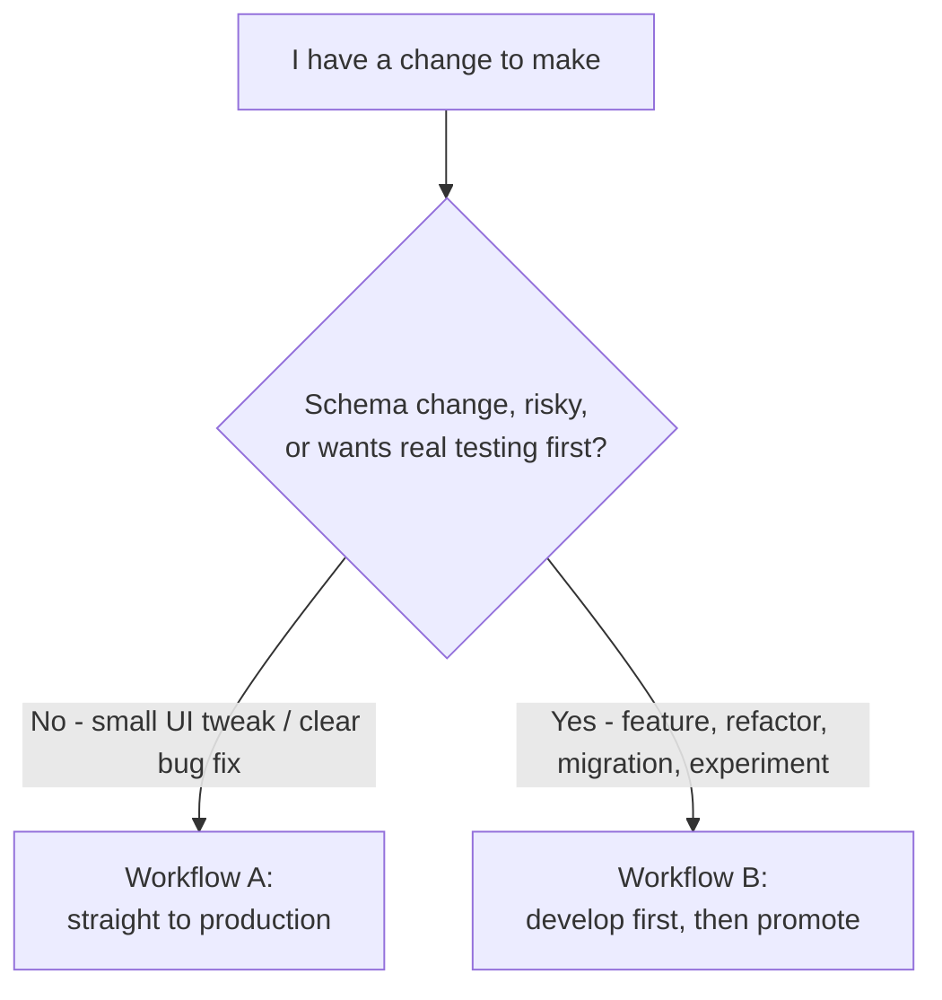
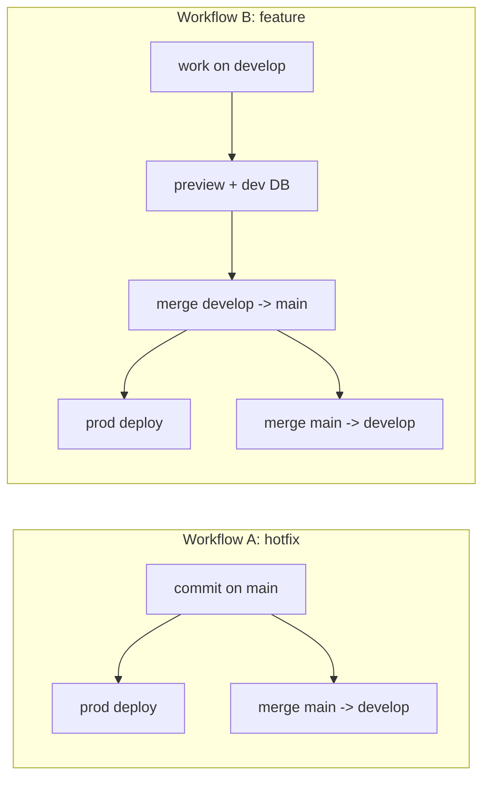

# Development Workflow

How to ship changes day-to-day across the two environments. For the underlying
setup (project refs, env vars, re-seeding), see
[DEV_PROD_ENVIRONMENT.md](./DEV_PROD_ENVIRONMENT.md).

---

## The two environments

```
git: main     -> Vercel Production -> Supabase PROD (gteygwfgjvczanmrwgbr) -> oa.uconstruct.app
git: develop  -> Vercel Preview    -> Supabase DEV  (dpnnmkhabysfdogllsyh)
```

- Pushing to **`main`** auto-deploys to **production** (live beta users).
- Pushing to **`develop`** auto-deploys to a **preview** URL backed by the **dev** database.
- The two databases are independent. Schema changes (`supabase/migrations/`) must be
  applied to each project manually with `supabase db push`.

---

## Golden rules

1. **`main` is always deployable.** It is what beta users are running.
2. **`develop` never gets ahead of `main` without a plan to merge back.** After every
   production change, bring it into `develop` so the two don't drift.
3. **Never edit a migration file that has already been applied.** Always add a new
   timestamped file. Editing an applied migration desyncs the two databases.
4. **Apply a migration to dev first, prod second** (except production hotfixes — see
   Workflow A). The database change should land before/with the code that needs it.
5. **Secrets stay out of git.** Env vars live in Vercel and Supabase, not in the repo.

---

## Which workflow do I use?



- **Workflow A** — minor UI/UX changes and clear, low-risk bug fixes.
- **Workflow B** — new features, schema changes, refactors, anything you want to test
  on a real deployment before beta users see it.

When in doubt, use Workflow B.

---

## Workflow A — minor fix straight to production

For small UI changes and obvious bug fixes that don't need a migration and don't need
preview testing.

```bash
# 1. Make sure you're on main and up to date
git checkout main
git pull origin main

# 2. Make the change, then commit and push -> auto-deploys to production
git add -A
git commit -m "fix: <what you fixed>"
git push origin main

# 3. Immediately keep develop in sync so the two branches don't drift
git checkout develop
git pull origin develop
git merge main
git push origin develop
```

Verify production at https://oa.uconstruct.app after the deploy goes green in Vercel.

**If a hotfix needs a database change** (rare for "minor" work): write the migration,
then apply it to **prod first** (because prod code is about to depend on it),
then to dev when you sync:

```bash
# new migration file already added under supabase/migrations/
supabase link --project-ref gteygwfgjvczanmrwgbr   # PROD
supabase db push
# ...commit + push code to main (step 2 above)...
# then, after merging main into develop, apply the same migration to dev:
supabase link --project-ref dpnnmkhabysfdogllsyh   # DEV
supabase db push
```

---

## Workflow B — develop first, then promote to production

For features, refactors, schema changes, and anything experimental. You build and test
on the develop preview (backed by the dev database), then promote to production as a
single episodic update.

### 1. Start the work

You can commit directly on `develop`, or use a short-lived feature branch off `develop`
for bigger pieces of work.

```bash
git checkout develop
git pull origin develop

# optional: a feature branch for larger work
git checkout -b feature/<short-name>
```

### 2. If the change needs the database, write + apply the migration to DEV

```bash
# add a new file under supabase/migrations/ (never edit an applied one)
supabase link --project-ref dpnnmkhabysfdogllsyh   # DEV
supabase db push

# regenerate types from dev so the code matches the new schema
SUPABASE_PROJECT_REF=dpnnmkhabysfdogllsyh pnpm gen:types
```

### 3. Push and test on the preview

```bash
git add -A
git commit -m "feat: <what you built>"

# if on a feature branch, fold it into develop first
git checkout develop
git merge feature/<short-name>

git push origin develop
```

Vercel builds a preview deployment for `develop` automatically. Test it there — it runs
against the **dev** database, so you can experiment freely without touching beta users.
Iterate (repeat steps 2–3) until it's ready.

### 4. Promote to production (the episodic update)

When the batch of work on `develop` is ready for beta users:

```bash
# apply any new migrations to PROD before/with the code that needs them
supabase link --project-ref gteygwfgjvczanmrwgbr   # PROD
supabase db push

# merge develop into main -> auto-deploys to production
git checkout main
git pull origin main
git merge develop
git push origin main
```

Then verify production at https://oa.uconstruct.app, and bring `main` back into
`develop` so they start the next cycle in sync:

```bash
git checkout develop
git merge main
git push origin develop
```

> Order matters: push the migration to PROD **before** (or together with) the code that
> depends on it, so production code never runs against a schema that lacks the change.

---

## Keeping `develop` and `main` in sync

Drift between the two branches is the main thing that causes painful merges later. Keep
them aligned with this habit:

- **After any production change (Workflow A):** merge `main` -> `develop`.
- **After any promotion (Workflow B):** merge `main` -> `develop` again (picks up the
  merge commit and anything else that landed on `main`).



If the branches have drifted badly, `git merge` will report conflicts — resolve them on
`develop` (the safe side) rather than on `main`.

---

## Database migration rules (both workflows)

- Migrations live in `supabase/migrations/` as timestamped SQL files and are applied with
  `supabase db push` against whichever project you've `supabase link`ed.
- **One file per change; never edit an applied file.** If you got something wrong, add a
  new migration that corrects it.
- **Dev gets it first** in normal development (Workflow B); **prod gets it first** only
  for a production hotfix (Workflow A) — then sync the other side.
- After a schema change, regenerate types so the codebase matches:

```bash
SUPABASE_PROJECT_REF=dpnnmkhabysfdogllsyh pnpm gen:types   # from dev
SUPABASE_PROJECT_REF=gteygwfgjvczanmrwgbr pnpm gen:types   # from prod (default)
```

- The dev database can be re-seeded from production at any time (full schema + base data,
  campaign data stripped) — see [DEV_PROD_ENVIRONMENT.md](./DEV_PROD_ENVIRONMENT.md).

---

## Rolling back

- **Code:** in the Vercel dashboard (project `offshore-alliance`), open Deployments, find
  the last good production deployment, and use **Instant Rollback** / "Promote to
  Production". This is faster than a git revert for an urgent fix. Follow up with a git
  revert on `main` so the code history matches, then merge `main` -> `develop`.
- **Database:** migrations are not auto-reversible. To undo a schema change, write a new
  migration that reverses it and `db push` it (dev first, then prod, or prod first for a
  hotfix). Avoid destructive rollbacks on production data.

---

## Cheat sheet

| Task | Commands |
|------|----------|
| Minor fix -> prod | commit on `main` -> `git push origin main` -> merge `main` into `develop` |
| Feature -> dev | work on `develop` (or `feature/*`) -> `git push origin develop` -> test preview |
| Promote feature | `db push` to PROD -> merge `develop` into `main` -> push -> merge `main` back into `develop` |
| Apply migration (dev) | `supabase link --project-ref dpnnmkhabysfdogllsyh && supabase db push` |
| Apply migration (prod) | `supabase link --project-ref gteygwfgjvczanmrwgbr && supabase db push` |
| Regen types (dev) | `SUPABASE_PROJECT_REF=dpnnmkhabysfdogllsyh pnpm gen:types` |
| Production URL | https://oa.uconstruct.app |
| Dev preview | Vercel `develop` preview deployment (see Vercel dashboard) |

| Environment | Git branch | Vercel | Supabase ref |
|-------------|-----------|--------|--------------|
| Production | `main` | Production | `gteygwfgjvczanmrwgbr` |
| Development | `develop` | Preview | `dpnnmkhabysfdogllsyh` |