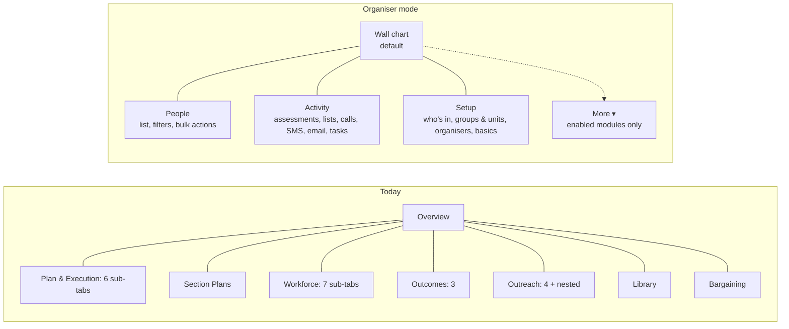
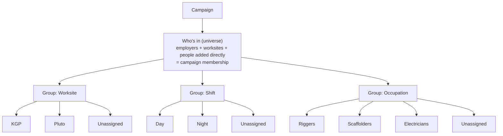

# Organiser UX review and simplification plan

**Status:** review and plan only. Nothing in this document has been implemented.
**Date:** 7 September 2026
**Scope:** `apps/organising-db` (the Organising DB), with the wall chart treated as the central working page for an organiser who runs two to six campaigns.
**Evidence:** the full code of the navigation shell, campaign page, wall chart, campaign setup flows and unit/universe model; the Supabase migrations; read-only aggregate queries against the production database (counts only, no names or contact details); every prior design document in the repo; the SOC Field Guide; and published UX guidance (cited in section 4). Six detailed appendices sit in `docs/organiser-ux-review/`.

---

## 1. Summary

The app is not hard to use because any one screen is bad. It is hard because an organiser is shown the whole organisation's tooling all the time, the campaign page has grown to about 44 surfaces across three levels of tabs, and the one page organisers actually live on, the wall chart, carries roughly 700 interactive elements once a campaign has a handful of units. Underneath that, the campaign "architecture" the organiser is asked to build (universe, groups, units) means three different things in the code and two different things in the training videos, so the most important concept in the product has no stable definition.

The production data confirms the cost. Nine of the 22 campaigns have no units at all, 44% of campaign memberships (1,162 of 2,670) sit in no unit, and the median unit holds two workers. Organisers are either not structuring campaigns, or structuring them so finely that the chart stops being readable. Eleven of the thirteen user accounts are admins, so the role model that could have simplified the UI has never been exercised.

The recommended direction, in one paragraph, and grounded in the published guidance summarised in section 4: give organisers a **campaign-first workspace** (a "My campaigns" home, a four-tab campaign page that opens on the wall chart, a campaign switcher, and everything else moved behind an admin-configured "More" menu); replace the implicit unit-type model with **first-class groups** (a group is a dimension such as Worksite, Shift or Occupation; each group has its units plus a derived Unassigned bucket; a worker is in at most one unit per group); give the wall chart and list a **group selector that shows one group by default** and can add more; and replace four campaign-creation paths with **one three-step setup** that lands on the wall chart with a checklist, where strategic planning is an optional module attachable at any time. Standalone SMS, email and phone actions stay one click away in organiser mode through an **Actions hub**, and every action gains a **Link to campaign** operation so that a bulk SMS or mass email that grows into a campaign carries its audience and results with it.

Headline numbers behind the diagnosis:

| Measure | Today |
|---|---|
| Sidebar items an organiser sees | 10 (13 for admins), flat, mixing campaign work, org databases, inboxes, reports, training and admin |
| Campaign page surfaces (tabs × sub-tabs × nested tabs) | 8 top-level, 20 second-level, 16 third-level (about 44) |
| Header actions inside a campaign | 12 |
| Wall chart controls | about 30 fixed, 11 per unit card, 6 per sub-unit, 6 per tile, 8 in the build-list panel |
| Ways to create a campaign | 4 (guided wizard, planner wizard, manual, list import) |
| Guided wizard length | 9 screens for bargaining, 8 otherwise; the campaign row is written at step 1; situation analysis is a hard gate for every campaign type |
| Campaigns with zero units | 9 of 22 |
| Campaign memberships in no unit | 1,162 of 2,670 (44%), across 14 campaigns |
| Median / 90th-percentile / max workers per unit | 2 / 14 / 149; one campaign has 161 units for 305 members |
| Campaigns per organiser | 7, 6, 4, 2, 1, 1 (matches the two-to-six brief) |
| Accounts with role `admin` | 11 of 13 (7 of them are organisers by work role) |
| Meanings of the word "group" in the code | 3 (a band of same-type units, a container row, the sub-unit hierarchy) plus "occupation group" |

The plan is phased so that the cheapest, highest-value changes (defaults, landing page, hiding non-campaign chrome) ship first, and the data-model change to groups ships behind a flag with a migration that has already been dry-run against production counts (only about seven worker rows conflict with a one-unit-per-group rule).

---

## 2. How this review was done

- **Code reading.** The navigation shell, campaign list and detail pages, the wall chart and its 60 supporting files, the campaign wizard and its eight step components, the planner wizard, settings, universe and units sections, and the API routes and hooks they call. Appendices A, B and D carry file and line references for every claim.
- **Schema reading.** All 245 migrations, focused on campaigns, universe, organising units, worker membership, ratings, roles and row-level security. Appendix C.
- **Production data.** Read-only aggregate SQL against the production Supabase project (counts, distributions, constraint checks). No worker names, phone numbers or emails were read. Section 3.4 and appendix G.
- **Prior decisions.** Every design and review document in the repo, cross-checked against the code to see what shipped, what was dropped and where documents contradict each other. Appendix E.
- **Methodology.** The SOC Field Guide, to check what the software should make easy for an organiser in the field. Appendix E, section 4.
- **Best practice.** Published guidance from Nielsen Norman Group, Baymard, GOV.UK, Atlassian, Shopify Polaris and comparable organising products (Action Builder and others). Appendix F, summarised in section 4.
- **What this review did not do.** No organiser was interviewed and no usage analytics were available (PostHog is wired for page views only). Section 8 proposes closing that gap in the first two weeks, before the larger changes are built.

---

## 3. Findings

### 3.1 An organiser sees the whole organisation, all the time

**Navigation.** The sidebar (`src/components/layout/sidebar.tsx`) is a flat list: Campaigns, Dashboard, Overview, Worksites, Upcoming Projects, Email Inbox, SMS Tools, SMS Inbox, Reports, Guides, plus Email Imports, Email Wrappers and Administration for admins. Nothing is gated by anything other than `isAdmin`. There is no campaign switcher, no breadcrumb, no search (it was removed because it was never wired up), and no notion of "my work". Workers, Employers, Agreements, Programs, Work Scopes, Templates, Workload and Organiser Patches are reachable as pages but are not in the sidebar, so the header names routes the menu does not, and most pages render their title twice.

**Landing.** Every role lands on `/campaigns`, a portfolio list with a five-card metrics block. The list is filtered to the signed-in organiser only if their profile is linked to an organiser record, otherwise it shows everyone's campaigns with a warning. Clicking a row already deep-links to the wall chart (`?tab=workforce&sub=wall-chart`), which shows that somebody has already recognised the wall chart as the working page. But the campaign page's own default is Overview, dashboard cards deep-link to Plan → Pending review, and the header's Back arrow returns to the full list. Three different answers to "where does a campaign open".

**The campaign page.** `src/app/(dashboard)/campaigns/[id]/page.tsx` renders eight top-level tabs (Overview, Plan & Execution, Section Plans, Workforce, Outcomes, Outreach, Library, Bargaining), twenty sub-tabs and sixteen nested tabs inside those. The wall chart is the first sub-tab of the fourth top-level tab. Twelve header actions sit above it, three of them primary buttons for creating phone, email and SMS actions. Wizards launched from inside a campaign (SOC wizard, "Re-run wizard") drop the campaign chrome entirely, so the organiser loses their place.

**Duplicated entry points.** Phone calling can be started from the header, the Outreach → Phone Ops panel, `/campaigns/phone-wizard`, and the build-list "Fire" action. SMS from the header, the Outreach → SMS panel, the `/sms` hub, `/sms/new`, the sidebar, the campaigns-list strip and "Fire". Importing a worker list is mounted in eight files. Campaigns can be created five ways. Each duplicate is a reasonable shortcut on its own; together they mean there is no single obvious path for any task.

**Mobile.** The mobile menu is the same 13 items. The wall chart uses native HTML5 drag-and-drop with no touch support, so on a phone or iPad tiles cannot be moved; the List view would work but is not selected automatically.

### 3.2 The role model has never been used to simplify anything

Roles are `admin`, `user`, `viewer` on `user_profiles.role`. At the database, admin and user are identical for reads and writes on the core campaign tables, except that **only admins can delete** organising units, worker-unit rows, leader links and campaigns (migration `0013` policies). The client exposes `isAdmin` and `canWrite` and nothing else; `work_role` (organiser, lead organiser, coordinator, industrial officer) and `reports_to` are stored but never read for UI. A campaign-level permission system (`campaign_edit_permissions`, `can_write_to_campaign()`) exists and is used by 43 later migrations, but the four tables organisers touch most (campaigns, units, worker-unit rows, membership) still use the older coarse policy, and the permission-request UI components are imported nowhere.

In production 11 of 13 accounts are admins, `campaign_organisers` has zero rows, `campaign_edit_permissions` has zero rows, and the dashboard's "My team" filter is a no-op. In practice everyone is an admin, everyone sees everything, and "my campaigns" is a client-side filter on `campaigns.organiser_id`. This matters for the brief in two ways: an "organiser campaign view" cannot be keyed off the current role field without first fixing who is an admin, and a self-setup organiser with the `user` role would hit silent failures today (delete a unit: nothing happens, no error).

### 3.3 Campaign setup is long, coupled to bargaining and planning, and lossy

**Four creation paths.** The guided wizard (`campaign-wizard.tsx`, 2,071 lines), the OA Planner wizard (`planner-wizard.tsx`, triggered by query parameters on the same URL), Manual create (four fields then a settings accordion), and the campaigns-list "Import lists" wizard, which creates a campaign as a side effect. Three of the four default the campaign type to `bargaining`; only the import path defaults to `organising`.

**The guided wizard.** Nine screens for bargaining, eight otherwise. Only five or six inputs are actually required (name, scope, at least one employer or worksite, and two situation-analysis fields), but the organiser is presented with roughly 60 to 80 controls before repeating rows. The campaign row is inserted at step 1, so an abandoned wizard leaves a visible half-built campaign. Step 7, Situation Analysis (a seven-section survey written for bargaining), is a hard gate for organising, mobilisation and political campaigns as well. Step 2's button says "Continue to workers" but goes to Agreements. Step 6 wipes and re-inserts every worker-unit row for the campaign, discarding rule-based and primary flags set elsewhere, and as a side effect mutates global worker records and other campaigns. Step 9 hands off to "OA Planner", described in the copy as six stages and five gates, while another panel on the campaign page describes "the 11-stage Playing-to-Win framework".

**Planning coupling is in the UI, not the schema.** A campaign row needs only a name, a type and a status. Plan tables are separate and written only by the planner hooks. The database already has a `standalone_activities` phase and stage 0 for "ambitions created outside the stage sequence". So "standalone by default" is a defaults-and-copy change plus removing one gate, not a data-model change. What does break without a plan is cosmetic: "No plan" in the list, an empty Strategy panel with a "Create Campaign Plan" button, an always-rendered 11-column stage-coverage grid on Overview, and an inert "Suggest from plan" button.

**Settings is not equivalent to the wizard.** The settings accordion reuses the wizard's unit step but saves without the group fields (`parent_ou_id`, `is_group_container`, `ou_group_id`), so a group edited in Settings is flattened into unrelated units. Settings has no Agreements or Situation Analysis section. "Re-run wizard" only edits step 1. The Situation Analysis card links to wizard step 7 but the wizard ignores the step parameter in edit mode and opens step 1.

**Self-setup already works at the database.** Organisers with the `user` role can insert campaigns. The friction is elsewhere: the planner wizard only accepts lead organisers, a non-admin cannot assign a colleague who lacks an organiser record, and the delete button shows for writers but fails at the database.

### 3.4 The architecture organisers must understand has no single definition

**What the training says.** Guide B1 teaches: an organising unit is typed by shift, department, worksite, crew rotation, work area, network, ethnic community, accommodation, job type or custom; a *group container* is a named header bundling several units of the same type, workers are never assigned to the container; and a worker can be in only one group per unit type per campaign. Guide B3 then says a worker can sit in more than one unit and should mark a primary.

**What the code does.** `ou_type` is an 11-value check constraint, not an entity: no per-campaign label, order or default, no "profession" type (job type is the closest, and the split wizard, the rules engine and the worker table each use a different vocabulary for occupation). The wall chart bands units by their *top-level* type, so the 143 worksite units that were imported under 18 employer containers render under an "Employer" band, not a "Worksite" one. The word "group" means a same-type band in one place, a container row in another, the sub-unit hierarchy in a third, and "occupation group" in a fourth. "Dimension" means a band, a split axis, and a rule field. "Unassigned", "Unallocated" and "No group" are computed three different ways in three components.

**What the database enforces.** One container per type per worker (not one unit), no workers on containers, and a maximum depth of three. Nothing stops a worker being in two standalone units of the same type, and nothing re-validates when a unit is re-typed or re-grouped. "Unallocated" was deliberately made a computed, campaign-wide bucket in May 2026 ("no auto-created row"); there is no per-type bucket anywhere.

**What organisers actually built** (production, September 2026):

| Pattern | Count |
|---|---|
| Campaigns with zero units | 9 of 22 (including campaigns with 224, 160, 146 and 72 members) |
| Campaigns using exactly one unit type | 8 |
| Campaigns using two or three unit types | 5 |
| Unit types ever used | 6 of 11 (worksite 156, employer 28, work area 23, custom 18, job type 9, shift 5) |
| Group containers | 20 (18 employer containers holding worksite units; 2 custom) |
| Parent-plus-sub-unit "roll-up" rows | 0 (the roll-up model is unused) |
| Workers in more than one unit of the same group or type | 7 (2 within a group, 5 across standalone units) |
| Units with no usable dimension (custom, or no basis) | 34 of 219 leaf units |
| Rule-based assignments | 194 of 1,614 (two rule rows exist in the whole database) |
| Anchor worker set on a unit | 0 |

The picture is consistent: the concepts are hard enough that most campaigns are left unstructured, and where structure exists it is almost always one dimension built from the employer/worksite universe. The per-group "unassigned" bucket the brief asks for is not an edge case; it is the state 44% of memberships are in today, with nowhere to appear.

**Universe.** The live universe is `campaign_employers` plus `campaign_worksites`; workers are pulled in by application code that runs when scope is saved and, silently, every time a writer opens the wall chart. Agreements, occupations, sectors and the campaign's own `sector_wide` flag play no part in matching. The legacy `campaign_universes` / `campaign_universe_rules` tables (zero rows in production) still ship in the UI as "Named universes (optional), labels for the Actions tab only", on the same "Scope" tab as the real universe. A second worker-to-campaign table, `worker_campaign_connections`, has two rows and is read by the phone paths.

### 3.5 The wall chart is the right page with the wrong density

The chart itself is well built for what it tries to do: tiles coloured by rating, leader/follower overlay, structure-test participation, drag-and-drop, bulk selection, a build-list panel that fires into email, phone and task pathways. The problems are density, scattered state, and the unit model underneath.

- **Control inventory** (appendix A, section 3): four board-level controls, seven in the selection bar, twelve in the sticky summary header (assessment view, participation source, list badges, %/#, links, search, add worker, import, a units manager popover with its own eleven controls, expand/collapse all), two on the distribution charts, five on the Unassigned card, eleven on every unit card (view override, badges override, unit/sub-unit view, add worker, select all, sort, filter, a kebab with split/add/delete, a 1–5 rating, a drag handle), six on every sub-unit, six on every tile, eight in the build-list panel, plus thirteen dialogs and a six-tab worker sheet. Each unit card carries its own filter, sort, assessment-view and badge overrides, so the same question ("who is unrated on Shift A?") is answered per card instead of once.
- **Three views of one dataset.** Wall chart, List, and the "Campaign Units" tab each load the same data through their own query keys and each compute "unassigned" differently. Switching Wall chart to List unmounts the other and resets all its state.
- **State is scattered.** Tab, view, build-list and focused unit live in the URL; hidden units, %/# mode, per-parent unit/sub-unit view and the overlay toggle live in `localStorage` ("stored in this browser only"); the assessment view, per-unit filters, badge overrides, participation source and selection live in React state and are lost on navigation; ordering and everything else is on the server. An organiser who sets up a useful view on their laptop gets a different chart on their phone.
- **Tiles are below the fold.** The summary header and the assessment-distribution charts sit above the units; the how-to video production notes record that every clip had to scroll to find a tile.
- **Type-banding is the closest thing to a group selector**, and it is hidden when a campaign has one type, cannot be chosen, and is confused by nesting. The distribution charts have their own single-select "Group units by" with a coverage-based default, which is the right idea in the wrong place.
- **Sub-unit hierarchy adds a second axis** (unit view vs sub-unit view per parent, expand all, collapse all, three card depths with different toolbars) that production data shows nobody uses beyond the import-created employer → worksite nesting.
- **Inconsistencies found in passing:** a six-tab sheet in a five-column grid, "up to 40 displayed" copy against a cap of 24 placeholders, a silent no-op when a tile is dropped on a unit of another type, "Apply to all units" including containers, a role check that compares `"Activist"` with a capital while migrations moved to lower-case, and hidden child units that still count in parent roll-ups. There are no tests in the wall-chart tree.

### 3.6 Terminology

| Concept | Terms in use | Recommendation |
|---|---|---|
| Who is in the campaign | universe, scope, campaign scope (also the 4-value enum), target universe, workers in scope, named universe, sector-wide (two different flags) | **Who's in** (the universe): employers and worksites, plus people added directly |
| A slice of the workforce | organising unit, OU, campaign unit, unit, sub-unit, group, group container, member unit, dimension, cohort, crew, segment | **Group** for the dimension (Worksite, Shift, Occupation), **Unit** for a member of a group |
| Workers with no unit | Unassigned, Unallocated, No unit, No group, Unassigned / No group | **Unassigned** (within a group), **Not in any group** (campaign-wide) |
| The plan | campaign plan, strategic plan, OA Planner, Playing to Win, P2W, stage plan, section plan, workplan, Plan & Execution, Strategy | **Strategic plan** (optional module); **Workplan** only if it survives as a distinct thing |
| The people doing the work | organiser, campaign organiser, lead organiser, team member, staff account, organiser record | **Organiser** and **Lead organiser**; hide "organiser record" from users by auto-creating it |
| The wall chart's "view" | View (assessment override), unit/sub-unit view, `?view=list` | **Colour by** for the rating source; **Wall chart / List** for layout |
| SOC | Structured Organising Conversation in the app, "scope-of-campaign" in the product spec | Structured Organising Conversation, and rename the spec |
| An action outside any campaign | standalone, org-wide, episode, standing campaign | **Standalone** (an action not linked to a campaign); "episode" and "standing campaign" disappear from the UI |

### 3.7 What the organising method needs from the software

The SOC Field Guide never uses the words "wall chart", "unit" or "universe". Its grain is the **crew** (the unit of leadership, of the peer-conversation ask and of delegate coverage), the **population** (permanent, experienced shutdown hand, green hat), a **sentiment read** that is re-taken every conversation, a **specific commitment**, and a **dated next contact**. It asks organisers to "map relentlessly" and to debrief daily into "your tracking system". The app's tile is rating-centric and its structure is employer/worksite-centric; neither is wrong, but the redesign should make it easy to have a Crew group and to record "last conversation, next contact, commitment" without inventing a data field each time. The existing `campaign_data_fields` facility can carry this; the plan schedules it late, after the structural changes.

### 3.8 What earlier work already decided

Appendix E lists 24 previously identified pain points and 20 proposals that were never built. The ones this plan depends on:

- The April 2026 analysis proposed **removing organising units** altogether; the codebase went the other way and made them central. This plan treats that as settled: units stay, but become members of first-class groups.
- The same analysis asked for **one scope mechanism**; the legacy universe rules were demoted to "labels" rather than removed. This plan removes them from the organiser's UI.
- The 2026 integration plans proposed a **Management / Planning mode toggle persisted per campaign** and a three-tab campaign page. Neither shipped; the page went to eight tabs instead. This plan revives the mode idea as a per-user workspace mode.
- The wall chart v2 plan left **auto-linking new unit members to the unit's delegate** and **touch drag-and-drop** open. This plan keeps them open but schedules touch handling.
- The how-to library (19 clips) documents the current model and will need re-recording for series A, B and C after the group model lands.

### 3.9 Standalone SMS, email and phone use three mechanisms and cannot be linked to a campaign afterwards

Organisers also run actions that are not part of any campaign, and the code supports this three different ways:

- **SMS.** Standalone blasts, chat boards and surveys run on a hidden per-action "episode" campaign (`campaigns.is_sms_episode`), created before the editor opens and discarded if unsaved; relays can be org-wide. Episodes are excluded from every campaign picker. A standalone chat board can nominate a real campaign to receive its ratings (`sms_lists.assessment_campaign_id`); a standalone survey has no campaign activity to write ratings to.
- **Email.** In-app email lists and drafts require a campaign (`email_lists.campaign_id` is not nullable). The only standalone email path is the legacy Email wizard, which pushes an audience (employer, worksite, tag or hand-picked workers) to Action Network and leaves no in-app send record; the resume banner deliberately ignores such drafts.
- **Phone.** Standalone call lists and scripts are filed under one shared "standing" campaign, "OA Membership Outreach" (`campaigns.is_standing`), which every authenticated user may write to.

Nothing links an action to a campaign after the fact. Individual SMS and email conversations can be reassigned to a campaign from the inbox, and a chat board can nominate an assessment campaign, but a blast, survey, call list or email send, with its audience, send log, replies and ratings, stays wherever it was created. The most recent of the three designs, SMS episodes, is the right base to generalise: each action already owns its own container, membership rows and audience, so it can be moved to a campaign as one unit (5.12).

---

## 4. Best-practice basis

Appendix F holds the full research, with every source fetched and quoted. The principles below are the ones this plan relies on; each names its best source and the recommendation it supports.

| # | Principle | Source | Where it is applied |
|---|---|---|---|
| 1 | **The wall chart is the home and the workbench.** Action Builder, the organising tool built by Action Network and the AFL-CIO, makes its Wall Chart "the default view for users" and lets organisers "accomplish most of your tasks straight from the Wall Chart". | [Action Builder: Wall Chart](https://actionbuilder.zendesk.com/hc/en-us/articles/22306100963092-Wall-Chart) | 5.1, 5.4, 5.6 |
| 2 | **Scope what organisers see by campaign; admins switch features on and off to remove clutter.** Action Builder's own guide: organisers found other systems "cumbersome, overwhelming, and filled with clutter", so "what organizers see" is campaign-specific and "you control the options organizers see". "Fewer sections has generally been better." | [Action Builder Getting Started Guide (PDF)](https://actionnetwork.org/user_files/user_files/000/062/020/original/Action_Builder_Guide.pdf) | 5.2 |
| 3 | **Two levels of disclosure, split by frequency of use.** "Initially, show users only a few of the most important options"; designs "that go beyond 2 disclosure levels typically have low usability." | [NN/g: Progressive Disclosure](https://www.nngroup.com/articles/progressive-disclosure/) | 5.2, 5.4 (four tabs plus one More menu) |
| 4 | **Hide only what a user can never use; mute and explain what is merely switched off; never bury primary navigation.** Hiding main navigation "cut[s] discoverability almost in half" and increases task time. | [Nielsen: Inactive GUI Controls](https://jakobnielsenphd.substack.com/p/inactive-buttons); [NN/g: hamburger menus study](https://www.nngroup.com/articles/hamburger-menus/) | 5.2 (organiser sidebar stays visible; disabled modules show muted with "Ask an admin") |
| 5 | **Adaptable beats adaptive.** In a controlled study, menus that users or admins configured were faster and preferred; menus that rearranged themselves were slowest. | [Findlater & McGrenere, CHI 2004](https://www.cs.ubc.ca/labs/imager/tr/2004/findlater04menus/) | 5.2 (admin-configured modes, stable layout, no usage-based hiding) |
| 6 | **Few roles, assigned by an admin, with an out.** "Don't create more roles than you can support"; "Provide an out, as appropriate." | [NN/g: Personalization](https://www.nngroup.com/articles/personalization/) | 5.2, 5.10 (organiser / lead / admin, "Show everything") |
| 7 | **Standalone by default, standardised by choice.** Jira's team-managed projects are "set up and maintained by anyone on the team" with "simpler configuration"; company-managed projects add standardisation at the cost of complexity. | [Atlassian: team-managed vs company-managed](https://support.atlassian.com/jira-software-cloud/docs/what-are-team-managed-and-company-managed-spaces/) | 5.8, 5.9 (standalone campaign; planning module attachable) |
| 8 | **Groups are facets over one population, not levels of a tree.** Facets are "multiple filters, one for each different aspect of the content"; forcing multi-parent items into exclusive categories "can easily increase the complexity of taxonomies". Paper wall-chart practice groups names "by work area, job, and shift". | [NN/g: Filters vs Facets](https://www.nngroup.com/articles/filters-vs-facets/); [NN/g: Polyhierarchy](https://www.nngroup.com/articles/polyhierarchy/); [Labor Notes: Secrets handouts (PDF)](https://www.labornotes.org/sites/default/files/Secrets%20Handouts%20Part%20Two-%20Assembling%20Your%20Dream%20Team.pdf) | 5.5 (Worksite, Shift, Occupation as independent groups; no nesting) |
| 9 | **One grouping dimension by default, additive sub-grouping capped at two or three levels, empty groups hideable.** Linear, Airtable and Notion boards all default to one group-by and add a second as rows. | [Linear: Display options](https://linear.app/docs/display-options); [Airtable: Grouping records](https://support.airtable.com/docs/grouping-records-in-airtable) | 5.6 (group selector, Compare matrix, show-empty-units toggle) |
| 10 | **"Unassigned" is a real, visible, positionable lane and a selectable value.** Jira puts "unassigned work items ... either above or below the swimlanes (your choice)"; Action Builder's assessment filter has an explicit "no assessment" value; Labor Notes: "Enter one row for each worker, even people you don't have much information about." | [Atlassian: swimlanes](https://support.atlassian.com/jira-software-cloud/docs/configure-swimlanes/); [Action Builder: Query Builder criteria](https://actionbuilder.zendesk.com/hc/en-us/articles/22282364273300-Query-Builder-Criteria) | 5.5, 5.6 (Unassigned per group; Not in any group) |
| 11 | **Applied filters and the active context stay visible; view state persists per user.** 28% of benchmarked sites show no applied-filter overview and users "easily forget" what is active. | [Baymard: applied filters](https://baymard.com/blog/how-to-design-applied-filters); [Linear: persistence](https://linear.app/docs/display-options) | 5.6 (chips, server-side prefs, URL group parameter) |
| 12 | **Overview first, zoom and filter, details on demand; quantity by length, category by colour plus shape plus label.** | [Shneiderman 1996 (PDF)](https://www.cs.umd.edu/~ben/papers/Shneiderman1996eyes.pdf); [NN/g: Dashboards and preattentive attributes](https://www.nngroup.com/articles/dashboards-preattentive/) | 5.6 (unit strength as bars, rating as colour plus numeral, sheet on demand) |
| 13 | **Bulk actions need selection, a contextual action bar, a count, Select all, and undo.** | [NN/g: Data tables](https://www.nngroup.com/articles/data-tables/); [NN/g: Bulk actions](https://www.nngroup.com/videos/bulk-actions-design-guidelines/) | 5.6, 5.7 |
| 14 | **Wizards are for infrequent setup: resumable, one decision per step, strong defaults labelled "change later", create separated from configure, empty states do the rest.** | [NN/g: Wizards](https://www.nngroup.com/articles/wizards/); [GOV.UK: question pages](https://design-system.service.gov.uk/patterns/question-pages/); [NN/g: Empty states](https://www.nngroup.com/articles/empty-state-interface-design/) | 5.8 |
| 15 | **No product tours; a three-to-five-item, event-driven checklist and first-use hints.** Tutorials "don't make users faster or more successful"; checklists over five items complete less often. | [NN/g: Onboarding tutorials](https://www.nngroup.com/articles/onboarding-tutorials/); [Appcues: checklist best practices](https://docs.appcues.com/checklist-best-practices) | 5.8 (setup checklist) |
| 16 | **A campaign switcher for a handful of contexts: always visible, recency-sorted, keyboard-reachable, collapsing to a label for single-campaign users; "my work" as home.** Broadstripes' project switcher and Linear's My Issues are the models. | [Broadstripes: switch projects](https://help.broadstripes.com/docs/getting-started/switch-projects); [Linear: My Issues](https://linear.app/docs/my-issues) | 5.3, 5.4 |
| 17 | **Field use: targets of at least 1 cm, tap-not-type logging, saved state when the signal drops, and redesign the workflow before mobilising it.** | [NN/g: Touch target size](https://www.nngroup.com/articles/touch-target-size/); [NN/g: Mobile Intranets and Enterprise Apps (PDF)](https://media.nngroup.com/media/reports/free/Mobile_Intranets_and_Enterprise_Apps.pdf) | 5.11 |
| 18 | **Measure with top-task success, time and errors, SUS before and after, five-user think-aloud rounds, and a card sort of the vocabulary plus a tree test of the navigation before building.** | [NN/g: Success rate](https://www.nngroup.com/articles/success-rate-the-simplest-usability-metric/); [NN/g: Five users](https://www.nngroup.com/articles/why-you-only-need-to-test-with-5-users/); [Brooke: SUS (PDF)](https://hell.meiert.org/core/pdf/sus.pdf) | 8 |

Two findings from comparable products deserve a sentence each. Action Builder scopes assessments to one fixed scale per instance and shows it as colour everywhere, which matches this app's `rating_level` table and argues against per-unit colour overrides. Broadstripes models worksite, department and classification as attributes of the worker's employment and lets users define cross-cutting "social groups" alongside them, which is the same split as this plan's auto-built groups (Worksite, Employer, Occupation) versus named Custom groups. A case study of the Minnesota Nurses Association's use of Action Builder across fourteen hospitals records that organisers first experienced the tool as "a chore" and adopted it once dashboards showed "top issue by department, connections and leaders" (appendix F, A.6): a simpler UI on its own will not drive data entry unless the chart pays organisers back with per-unit strength, gaps and leader coverage.

---

## 5. Target experience

### 5.1 Design principles for this redesign

1. **The wall chart is home.** Inside a campaign, the first thing an organiser sees is the chart, and every other campaign screen is one click from it and one click back.
2. **One group at a time.** The chart and the list show a single group by default; comparing groups is an explicit, additive choice. Every worker is somewhere in every group, even if that somewhere is Unassigned.
3. **Disclose progressively, relocate rather than delete.** Non-campaign features are moved behind a "More" menu and an admin-controlled module list. Nothing is removed from the product; it stops being in the organiser's face.
4. **Create, then configure.** A campaign exists after three short screens with sensible defaults. Everything else is a checklist item on the chart, done in any order, with "you can change this later" as the rule.
5. **One definition per concept, one place to edit it.** Groups and units are edited in one editor used by setup, settings and the chart. "Unassigned" is computed once, server-side.
6. **Per-user, server-side view state.** What an organiser chose to look at (group, colour-by, layout) follows them between devices and survives navigation.
7. **Field-usable.** The list view is the default on touch devices, tiles are tappable, and moves work without drag.

### 5.2 Organiser mode

Introduce a **workspace mode** per user: `organiser` (default for organisers) or `full` (today's UI). An admin or lead organiser sets the default per work role and can override per user; a user in organiser mode can open "Show everything" for the session if their profile allows it (the recommendation is to allow it, so nobody is ever locked out of a feature they used to have).

Organiser mode changes three things and nothing else:

| Surface | Full mode (today) | Organiser mode |
|---|---|---|
| Sidebar | 10 flat items (+3 admin) | **My campaigns**, **Actions** (SMS, email and calls, standalone or campaign-linked; 5.12), **Inbox** (SMS and email conversations, badge count), **Guides**; an "Organisation" section (Worksites, Employers, Agreements, Reports, Upcoming projects, Admin) only if the admin has enabled those modules for the user, collapsed by default |
| Landing page | `/campaigns` portfolio list | **My campaigns** home (5.3); an organiser with exactly one campaign lands on its wall chart |
| Campaign page | 8 tabs, 20 sub-tabs, 12 header actions | 4 tabs (5.4), a campaign switcher, and a "More" menu whose items are the enabled modules |

A module an admin has switched off for a user is hidden from the sidebar and menus when the user could never use it (an organiser who is not allowed to import), and shown muted with "Ask an admin to enable" when it is merely off for that campaign, so nobody concludes a feature has vanished.

Modules an admin can enable per role or per user (proposal; the first four are on for organisers by default):

| Module | Contains | Default for organisers |
|---|---|---|
| Wall chart & people | chart, list, assessments/ratings, leaders, build list | on |
| Actions | SMS blasts, chat boards, surveys and relays; email sends; call lists and sessions; task lists and the leader webform; standalone or campaign-linked | on |
| Setup | universe, groups and units, organisers, basics | on (self-setup) |
| Inbox | SMS and email conversations | on |
| Strategic planning | Playing to Win stages, gates, section plans, situation analysis, ambitions | off (attachable per campaign) |
| Bargaining | Bargaining hub, PABO, PIA, votes | off (phase-gated anyway) |
| Insights | reports, results, campaign progress, facts report | off |
| Data fields | custom facts | off |
| Activists & WOCs | activist register, 4A tasking, WOCs, structure tests | off (until the module is used) |
| Library | documents, agreements, offers | off |
| Imports | worker list import, participation import, email audience import | off (admin/senior) |
| Organisation databases | worksites, employers, agreements, programs, work scopes, upcoming projects | off |
| Administration | users, settings, wrappers, email imports | admins only |

Implementation hooks already exist: `navItems` and `adminItems` are exported from one file and consumed by both navs; the tab registry in `src/lib/campaign-tabs.ts` is the natural place for a per-tab module id; `useAuth()` already carries `work_role` and `reports_to`; `app_settings` (admin-only key/value) can hold the org-wide module defaults, and a `workspace_prefs` JSONB column on `user_profiles` the per-user overrides (appendix D, section 10).

### 5.3 "My campaigns" home

A page built for someone who runs two to six campaigns, not a portfolio table.

- One card per campaign the user is an organiser on (from `campaign_organisers`, backfilled from `campaigns.organiser_id`; lead organisers also see the campaigns of people who report to them, in a second row).
- Each card: name, type and status pills, a four-number strip (people, in a unit, rated, leaders), a thin rating-distribution bar, "last activity" (latest rating, call, SMS or list fire), and one primary action: **Open wall chart**.
- Below the cards: "Needs attention" items pulled from the existing pending-review and role-check queues and the resume banners (an in-progress phone, email or SMS action), each deep-linking into the right campaign.
- A single **New campaign** button (5.8). The "Email wizard / Phone wizard / SMS tools / Import lists" strip is removed from this page. Campaign-linked actions start from inside the campaign; standalone actions start from the Actions hub (5.12); imports are a module.

### 5.4 The campaign workspace



- **Header:** campaign switcher (my campaigns sorted by recency, reachable with a keyboard shortcut, collapsing to a plain label when the user has one campaign, plus "All campaigns"), name, status pill, and two actions: **New action ▾** (Call list, SMS, Email, Task list, Assessment) and **Build list**. The three primary comms buttons collapse into one menu; "Re-run wizard", "All settings" and "View full plan" move into Setup and More.
- **Wall chart** tab: section 5.6. The List view is a layout toggle within it, as today, so the People tab may not be needed; the recommendation is to keep People as the tab name and make Wall chart / List the two layouts inside it, opening on Wall chart. Whichever name wins, the URL should open on the chart.
- **Activity** tab: assessments and ratings, structure-test participation, saved lists and their status, call lists and sessions, SMS and email sends, task lists. One chronological list with type chips, in the style of the SMS hub ("one list, not five tabs"), with the create actions at the top. Actions linked to the campaign from the Actions hub appear here with their history intact.
- **Setup** tab: the four things that define a campaign, each a card that edits in place: Who's in (universe), Groups & units, Organisers, Basics. Plus a setup checklist (5.8) and "Add a strategic plan" (5.9).
- **More ▾:** whatever modules are enabled: Strategic plan, Bargaining, Section plans, Insights, Data fields, Activists & WOCs, Library, Imports. Each opens as a page under the campaign with the same header, so the campaign is never lost.
- Wizards launched from the campaign (SOC wizard, planner) keep the campaign header.

### 5.5 Groups and units: the model organisers are asked to understand



Definitions the product will use everywhere, in the UI, the guides and the schema:

- **Campaign membership.** The set of people in the campaign. It comes from the universe (employers and worksites) plus people added directly. It is the only thing "in the campaign" means.
- **Group.** A way of slicing the membership: Worksite, Employer, Shift, Crew or roster, Occupation, Work area, or a named Custom group. A campaign has zero or more groups. Every group is a complete partition of the membership: each member is in exactly one unit of the group, and if they have not been placed yet they are in that group's **Unassigned** unit.
- **Unit.** A member of a group: KGP, Night shift, Riggers. A unit has a name, an estimated size (entered as a share of the group when the group is defined, stored as a number), an optional leader, and its own rating and coverage. Units of a Worksite or Employer group are created automatically from the universe; units of Occupation, Shift, Work area and Crew groups can be auto-filled from the matching worker fields when those are populated, and otherwise named by the organiser.
- **Unassigned.** Derived, not stored: "members with no unit in this group". It appears as the last card in every group, is a drop target that removes a worker from their unit in that group, can be filtered and bulk-acted on, but cannot be renamed, rated or deleted.
- **Not in any group.** The members who are Unassigned in every group. Available as a view from the group selector and as a count on the setup checklist. For a campaign with no groups yet, this is the whole membership, shown as a single flat grid.
- **No nesting inside the organiser's model.** Employer → Worksite nesting becomes two groups (Employer, Worksite). "Split a unit" creates sibling units in the same group. The three-level container hierarchy remains only as an input to the migration.

This maps the brief's example directly: a worker known to be at KGP and a rigger, shift unknown, is in KGP (Worksite), Riggers (Occupation) and Unassigned (Shift). Switching the chart from Worksite to Shift shows them in the Shift group's Unassigned card, which is exactly the prompt the organiser needs.

### 5.6 The wall chart

**Toolbar** (one row, campaign-wide, replacing the sticky summary header, the per-unit toolbars and the distribution card's own selector):

```
[Group: Worksite ▾] [+ Compare]   [Colour by: Cumulative ▾]   [Filter (2)] [Search]   [Wall chart | List]   [Build list] [+ Person] [⋯]
```

- **Group selector.** Lists the campaign's groups in display order plus "Not in any group". Single-select. The default is the campaign's first group; the user's last choice is remembered per campaign, server-side, and the choice is in the URL (`?group=`) so links share the view. When the campaign has one group the selector still shows, so the concept is visible from day one. A "Show empty units" toggle (off by default) keeps unfilled units out of the way until the organiser wants them.
- **Compare.** Adds a second group. Two groups render as a **matrix**: rows are the units of the primary group, columns are the units of the secondary group (including Unassigned on both axes), each cell shows the count and the rating mix, and clicking a cell shows those workers as tiles below. Three or more groups render as stacked bands; that is allowed but not optimised. Compare is off by default and resets when the primary group changes.
- **Colour by.** Cumulative rating or a named assessment, campaign-wide. Per-unit overrides are removed; the per-unit "View" and "Badges" popovers go with them. Participation source moves into Filter.
- **Filter.** One popover, one state, applied to every unit shown. Filters: rating, role, membership, occupation, phone/email presence, assessment answers, facts, participation, and "in unit of another group" (so "Night shift workers, viewed by Worksite" is one filter, not a second dimension). Active filters show as chips.
- **Unit card.** Name, count / estimate with unfilled slots, a rating dot, leader avatar, and a single ⋯ menu: Rename, Set estimate, Assign people, Split, Merge, Delete. Selection is by click / shift-click / drag-select; the selection bar keeps Move, Add to list, Set rating, Link to leader, Clear ratings, shows the count, and every bulk change gets an undo toast. "Select all" becomes a click on the card count.
- **Tile.** Unchanged in content, minus the multi-unit indicator (meaningless inside a single group). Drag = move within the group. Dropping on Unassigned removes the worker from their unit in this group only. There is no copy drag; cross-group placement is done in the sheet or by switching group.
- **Layout.** Tiles first. The assessment-distribution charts move below the units or into a collapsible side panel, and are pre-set to the selected group. Print remains.
- **State.** Group, compare, colour-by, layout and filter are stored per user per campaign on the server; hidden units and %/# move there too. Nothing view-related is lost when switching to List, because both layouts read the same state.
- **Relationship overlay and build list** are unchanged in function. The build-list panel becomes a right-hand drawer that works over either layout.

### 5.7 The list view

Same toolbar and state as the chart. Columns: Name, Unit (in the selected group), Rating, Role, Phone, Email, Last contact, and an optional column per other group. "Group by unit" is the default grouping; "Not in any group" and each group's "Unassigned" are rows like any other. Bulk toolbar: Set rating, Move to unit (in the selected group), Add to list, Link to leader. This is the default layout on touch devices.

### 5.8 Campaign setup: create, then configure

**Create** (one path for everyone; the same three screens whether an organiser sets up their own campaign or an admin sets it up for them):

1. **Name and kind.** Name; kind (Organising by default; Bargaining, Mobilisation, Political); organiser (defaults to me; admins and lead organisers can pick someone else, and the organiser record is created automatically). Creates the campaign as `planning` with a `setup_complete = false` flag, so a half-finished setup is visibly a draft and can be discarded from the list.
2. **Who's in.** Pick employers and worksites with the live count already built for the estimate step, or "I'll add people myself". The universe sync runs here, visibly ("312 people added from 2 employers and 4 worksites"), and never again silently.
3. **How to slice it.** Tick the groups that apply. Worksite and Employer are pre-ticked and pre-built from step 2. Shift, Crew, Occupation, Work area and Custom ask for unit names (chips: "Day, Night") and a share-of-group slider per unit, which becomes each unit's estimate. Auto-fill from worker fields is offered where data exists ("Occupation: 14 occupations found, build units from them?").

Two optional templates ("Offshore platform campaign": Worksite, Shift, Occupation; "Contractor crew campaign": Employer, Crew, Occupation) pre-fill step 3 for the common cases.

Then **land on the wall chart** with a setup checklist in the right-hand drawer: Who's in ✓, Groups ✓, Place people (n unassigned in Shift), Add an assessment, Identify leaders, Invite a co-organiser, Add a strategic plan (optional). Each item opens the relevant card in Setup or the relevant action, and the drawer disappears when everything except the optional items is done.

**Configure** happens in the Setup tab, which becomes the single editor for universe, groups and units, organisers and basics. The existing settings accordion, "Re-run wizard", the manual-create page, the planner wizard's standalone mode and the campaign-creating side effect of list import are retired or redirected to it. The guided wizard's remaining steps (agreements, worker estimate, situation analysis, ambitions, plan handoff) move into the Strategic plan module.

**Admin setup** is the same flow with two extras: picking the organiser, and toggling that campaign's modules (for example turning Strategic planning on for a bargaining campaign). "Set up for someone" is a checkbox on step 1, not a different wizard.

### 5.9 Strategic planning as an optional module

- Default campaign kind is Organising with no plan. `current_phase` defaults to `standalone_activities` (which already exists) for non-bargaining campaigns; attaching a plan no longer forces the status to `active`.
- "Add a strategic plan" is available at any time from the checklist, Setup, and More. It runs the existing linked-mode planner (agreement, lead organiser, timeline) and accepts the campaign's existing organiser rather than only lead organisers.
- Situation analysis and campaign ambitions live inside the module. Nothing in the base campaign gates on them.
- Plan-only chrome (stage coverage grid, "View full plan", "Suggest from plan", the Plan column on the list) renders only when a plan exists or the module is enabled.
- Bargaining campaigns get a prompt on creation ("Bargaining campaigns usually carry a strategic plan. Add one now, or later from Setup") rather than a ninth wizard step.

### 5.10 Roles and permissions

- Add `isLeadOrganiser` to the client auth context from `work_role`, and use `reports_to` for the "my team" view on the home page.
- Backfill `campaign_organisers` from `campaigns.organiser_id` and make it the source of "my campaigns"; keep `campaigns.organiser_id` as the primary lead for reporting.
- Bring the four core tables (campaigns, organising units, worker-unit rows, membership) under `can_write_to_campaign()` for insert, update and delete, so a self-setup organiser can delete the unit they just made and the UI stops offering actions that silently fail.
- Decide who should really be `admin`. Seven of the eleven current admins are organisers by work role; they should become `user` with `work_role = organiser` and, where appropriate, `lead_organiser`, so organiser mode applies to them by default. This is a data change, not a code change, and it is the single cheapest simplification available.

### 5.11 Mobile and field use

- Default to the List layout on touch devices (the device detection already exists), with the group selector as a segmented control across the top.
- Tile and row tap opens the worker sheet; the sheet gets a "Move to unit" action so no drag is needed.
- Touch targets of at least 1 cm on the rating picker and tiles, with a five-button rating row rather than a dropdown.
- Later: touch drag via `@dnd-kit` (already a dependency), an offline queue for ratings and call outcomes with a visible sync state, and a field-mode sheet that leads with the SOC grain (last conversation, next contact, commitment, sentiment) backed by campaign data fields.

### 5.12 Standalone SMS, email and phone actions, and linking them to a campaign later

Organisers work in a dynamic external context: a mass email or a bulk SMS with a call to action often has to go out before anyone knows whether a campaign will follow. Organiser mode therefore keeps standalone actions as a first-class, top-level item, and makes every action linkable to a campaign at any time.

- **One Actions hub, in the sidebar.** The SMS hub's shape (one list with status chips, "Start something" cards that lead with the job, a create wizard that asks what you want to run and then where it belongs) is generalised to email and calls. The hub lists my actions by default, with an All switch, across kinds: SMS blast, chat board, survey, relay; email send; call list. Each row shows kind, status bucket (Live, Drafts and paused, Finished), audience size, results so far, and scope: a campaign name, or Standalone.
- **One creation wizard, two entry points.** Starting an action from the hub asks "Where does this belong?" (Standalone, or a campaign I organise). Starting it from inside a campaign skips that question with the campaign pre-selected. Everything after that step is identical: audience, content, sending, results. A standalone action and a campaign action are the same object in a different container, which is what makes linking later a move rather than a rebuild.
- **Audience for standalone actions.** By employer, worksite, occupation or tag, from a pasted or imported list (the existing SMS audience import, extended to email), or hand-picked people. The action records its audience as membership of its own container, exactly as SMS episodes do today.
- **Results are captured the same way with or without a campaign.** Replies, call-to-action responses, survey answers and call outcomes are recorded against the action's container. A standalone action can carry its own assessment ("Will you sign the petition?") so ratings exist from day one; until the action is linked, those ratings live with the action and show on the worker's profile timeline rather than on any wall chart.
- **Link to campaign.** One action on any standalone action, available while it is live or after it has finished: choose a campaign I organise, review the overlap ("212 people; 40 already in the campaign; 172 will be added and appear as Unassigned in every group"), and confirm. The link moves, in one transaction, the action's lists and list items, send logs, conversations and messages, survey sessions and answers, call attempts and outcomes, its assessment activity and ratings, and its worker lists, into the campaign. Workers not yet in the campaign are added to its membership. A conversation that already exists in the campaign for the same number is merged rather than duplicated. The move is logged (who, when, from which container) and is one-way; the standalone container is then archived.
- **Start a campaign from this action.** The same dialog offers "New campaign from this action": it opens the three-step create flow with the audience pre-loaded as people added directly, with Worksite and Employer groups auto-built from their records, then links the action. This is the path for a bulk SMS with a call to action that turns into a campaign.
- **Linking is not merging.** A standalone action links to one campaign. If the same people should count in a second campaign, that campaign reaches them through its universe, not through the action.
- **Phone.** New standalone call lists get their own container instead of being filed under the shared "OA Membership Outreach" standing campaign; the standing campaign remains for existing lists, which can be linked list by list.

---

## 6. Data model changes

The intent is the smallest schema change that makes groups first-class and lets the client stop special-casing. Appendix C, sections 8 and 9, has the full analysis and two options; this is the recommended one.

```sql
-- 1. Groups become an entity.
create table campaign_groups (
  group_id      serial primary key,
  campaign_id   int not null references campaigns(campaign_id) on delete cascade,
  name          varchar(100) not null,
  kind          varchar(30) not null check (kind in
                ('worksite','employer','shift','crew','occupation','work_area','custom')),
  display_order int not null default 0,
  unique (campaign_id, name)
);

-- 2. Every leaf unit belongs to exactly one group (NOT NULL after backfill).
alter table campaign_organising_units add column group_id int references campaign_groups(group_id) on delete cascade;

-- 3. One unit per group per worker, enforced.
alter table campaign_worker_ou add column group_id int;         -- maintained by trigger from the unit
create unique index campaign_worker_ou_one_per_group on campaign_worker_ou (worker_id, group_id);

-- 4. Unassigned is derived, one definition for every screen.
create view campaign_group_membership as
select g.campaign_id, g.group_id, m.worker_id, wo.ou_id       -- ou_id null = Unassigned in this group
from campaign_groups g
join campaign_worker_membership m on m.campaign_id = g.campaign_id
left join campaign_worker_ou wo on wo.worker_id = m.worker_id and wo.group_id = g.group_id;

-- 5. Per-user view state.
create table user_campaign_prefs (
  user_id uuid references auth.users on delete cascade,
  campaign_id int references campaigns on delete cascade,
  prefs jsonb not null default '{}',                             -- group, compare, colour_by, layout, hidden units
  primary key (user_id, campaign_id)
);
```

**Migration of existing structure** (dry-run against production counts, appendix G):

| Existing shape | Becomes |
|---|---|
| Leaf units of one `ou_type` in a campaign | one group of the matching kind (worksite → Worksite, employer → Employer, shift → Shift, crew_rotation → Crew, job_type → Occupation, work_area/department → Work area, network/ethnic_community/accommodation/custom → Custom, named from the container where one exists) |
| 18 employer containers holding 143 worksite units | an Employer group with 18 units and a Worksite group with 143 units; workers are placed in both from `unit_basis` (their employer and worksite) |
| 2 custom containers with 7 custom units | one Custom group per container, named after it |
| Standalone custom units (9) | a Custom group per campaign; flagged for review |
| Parent-plus-sub-unit roll-up rows | none exist (0), nothing to migrate |
| Workers in two units of one group or type | 7 rows: keep the primary (or the latest) and log the rest |
| 34 leaf units with no usable dimension | kept in their group; flagged in the setup checklist as "no auto-fill possible" |
| 1,162 memberships with no unit | appear as Unassigned in every group of their campaign; no rows are created |

Retirements, all safe on the production data: `campaign_universes` and `campaign_universe_rules` (0 rows) leave the UI; `worker_campaign_connections` (2 rows) is dropped from the phone paths in favour of membership; `is_group_container`, `ou_group_id` and the exclusivity trigger are replaced by `group_id` and the unique index once every client writer has moved (appendix A lists the 28 files that write these tables; a single `campaign-structure` API route or RPC set should replace direct table writes for assign, move, unassign, create and delete, and should be transactional).

**Action containers and linking.** `campaigns.is_sms_episode` becomes a general `container_kind` (`campaign`, `action`, `standing`), and standalone email sends and call lists get an action container just as SMS episodes do, so the existing `campaign_id NOT NULL` constraints stay. One transactional RPC, `link_action_to_campaign(kind, id, target_campaign_id)`, re-parents the action's rows (`sms_lists`, `email_lists`, `call_lists` and their items; `sms_conversations` and `sms_messages`; `email_conversations` and `email_messages`; `sms_survey_sessions` and answers; `call_attempts` and outcomes; `campaign_activities` and `campaign_activity_ratings`; `campaign_worker_lists`; `campaign_worker_membership`) to the target, merges duplicate conversations on `(our_number, phone, campaign_id)`, writes an `action_links` audit row, and archives the container. The chat board's `sms_lists.assessment_campaign_id` nomination is kept for boards that must rate into a campaign while staying standalone, and is superseded when the board is linked.

Views and functions to update because they count units or assume one bucket: `campaign_unit_assignment_summary`, `campaign_unit_hierarchy_summary`, `campaign_ou_coverage_summary`, `v_campaign_coverage_map` / `_summary`, `v_woc_unit_representation`, `v_section_plan_workforce_mapping`, `campaign_worker_unit_membership_summary`, and `split_campaign_organising_unit()` (sibling units in the same group, `keep_in_parent` removed).

---

## 7. Phased plan

Effort figures are ranges for one developer familiar with the codebase; they assume the decisions in section 9 are made before each phase starts. Each phase ships behind the workspace-mode flag or a feature flag so full mode keeps working until organiser mode is proven.

### Phase 0: baseline and quick wins (1 to 2 weeks)

Goal: measure before changing, and remove the friction that needs no design decision.

- Instrument navigation and wall-chart events in PostHog (tab opens, group/filter use, time from login to first tile interaction).
- Run a five-organiser usability baseline on three tasks: open the wall chart for a named campaign; put a named worker into the right shift; create a new campaign for a worksite. Record task success, time, errors and SUS.
- Fix defaults and copy: campaign pages open on the wall chart; list rows, dashboard cards and the header Back arrow agree; tiles above charts; "Scope" renamed "Who's in"; the Named universes card hidden; "Unallocated" and "No unit" renamed "Unassigned" everywhere; "Continue to workers" corrected; List layout default on touch devices; the six-tab sheet grid fixed.
- Data hygiene: convert the seven organiser accounts from `admin` to `user` (with `work_role`), backfill `campaign_organisers`, resolve the seven duplicate unit placements.
- Exit criteria: baseline numbers recorded; wall chart is two clicks from login for every organiser.

### Phase 1: organiser mode (3 to 4 weeks)

Goal: an organiser sees only campaign work by default, with everything else one menu away.

- Workspace mode and module toggles (`app_settings` defaults, `user_profiles.workspace_prefs`, admin UI in Administration → Users).
- Sidebar and mobile menu driven by modules; My campaigns home; campaign switcher in the campaign header; four-tab campaign workspace with More menu; wizards keep the campaign header.
- Actions hub as a top-level organiser item: the SMS hub generalised to list SMS, email and call actions, standalone or campaign-linked, so no standalone entry point is lost when the campaigns-page strip goes.
- `isLeadOrganiser` in the auth context; core-table policies moved to `can_write_to_campaign()`.
- Guides: OVERVIEW re-recorded; other clips remain valid (the chart itself is unchanged).
- Exit criteria: task 1 of the baseline (open the wall chart) succeeds first time for every tester in under ten seconds; no organiser reports a missing feature that cannot be reached via More or "Show everything".

### Phase 2: groups, the group selector and per-group Unassigned (4 to 6 weeks)

Goal: the architecture organisers are asked to understand is the architecture the software has.

- Schema from section 6, with the migration script and a rehearsal against a production snapshot; the transactional structure API.
- Wall chart rebuilt around the group selector: single group default, Compare matrix, campaign-wide Colour by and Filter, simplified unit cards, derived Unassigned per group, Not in any group view, server-side per-user state. The 2,527-line component is split along the lines it already has (header, band, card, tile, dialogs).
- List view on the same state; Setup → Groups & units editor replaces the wizard step, the settings accordion section, the units tab and the create-unit dialog.
- Assessment-distribution charts read the selected group.
- Guides B1 to B3 and C1 to C3 re-recorded.
- Exit criteria: task 2 of the baseline (place a worker in a shift) succeeds for every tester without help; the share of memberships in at least one unit rises from 56% (or the count of Unassigned falls visibly on active campaigns); no per-unit filter or view override remains.

### Phase 3: guided setup, planning as a module, and linkable actions (4 to 6 weeks)

Goal: one way to create a campaign, three screens, landing on the chart.

- The three-screen create flow and the setup checklist drawer; `setup_complete` flag and draft handling; visible universe sync.
- Strategic plan module: attach at any time, situation analysis and ambitions inside it, defaults for `current_phase` and status, planner accepts any organiser.
- Retire manual create, the planner's standalone mode, the wizard's steps 3, 4, 7, 8 and 9 (moved into the module), and the import wizard's campaign creation.
- Action containers for standalone email and phone (generalising SMS episodes), the shared creation wizard with "Where does this belong?", the transactional Link to campaign operation with its audience-overlap preview, and "New campaign from this action".
- Guides A4 and A5 re-recorded; A1 to A3 become admin-module guides.
- Exit criteria: task 3 of the baseline (create a campaign) completes in under three minutes with no admin help; no campaign is created without landing on its wall chart; a standalone SMS blast can be linked to a campaign and its recipients then appear in that campaign's Unassigned units with their responses.

### Phase 4: field use and method alignment (2 to 3 weeks)

- Touch drag with `@dnd-kit`; "Move to unit" in the sheet; segmented group selector on small screens.
- Optional SOC-grain fields (last conversation, next contact, commitment, sentiment) as campaign data fields surfaced on the tile hover and the sheet, with a "Crew" group kind promoted in the setup step.
- Re-run the usability study and SUS; compare with phase 0.

### What not to do

- Do not remove full mode. Organiser mode must be a default, not a cage; the "Show everything" escape keeps trust.
- Do not build a fifth creation path "for now". Every phase-3 change should delete one.
- Do not materialise Unassigned as unit rows. It doubles the trigger surface and pollutes every unit count; the derived view gives the same UX.
- Do not keep the sub-unit hierarchy in the organiser model to preserve an option nobody has used.
- Do not leave state in `localStorage` for anything that changes what an organiser sees on another device.

---

## 8. Measuring success

| Metric | Baseline (phase 0) | Target after phase 3 |
|---|---|---|
| Clicks and seconds from login to the wall chart of a named campaign | measure | 2 clicks, under 10 s |
| Task success: place a worker in the right unit of a named group | measure | 90% first-time, unaided |
| Task success: create a campaign and land on its chart | measure | 90%, under 3 minutes |
| System Usability Scale (organisers) | measure | above 70, and a 10-point gain over baseline |
| Campaigns with at least one group | 13 of 22 (59%) | above 90% of active campaigns |
| Memberships in at least one unit | 56% | above 85% on active campaigns |
| Median unit size | 2 workers | between 5 and 30 (a readable card) |
| Organiser weekly return rate to the wall chart | measure via PostHog | rising, not falling, after each phase |
| Clicks and seconds from login to a standalone SMS or email composer | measure | 3 clicks, under 60 s, in organiser mode |
| Support questions about "where is" and "which one do I use" | collect from the team | fewer each phase |

Method: five-participant think-aloud sessions per phase (NN/g's rule of thumb is that five users find most usability problems), the same three tasks each time, SUS at the end, a card sort of the vocabulary (universe, group, unit, crew, structure test, plan) with organisers before phase 2, and a short tree test of the four-tab workspace labels before phase 1 is built.

---

## 9. Decisions needed before building

1. **Organiser mode defaults.** Accept the module table in 5.2 as the default for organisers, or adjust it. Confirm that "Show everything" is allowed for organisers.
2. **Who is an admin.** Approve converting the seven organiser-by-work-role admin accounts to `user`, and naming the two lead organisers as such.
3. **Group kinds.** Approve the list (Worksite, Employer, Shift, Crew, Occupation, Work area, Custom) and the names. "Profession" versus "Occupation" is a wording choice; the data uses occupation.
4. **Unassigned is derived, not stored.** Approve, or ask for the materialised alternative (appendix C, section 8.5, option 2) with its trigger cost.
5. **No nesting in the organiser model.** Approve flattening employer → worksite nesting into two groups and turning "split" into sibling creation.
6. **Default campaign kind.** Organising, with bargaining prompting for a plan.
7. **Creation paths to retire.** Manual create, planner standalone mode, import-creates-campaign, and wizard steps 3, 4, 7, 8, 9 moving into the planning module.
8. **Who may assign other organisers.** Admins and lead organisers (recommended), or admins only.
9. **Guides budget.** About ten clips need re-recording across phases 1 to 3.
10. **Standalone actions.** Approve the Actions hub as a top-level organiser item, one action container mechanism for SMS, email and phone (no new lists in the shared standing campaign), and the one-way Link to campaign operation with "New campaign from this action".

---

## 10. Incidental findings (not part of the UX plan)

- **Row-level security is disabled on four tables** in production: `employer_state_bargaining_phase_map` and three `_archive_*` tables. Supabase's advisor flags them as readable and writable with the anon key. Enabling RLS without policies would block all access, so this needs a decision, not an automatic fix:
  `ALTER TABLE public.employer_state_bargaining_phase_map ENABLE ROW LEVEL SECURITY;` (and the same for `_archive_orphan_call_scripts_20260612`, `_archive_orphan_call_lists_20260612`, `_archive_call_attempt_outcomes_20260613`), followed by a read policy for the lookup table and probably dropping the archive tables, which their own comments say are safe to drop after validation.
- Bugs noticed in passing (appendix A, section 8; appendix B, section 8): the worker sheet's six tabs in a five-column grid; the silent no-op on cross-type drops; "Apply to all units" including containers; the `"Activist"` casing check in `lib/campaign/constants.ts`; the Situation Analysis card linking to a wizard step the wizard ignores; the delete-campaign button shown to users who cannot delete; step 6 of the wizard discarding rule and primary flags; the settings accordion flattening groups.
- The generated database types are one migration behind (`archived_at` on campaigns).

---

## Appendices

All in `docs/organiser-ux-review/`:

- **A. Wall chart audit** (`appendix-A-wallchart.md`): data shape, rendering, every control, state map, filter model, pain points, and what a group selector needs.
- **B. Campaign setup audit** (`appendix-B-campaign-setup.md`): every creation path and step, the universe and unit model as seen from setup, settings duplication, terminology, and what standalone-by-default needs.
- **C. Data model audit** (`appendix-C-data-model.md`): tables, constraints, triggers, RLS, views, the gap analysis and two schema options, and the hazard queries.
- **D. Navigation, IA and roles audit** (`appendix-D-navigation-roles.md`): the full inventory of navigation, tabs, header actions, sub-routes, role gates and scoping, and the hooks an organiser mode can build on.
- **E. Prior design documents and the SOC Field Guide** (`appendix-E-prior-docs.md`): what was decided, what was proposed and dropped, and fifteen contradictions to resolve.
- **F. Best-practice research** (`appendix-F-research.md`): sources and their application, with the fifteen principles used in section 4.
- **G. Production data snapshot** (`appendix-G-production-data.md`): the aggregate queries and results used throughout.
- **Implementation orchestration prompt** (`IMPLEMENTATION_ORCHESTRATION_PROMPT.md`): a ready-to-paste prompt for a Claude Code session to orchestrate the phased implementation, with work packages, model assignments, verification standards and a reviewer checklist.
