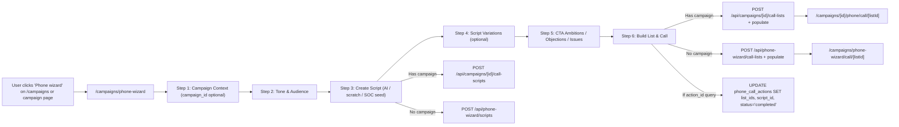
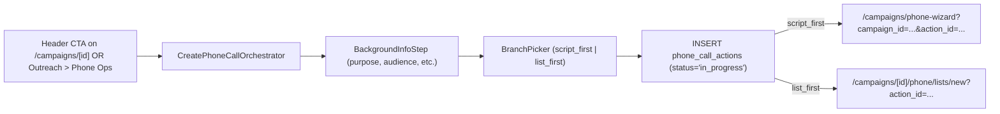
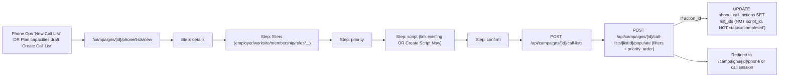
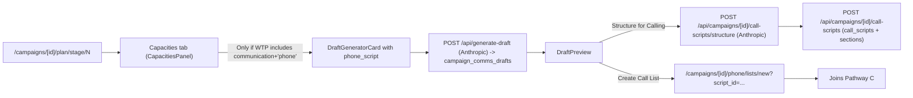
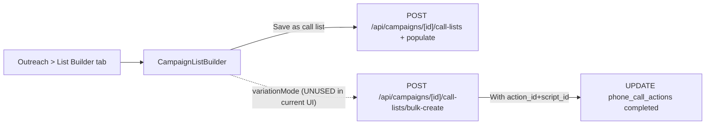
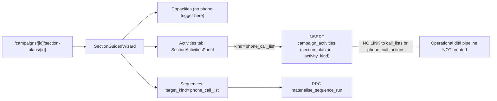
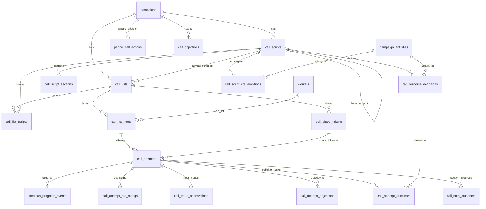

# Phone Call Features — Full Review & Drift Audit

> Generated: May 2026.
> Scope: `apps/organising-db/`. Citations use repo-relative file paths.
> No section plan, employer-matching, or scraper code creates phone calls; details below.

This is a research/audit deliverable. The companion documents are:

- [`docs/PHONE_CALL_REMEDIATION_PLAN.md`](PHONE_CALL_REMEDIATION_PLAN.md) — prioritised remediation workstream for the issues called out in §7.
- [`docs/PHONE_CALL_OUTCOME_SPLIT_BRAIN_DEEPDIVE.md`](PHONE_CALL_OUTCOME_SPLIT_BRAIN_DEEPDIVE.md) — deep dive on the highest-severity issue (§7.1).

---

## 1. Executive summary

There is **one** multi-step end-user wizard (`PhoneWizardSteps`) but **six distinct phone-call creation pathways** that all eventually write to overlapping tables (`phone_call_actions`, `call_lists`, `call_list_items`, `call_scripts`, `call_script_sections`). The most serious issues are:

- **Forked API namespaces** (`/api/phone-wizard/*` vs `/api/campaigns/[id]/*`) running in parallel against the **same tables** with `campaign_id` either null or set. The same UI component (`PhoneWizardSteps`) silently switches namespaces based on whether a campaign is selected, creating two parallel worlds.
- **Schema-vs-runtime drift on outcomes**. `call_attempt_outcomes` and `apply_call_outcome_side_effects` are still wired in the UI (`page.tsx` builds `outcome_entries`) but the **current** `record_call_attempt` RPC and the API handlers no longer accept or persist them. The newer `call_attempt_cta_ratings` path partly replaces them, but legacy code/views still reference the old path.
- **Stale generated DB types**. `packages/db-types/generated.ts` is missing share tokens, `call_attempt_cta_ratings`, claim columns, and `activity_id` on `call_script_cta_ambitions` — TypeScript safety is compromised.
- **`phone_call_actions` lifecycle is incomplete on the list-first path**. `lists/new` only updates `list_ids`; only the script-first path can mark the action `completed`. The action_id orchestration is fragile.
- **The "Section Plan" pathway does not actually create call lists, items, or attempts.** Section activities of kind `phone_call_list` only insert metadata rows in `campaign_activities` (no operational artifacts) — this is a real gap, not a duplicate.
- **Campaign-plan-capacities path is indirect**. It only triggers phone creation when WTP "Communication" rows mention "phone"; otherwise capacities never see phone at all.
- **Two near-duplicate call session UIs** (`phone/call/[listId]` vs `phone-wizard/call/[listId]`) hitting forked APIs.
- **Dead/unwired code**: `CampaignListBuilder` variation bulk-create (`variationMode`), some action_id linkage paths, and template-customise prompt mismatch (system prompt says "email" but is invoked for `phone_script`).

---

## 2. Definitions (cited)

- **Campaign Plan** = the P2W stage planner anchored on `campaign_stage_plans`. UI: [`apps/organising-db/src/components/campaigns/campaign-plan-panel.tsx`](../apps/organising-db/src/components/campaigns/campaign-plan-panel.tsx) and [`apps/organising-db/src/app/(dashboard)/campaigns/[id]/plan/stage/[stageNumber]/page.tsx`](../apps/organising-db/src/app/%28dashboard%29/campaigns/%5Bid%5D/plan/stage/%5BstageNumber%5D/page.tsx).
- **Capacities** = rows in `plan_capacities`. **Stage capacities** have `plan_id`; **Section capacities** have `section_plan_id` and `plan_id: null`.
- **Section Plan** = `section_plans` row. A time-bounded slice of campaign work (a sibling of the P2W stage plan). UI in [`apps/organising-db/src/components/campaigns/section-planning/SectionGuidedWizard.tsx`](../apps/organising-db/src/components/campaigns/section-planning/SectionGuidedWizard.tsx).
- **Phone Wizard** = the only multi-step phone wizard, [`apps/organising-db/src/components/campaigns/phone-wizard/PhoneWizardSteps.tsx`](../apps/organising-db/src/components/campaigns/phone-wizard/PhoneWizardSteps.tsx) (~1,500 lines, 6 steps).
- **CreatePhoneCallOrchestrator** = a 2-step **dialog**, not a wizard. It inserts a `phone_call_actions` row and routes to script-first or list-first paths. [`apps/organising-db/src/components/phone/CreatePhoneCallOrchestrator.tsx`](../apps/organising-db/src/components/phone/CreatePhoneCallOrchestrator.tsx).
- **`phone_call_actions`** = orchestration **session** table; not the dialing record. Tracks: `script_id`, `list_ids[]` (no FK), `entry_branch`, `status`. Defined in [`supabase/migrations/20260522100000_phone_call_actions.sql`](../supabase/migrations/20260522100000_phone_call_actions.sql) (21–41).

> **Correction to the user's premise**: There is **only one** multi-step phone-call wizard (`PhoneWizardSteps`). `CreatePhoneCallOrchestrator` is a thin dialog/router. They are not two competing wizards in the same sense.

---

## 3. Six phone-call creation pathways (workflow charts)

### Pathway A — `/campaigns/phone-wizard` (global Phone Wizard)

### Pathway B — `CreatePhoneCallOrchestrator` (dialog → routes to A or C)

### Pathway C — `/campaigns/[id]/phone/lists/new` (campaign mini-wizard)

### Pathway D — Campaign Plan capacities → Comms drafts → Call list

### Pathway E — `CampaignListBuilder` "Save as call list" (Outreach List Builder tab)

> The variation/`actionId`/`scriptId` props on `CampaignListBuilder` are **never passed** by `campaign-comms-section.tsx`. This is dead UX wiring.

### Pathway F — Section Plan "Phone call list" activity (PLANNING ONLY)

> **Critical finding**: Section plan capacities do **not** create call lists. The "Phone call list" activity kind only writes to `campaign_activities` — there is **no bridge** to `call_lists`, `call_list_items`, or `phone_call_actions`. `SectionActivitiesPanel.tsx` lines 205–208 explicitly tell users events are attached "elsewhere in the app".

---

## 4. Full feature & function inventory

### 4.1 User-facing pages

- `/campaigns/phone-wizard` — global wizard (Pathway A)
- `/campaigns/phone-wizard/call/[listId]` — wizard-scoped dialer
- `/campaigns/[id]` — header CTA (Pathway B); Outreach tab → `InlinePhoneOpsPanel`
- `/campaigns/[id]/phone` — phone hub (lists, scripts)
- `/campaigns/[id]/phone/lists/new` — campaign list mini-wizard (Pathway C)
- `/campaigns/[id]/phone/lists/[listId]` — list detail
- `/campaigns/[id]/phone/call/[listId]` — campaign-scoped dialer (`CallWizardPage`)
- `/campaigns/[id]/phone/scripts/[scriptId]` — script editor
- `/call/[token]` — public share-link dialer

### 4.2 Components (`src/components/phone/`)

- **Authoring**: `CallScriptEditor`, `ScriptVariationsPanel`, `setup/CallCtaAmbitionsEditor`, `setup/ObjectionsEditor`, `setup/IssueIdentificationEditor`, `CallOutcomeEditor`
- **Runtime in-call**: `CallSessionView`, `ScriptSidePanel`, `ConversationStepper`, `DialOutcomeBar`, `CtaRatingsPanel`, `InCallObjectionsPanel`, `InCallIssuesPanel`, `CallbackScheduler`, `ContactCard`, `WorkerEditDialog`
- **Orchestration**: `CreatePhoneCallOrchestrator`, `orchestrator/BackgroundInfoStep`, `orchestrator/BranchPicker`, `orchestrator/ResumeBanner`
- **Linking**: `LinkScriptToListDialog`, `LinkListToScriptDialog`, `CallListLinkedScripts`
- **Reporting**: `CallCampaignReporting`, `CallActionReport`
- **Inline ops**: `InlinePhoneOpsPanel`

### 4.3 Library helpers (`src/lib/phone/`)

- `priority-scoring.ts` — `computePriorityScore`, `PriorityOrder`
- `disposition-types.ts` — UI constants (dial/call dispositions, CTA, support levels, sections)
- `membership-outcomes.ts` — outcome partitioning helpers
- `cta-ambition-check.ts` — gating for "finalise call" from CTA ratings
- `call-flow-state.ts` — in-call reducer (phase machine)

### 4.4 Share-link helpers (`src/lib/campaign/`)

- `call-share-api.ts` — token resolve, `enrichCallListItem`, audit events
- `call-share-session.ts` — HMAC cookie session (NOT a DB table)

---

## 5. AI integrations (Anthropic Claude Sonnet 4 — `claude-sonnet-4-20250514` everywhere)

| # | Endpoint | Purpose | Triggered from |
|---|---|---|---|
| 1 | `POST /api/generate-draft` | Generate phone script body via `buildPhoneScriptPrompt` (SOC-aware) | Phone wizard `handleAIGenerate`, `ScriptVariationsPanel`, `DraftGeneratorCard` |
| 2 | `POST /api/soc-wizard/derive-artifact` (`artifact_kind='phone_script'`) | SOC session → phone draft (writes `campaign_comms_drafts`) | SOC wizard export |
| 3 | `POST /api/campaigns/[id]/call-scripts/structure` | Flat script → SOC-aligned `call_script_sections` JSON | "Structure for calling" buttons |
| 4 | `POST /api/phone-wizard/translate-ambitions` | Campaign ambitions → per-call recordable outcomes | `CallOutcomeEditor` (auto-on-load) |
| 5 | `POST /api/templates/customise` | Adapt template to WTP — **system prompt says "email"** but called for `phone_script` too | `DraftGeneratorCard` |
| 6 | `POST /api/templates/analyse` | Classify template platform (can return `phone_script`) | Templates UI |

**No real-time call assistance, transcription, or audio-summary AI exists.** `packages/employer-matching` is rule-based (Levenshtein), not AI, and is not used for call lists.

**AI duplication / inconsistency findings:**

- Two paths produce a phone script from "structured content" (#1 with `template_examples` vs #2). They share `buildPhoneScriptPrompt` but layer different `custom_instructions`.
- Variation-generation `custom_instructions` differ slightly between `PhoneWizardSteps` and `ScriptVariationsPanel` ("reference template" vs "reference script").
- `templates/customise` prompt says "email template" but is invoked for `phone_script` — output quality risk.
- `ai_model_used` strings recorded inconsistently: `'claude-sonnet'`, `'template-customised'`, vs full `'claude-sonnet-4-20250514'`.
- `translate-ambitions` lives under `/api/phone-wizard/*` even though it is shared by campaign flows — namespace is misleading.

---

## 6. Data model

### 6.1 Canonical tables

| Table | Role | Key FKs |
|---|---|---|
| `call_scripts` | Script header | `campaign_id` (nullable), `draft_id`, `base_script_id` (variation→base) |
| `call_script_sections` | SOC-style sections | `script_id` |
| `call_lists` | A dialing list | `campaign_id` (nullable), `script_id` (denormalized current wave) |
| `call_list_scripts` | **M:N** list↔script with `is_current`/`wave_label` | (`list_id`,`script_id`) |
| `call_list_items` | Worker on a list (+ share-claim cols later) | `list_id`, `worker_id` |
| `call_attempts` | One dial record (+ share-token cols later) | `list_item_id`, `script_id`, `caller_user_id` |
| `call_step_outcomes` | Per-section progress per attempt | `attempt_id`, `section_id` |
| `call_outcome_definitions` | Configurable outcome catalog | `script_id`, `maps_to_ambition_id`, `activity_id` |
| `call_attempt_outcomes` | Per-attempt outcome ticks (LEGACY-ish) | `(attempt_id, outcome_id)` |
| `call_objections` / `call_attempt_objections` | Objection bank + per-attempt | `campaign_id`, `attempt_id` |
| `call_issue_observations` | Per-attempt issue + heat | `attempt_id`, `worker_id` |
| `call_script_cta_ambitions` | Per-script CTA targets | `script_id`, `outcome_definition_id`, `activity_id` |
| `call_attempt_cta_ratings` | Per-(attempt, CTA) audit row (NEWER) | `attempt_id`, ambition_id |
| `phone_call_actions` | Wizard orchestration session | `campaign_id`, `script_id`, `list_ids` (array, **no FK**) |
| `call_share_tokens` / `call_share_form_events` | Public dial links | `list_id`, `issued_by` |
| `ambition_progress_events` / view `ambition_progress_phone_calls` | Phone-sourced progress | `ambition_id`, `attempt_id`, `outcome_id` |

### 6.2 ER diagram

### 6.3 TypeScript type files

- [`apps/organising-db/src/types/phone-call-action.ts`](../apps/organising-db/src/types/phone-call-action.ts) — DB orchestration row
- [`apps/organising-db/src/types/planner-types.ts`](../apps/organising-db/src/types/planner-types.ts) — main domain types (`CallScript`, `CallList`, `CallAttempt`, `CallOutcomeDefinition`, etc.)
- [`apps/organising-db/src/lib/phone/disposition-types.ts`](../apps/organising-db/src/lib/phone/disposition-types.ts) — UI constants
- [`apps/organising-db/src/lib/phone/call-flow-state.ts`](../apps/organising-db/src/lib/phone/call-flow-state.ts) — UI reducer (`CapturedObjection`, `CapturedIssue`)
- [`apps/organising-db/src/components/phone/setup/types.ts`](../apps/organising-db/src/components/phone/setup/types.ts) — `CallCtaAmbition`, editor shapes
- [`packages/db-types/generated.ts`](../packages/db-types/generated.ts) — Supabase generated (STALE — see §7)

---

## 7. Duplication, drift & compatibility issues (ranked)

### 7.1 SEVERE: Outcome model split-brain

- UI builds `outcome_entries` ([`apps/organising-db/src/app/(dashboard)/campaigns/[id]/phone/call/[listId]/page.tsx`](../apps/organising-db/src/app/%28dashboard%29/campaigns/%5Bid%5D/phone/call/%5BlistId%5D/page.tsx) lines 349–352).
- API does **not forward** them ([`apps/organising-db/src/app/api/campaigns/[id]/call-attempts/route.ts`](../apps/organising-db/src/app/api/campaigns/%5Bid%5D/call-attempts/route.ts) lines 22–38).
- Newest `record_call_attempt` (in [`supabase/migrations/20260610100000_call_share_tokens.sql`](../supabase/migrations/20260610100000_call_share_tokens.sql) lines 204–465) **does not insert** `call_attempt_outcomes` and **does not call** `apply_call_outcome_side_effects`.
- The newer `call_attempt_cta_ratings` path partially replaces this, but legacy reporting (`call_outcome_summary` view) still references the old path.

A full deep-dive on this issue is provided in [`docs/PHONE_CALL_OUTCOME_SPLIT_BRAIN_DEEPDIVE.md`](PHONE_CALL_OUTCOME_SPLIT_BRAIN_DEEPDIVE.md).

### 7.2 SEVERE: Stale generated types

[`packages/db-types/generated.ts`](../packages/db-types/generated.ts) is missing:

- `call_share_tokens`, `call_share_form_events`
- `call_attempt_cta_ratings`
- `activity_id` on `call_script_cta_ambitions` (line 2577–2589)
- Share columns on `call_attempts` (1736–1817)
- `claimed_*` columns on `call_list_items` (1962–1977)

This explains some `as never` casts in the orchestrator code.

### 7.3 HIGH: Forked API namespaces (same DB, different scopes)

| Wizard route | Campaign route | Same logic? |
|---|---|---|
| `GET/POST /api/phone-wizard/call-lists` | `GET/POST /api/campaigns/[id]/call-lists` | Near-identical PATCH allowed-fields list (`['name','description','status','script_id','priority_strategy']`); campaign variant adds `call_list_scripts` join + `source_filters` + `status:'draft'` default |
| `/api/phone-wizard/scripts` | `/api/campaigns/[id]/call-scripts` | Parallel; campaign variant adds `draft_id` linkage |
| `/api/phone-wizard/call-attempts` | `/api/campaigns/[id]/call-attempts` | **Identical RPC body** — pure duplication |
| Three `next` endpoints (wizard / campaign / share) | — | Wizard lacks `worker_campaign_connections` enrichment that campaign+share have; share uses RPC claim |
| `/.../populate` (wizard vs campaign) | — | Different contracts: wizard takes `worker_ids`; campaign takes `filters`+`priority_order` and computes `priority_score` |

### 7.4 HIGH: `phone_call_actions` lifecycle gaps

- Created only by `CreatePhoneCallOrchestrator` (Pathway B).
- Updated correctly by Phone Wizard (sets `list_ids`, `script_id`, `status='completed'`).
- `lists/new` only sets `list_ids` — never marks `completed` (gap when user enters via list_first branch).
- `bulk-create` updates correctly, but is not exposed in current UI (dead code path).
- `list_ids` has **no FK** — orphans possible if lists are deleted.

### 7.5 HIGH: Section plan ↔ phone disconnect

Section plans have a `phone_call_list` activity kind but **no bridge** writes to `call_lists`/`phone_call_actions`. Sequences with `target_activity_kind='phone_call_list'` materialise via `materialise_sequence_run` RPC but the UI does not link this to the operational phone hub. This is a **planning silo**.

### 7.6 MEDIUM: Type duplication and drift

- `CapturedObjection` (`call-flow-state.ts` 5–10) vs `CapturedObjectionPayload` (`planner-types.ts` 663–668)
- `CapturedIssue` vs `CapturedIssuePayload`
- `CtaTargetResponse` (setup/types.ts 11) vs `CtaResponse` (planner-types.ts 484) vs DB CHECK constraint
- `CallOutcomeDefinition` in planner-types.ts (585–604) **omits `activity_id`** present in DB
- `CallOutcomeSummary.campaign_id` typed non-null while DB allows null

### 7.7 MEDIUM: AI prompt mismatches

- `templates/customise` system prompt says "email template" but is invoked for `phone_script` ([`apps/organising-db/src/app/api/templates/customise/route.ts`](../apps/organising-db/src/app/api/templates/customise/route.ts) lines 10–38).
- `ai_model_used` recorded inconsistently across writers.
- Variation-generation custom instructions diverge slightly between PhoneWizard step and ScriptVariationsPanel.

### 7.8 MEDIUM: Two call session UIs

- [`apps/organising-db/src/app/(dashboard)/campaigns/[id]/phone/call/[listId]/page.tsx`](../apps/organising-db/src/app/%28dashboard%29/campaigns/%5Bid%5D/phone/call/%5BlistId%5D/page.tsx) (campaign APIs)
- [`apps/organising-db/src/app/(dashboard)/campaigns/phone-wizard/call/[listId]/page.tsx`](../apps/organising-db/src/app/%28dashboard%29/campaigns/phone-wizard/call/%5BlistId%5D/page.tsx) (wizard APIs)

Both deliver the same UX; maintenance is doubled and divergence is already visible (campaign version enriches with `worker_campaign_connections`).

### 7.9 LOW: Reporting joins use `call_lists.script_id` only

Views `call_section_funnel` and `vw_call_action_report` join via `cl.script_id` (the current wave) and lose history when waves change. `call_attempts.script_id` is recorded per attempt but views ignore it.

### 7.10 LOW: Naming overload

- `phone_call_actions` (DB orchestration row) vs `CallFlowAction` (UI reducer event) — same word, unrelated types.
- `CallWizardPage` is the in-call session, not the multi-step wizard.
- `CreatePhoneCallOrchestrator` ≠ a wizard, despite "create" in the name.

---

## 8. Connection to campaign management structures

| Surface | Direct phone link? | Mechanism |
|---|---|---|
| Campaign hub (`/campaigns/[id]`) | Yes | Header CTA → orchestrator (Pathway B); Outreach tab → `InlinePhoneOpsPanel` |
| Campaign Plan (P2W stage) | Indirect | Capacities only via WTP "communication" with text matching "phone" → drafts → list (Pathway D) |
| Section Plan | **No operational link** | Activity kind `phone_call_list` writes only to `campaign_activities` (Pathway F is metadata-only) |
| Outreach > Comms tab | Yes | `CampaignSendPanel` "Structure for Calling" + `DraftPreview` "Create Call List" |
| Outreach > List Builder | Partial | "Save as call list" works; variation/action_id wiring is dead (Pathway E) |
| Standalone | Yes | `/campaigns/phone-wizard` from global nav (Pathway A without campaign context — creates orphan rows) |

---

## 9. Recommendations (high-level)

These are documented as a workstream in [`docs/PHONE_CALL_REMEDIATION_PLAN.md`](PHONE_CALL_REMEDIATION_PLAN.md).

1. **Decide one source of truth for "phone call action lifecycle"**. Make `phone_call_actions` the canonical orchestration record and either (a) require it for all paths, or (b) remove it entirely. Currently it is half-required.
2. **Consolidate API namespaces**. Either unify under `/api/campaigns/[id]/...` with `null`-campaign support, or unify under `/api/call-*/...` and treat campaign as a filter. Eliminate the duplicate `call-attempts` route.
3. **Resolve the outcome split-brain**. Pick `call_attempt_cta_ratings` as canonical, deprecate `call_attempt_outcomes` + `apply_call_outcome_side_effects`, and update views + UI accordingly.
4. **Regenerate `db-types/generated.ts`**. Refresh from current schema; eliminate `as never` casts.
5. **Bridge Section Plan → operational phone**. Add a "create call list from this activity" action that writes to `call_lists` with `section_plan_id` (or back-link via `campaign_activities.section_plan_id`).
6. **Unify the two call session UIs** into one parameterised component.
7. **Fix `templates/customise` prompt** to be platform-aware, or split into per-platform endpoints.
8. **Standardise `ai_model_used`** to a single constant.
9. **Add FK + cascade** to `phone_call_actions.list_ids` (or replace array with a join table).
10. **Either wire or delete** `CampaignListBuilder` variation/`actionId`/`scriptId` props.
11. **Update reporting views** to join on `call_attempts.script_id` rather than `call_lists.script_id` for historical accuracy.

---

## 10. Migration file index (cited)

- [`supabase/migrations/20260414200000_phone_call_operations.sql`](../supabase/migrations/20260414200000_phone_call_operations.sql) — base tables, `record_call_attempt` v1, views
- `20260415100000_phone_wizard_standalone.sql` — nullable `campaign_id` on scripts/lists
- `20260416200000_call_outcome_to_assessment.sql` — `call_attempt_outcomes`, `activity_id`, `call_outcome_summary`
- `20260416300000_outcome_response_types.sql` — JSON outcomes in RPC
- `20260417100000_harmonise_phone_pathways.sql` — `base_script_id`, `ambition_progress_events`, side effects fn
- `20260418120000_call_outcomes_member_pending.sql` — `set_membership_pending` side effect
- `20260424120000_update_record_call_attempt_for_phase.sql` — last RPC version that writes outcomes
- `20260428100000_call_outcome_explicit_rating.sql` — explicit rating columns
- `20260430120000_call_list_scripts.sql` — M:N + sync trigger
- `20260522100000_phone_call_actions.sql` — orchestration table, RPC reshape
- `20260607130000_activity_section_link_and_sequences.sql` — `section_plan_id` on activities, `phone_call_list` in sequences
- `20260609100000_cta_assessment_linkage_and_call_ratings.sql` — `call_attempt_cta_ratings`, `activity_id` on CTA ambitions
- `20260610100000_call_share_tokens.sql` — share tokens, claims, **final** `record_call_attempt` (drops outcome insert)

---

## 11. Methodology

This audit was produced by dispatching five parallel research agents over the codebase:

1. **Pathway-mapping agent** — identified every wizard, dialog, and route that creates phone artifacts.
2. **Schema agent** — read every relevant migration in `supabase/migrations/` and every TypeScript type file.
3. **AI integration agent** — found every Anthropic call site touching phone scripts.
4. **Campaign/Section integration agent** — followed code from `Capacities` and `SectionGuidedWizard` to phone artifacts.
5. **API catalog agent** — inventoried every route under `api/phone-wizard`, `api/campaigns/[id]/call-*`, `api/campaigns/[id]/phone`, and `api/call-share`.

Findings were cross-checked across agents. All concrete claims include file paths and (where present) line numbers.
