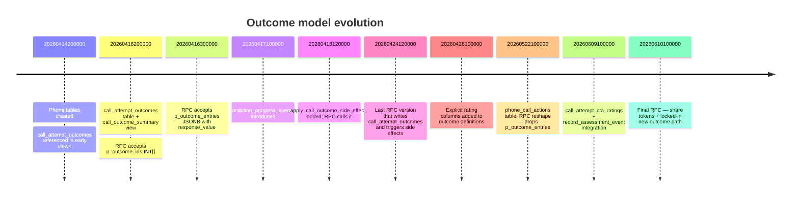

# Deep Dive — Phone Call Outcome Model "Split-Brain" (§7.1)

> Companion to [`docs/PHONE_CALL_AUDIT.md`](PHONE_CALL_AUDIT.md) and [`docs/PHONE_CALL_REMEDIATION_PLAN.md`](PHONE_CALL_REMEDIATION_PLAN.md).
> Generated: May 2026.
> **Resolved in Phase D (May 2026)**: `outcome_entries` has been removed from all UI and API layers. Calls now record a single `outcome_classification` string on `call_attempts` (e.g. `agreed_to_join`, `interested_undecided`, `declined`) plus per-CTA `call_attempt_cta_ratings` rows. The legacy `call_attempt_outcomes` table was archived as `_archive_call_attempt_outcomes_20260613`. The generic `set_worker_union_membership_pending` RPC handles membership transitions from any channel.

> **Unified across surfaces (May 2026 mobile-dialer rebuild)**:
> `outcome_classification` is now derived from the same single source of
> truth (`apps/organising-db/src/lib/phone/outcome-model.ts`,
> `deriveOutcomeClassification`) by every dialer surface — the mobile
> share-link flow, the desktop `CallSessionPage`, and the share-side
> API route. The migration
> [`supabase/migrations/20260624100000_outcome_classification_in_record_call_attempt.sql`](../supabase/migrations/20260624100000_outcome_classification_in_record_call_attempt.sql)
> added a `p_outcome_classification` parameter to `record_call_attempt`,
> and both the staff (`/api/calls/attempts`) and share
> (`/api/call-share/[token]/attempt`) routes pass it through. Vitest
> coverage for the derivation logic lives in
> `apps/organising-db/src/lib/phone/__tests__/outcome-model.test.ts`.

This document explains in detail the **single most damaging issue** in the phone-call subsystem: there are two different models for "what was the outcome of this call?", they are simultaneously active in different layers of the stack, and they silently disagree with each other — meaning some user input is being discarded and some reporting tables are stale.

---

## TL;DR

- The **call session UI** (the screen organisers actually click during a call) builds an `outcome_entries[]` payload from the `checkedOutcomes` checkboxes, and sends it to the API.
- The **API route** does not include `outcome_entries` in the RPC call.
- The **current `record_call_attempt` RPC** does not accept an `outcome_entries` parameter at all.
- The **previous `record_call_attempt` RPC** did accept it, inserted into `call_attempt_outcomes`, computed a derived rating for `campaign_activity_ratings`, and triggered membership side effects via `apply_call_outcome_side_effects`.
- The **`call_outcome_summary` view**, still in the schema, still joins via `call_attempt_outcomes` — so any reporting that uses it now returns stale or zero data for new attempts.
- A **newer path** (`call_attempt_cta_ratings` + `record_assessment_event`) replaces some — **but not all** — of the lost functionality.

The net effect: organisers tick outcome checkboxes during a call, those ticks travel through three layers, and **at no layer are they persisted**. Membership side effects (e.g. setting workers to `member_pending` after a positive join outcome) are no longer triggered. Reporting that reads `call_outcome_summary` shows yesterday's numbers forever.

---

## 1. Code & data evidence

### 1.1 UI: `outcome_entries` is built and sent

```349:352:apps/organising-db/src/app/(dashboard)/campaigns/[id]/phone/call/[listId]/page.tsx
      step_outcomes: flowState.dialDisposition === 'connected' ? stepOutcomes : [],
      outcome_entries: flowState.dialDisposition === 'connected'
        ? [...checkedOutcomes.entries()].map(([id, val]) => ({ outcome_id: id, response_value: val }))
        : [],
```

The same code is present at line 349–351 of the **wizard-scoped** call page ([`apps/organising-db/src/app/(dashboard)/campaigns/phone-wizard/call/[listId]/page.tsx`](../apps/organising-db/src/app/%28dashboard%29/campaigns/phone-wizard/call/%5BlistId%5D/page.tsx)).

The `RecordCallAttemptRequest` type still **declares** `outcome_entries`:

```697:697:apps/organising-db/src/types/planner-types.ts
  outcome_entries?: OutcomeEntry[]
```

The share-link validation schema accepts `outcome_entries`:

```27:27:apps/organising-db/src/lib/validation/call-share.ts
  outcome_entries: z.array(z.record(z.string(), z.unknown())).optional(),
```

So at the UI layer, `outcome_entries` is a first-class concept and is populated from a checkbox grid (`checkedOutcomes` Map) rendered in lines 196–245 of the call page.

### 1.2 API routes silently drop `outcome_entries`

The campaign API route enumerates exactly which fields it forwards to the RPC and **does not include `outcome_entries`**:

```22:38:apps/organising-db/src/app/api/campaigns/[id]/call-attempts/route.ts
    const { data, error } = await supabase.rpc('record_call_attempt', {
      p_list_item_id: body.list_item_id,
      p_script_id: body.script_id || null,
      p_caller_user_id: user.id,
      p_dial_disposition: body.dial_disposition,
      p_call_disposition: body.call_disposition || null,
      p_overall_notes: body.overall_notes || null,
      p_callback_datetime: body.callback_datetime || null,
      p_support_level: body.support_level_assessed || null,
      p_follow_up_action: body.follow_up_action || null,
      p_cta_response: body.cta_response || null,
      p_duration_seconds: body.duration_seconds || null,
      p_step_outcomes: body.step_outcomes || [],
      p_objections: body.objections && body.objections.length > 0 ? JSON.stringify(body.objections) : '[]',
      p_issues: body.issues && body.issues.length > 0 ? JSON.stringify(body.issues) : '[]',
      p_cta_ratings: body.cta_ratings && body.cta_ratings.length > 0 ? JSON.stringify(body.cta_ratings) : '[]',
    })
```

The wizard variant ([`apps/organising-db/src/app/api/phone-wizard/call-attempts/route.ts`](../apps/organising-db/src/app/api/phone-wizard/call-attempts/route.ts)) and the share variant ([`apps/organising-db/src/app/api/call-share/[token]/attempt/route.ts`](../apps/organising-db/src/app/api/call-share/%5Btoken%5D/attempt/route.ts) lines 46–66) are identical in this respect: they all build the same parameter set and **all silently drop `outcome_entries`**.

### 1.3 The current RPC has no `p_outcome_entries`

The signature declared in the most recent migration:

```204:223:supabase/migrations/20260610100000_call_share_tokens.sql
CREATE OR REPLACE FUNCTION record_call_attempt(
  p_list_item_id INTEGER,
  p_script_id INTEGER,
  p_caller_user_id UUID,
  p_dial_disposition VARCHAR(30),
  p_call_disposition VARCHAR(30) DEFAULT NULL,
  p_overall_notes TEXT DEFAULT NULL,
  p_callback_datetime TIMESTAMPTZ DEFAULT NULL,
  p_support_level VARCHAR(30) DEFAULT NULL,
  p_follow_up_action TEXT DEFAULT NULL,
  p_cta_response VARCHAR(20) DEFAULT NULL,
  p_duration_seconds INTEGER DEFAULT NULL,
  p_step_outcomes JSONB DEFAULT '[]',
  p_objections JSONB DEFAULT '[]'::JSONB,
  p_issues JSONB DEFAULT '[]'::JSONB,
  p_cta_ratings JSONB DEFAULT '[]'::JSONB,
  p_share_token_id INTEGER DEFAULT NULL,
  p_caller_leader_worker_id INTEGER DEFAULT NULL,
  p_caller_session_label TEXT DEFAULT NULL,
  p_caller_session_worker_id INTEGER DEFAULT NULL
)
```

Critically: **`p_outcome_entries` is gone**. The body of the function (lines 257–465) inserts into `call_attempts`, `call_step_outcomes`, `call_attempt_objections`, `call_attempt_cta_ratings` (with `record_assessment_event`), and `call_issue_observations`. It does **not** insert into `call_attempt_outcomes` and does **not** call `apply_call_outcome_side_effects`.

### 1.4 The previous RPC did

```110:196:supabase/migrations/20260424120000_update_record_call_attempt_for_phase.sql
  -- 2b. Process outcome entries (JSONB format with response_value)
  IF jsonb_array_length(p_outcome_entries) > 0 THEN
    FOR v_entry IN SELECT * FROM jsonb_array_elements(p_outcome_entries)
    LOOP
      v_outcome_id := (v_entry->>'outcome_id')::INTEGER;
      v_response_value := v_entry->>'response_value';

      INSERT INTO call_attempt_outcomes (attempt_id, outcome_id, response_value)
      VALUES (v_attempt_id, v_outcome_id, v_response_value)
      ON CONFLICT (attempt_id, outcome_id) DO UPDATE SET response_value = EXCLUDED.response_value;
      ...
    END LOOP;
  ...
  END IF;
  ...
  -- 2e. Membership / ambition side effects
  PERFORM apply_call_outcome_side_effects(v_attempt_id, v_worker_id, v_campaign_id);
```

So the path **used to be**: UI → API → RPC → `call_attempt_outcomes` + `campaign_activity_ratings` (composite) + side effects.

The new RPC (in the `20260522100000_phone_call_actions.sql` migration and refined in `20260610100000_call_share_tokens.sql`) replaced this with a different mechanism — but **the API routes and the UI were never updated to match**. The result is the split-brain.

### 1.5 The new path: `call_attempt_cta_ratings`

The newer migration introduces a more granular per-CTA rating table:

```50:66:supabase/migrations/20260609100000_cta_assessment_linkage_and_call_ratings.sql
CREATE TABLE IF NOT EXISTS call_attempt_cta_ratings (
  cta_rating_id BIGSERIAL PRIMARY KEY,
  attempt_id INTEGER NOT NULL REFERENCES call_attempts(attempt_id) ON DELETE CASCADE,
  cta_ambition_id INTEGER NOT NULL REFERENCES call_script_cta_ambitions(id) ON DELETE CASCADE,
  activity_id INTEGER REFERENCES campaign_activities(activity_id) ON DELETE SET NULL,
  worker_id INTEGER NOT NULL REFERENCES workers(worker_id) ON DELETE CASCADE,
  rating SMALLINT CHECK (rating IS NULL OR rating BETWEEN 1 AND 5),
  binary_value VARCHAR(30),
  notes TEXT,
  created_at TIMESTAMPTZ NOT NULL DEFAULT now(),
  created_by UUID REFERENCES auth.users(id) ON DELETE SET NULL,
  CONSTRAINT chk_cacr_rating_or_binary
    CHECK (rating IS NOT NULL OR binary_value IS NOT NULL),
  CONSTRAINT cacr_attempt_ambition_uq UNIQUE (attempt_id, cta_ambition_id)
);
```

And the current RPC writes to it and propagates ratings to assessment activities:

```405:433:supabase/migrations/20260610100000_call_share_tokens.sql
    INSERT INTO call_attempt_cta_ratings (
      attempt_id, cta_ambition_id, activity_id, worker_id,
      rating, binary_value, notes, created_by
    ) VALUES (
      v_attempt_id, v_ambition_id, v_ambition_activity_id, v_worker_id,
      v_cta_rating, v_cta_binary, v_cta_notes, p_caller_user_id
    )
    ON CONFLICT (attempt_id, cta_ambition_id) DO UPDATE SET
      ...

    IF v_ambition_activity_id IS NOT NULL THEN
      PERFORM record_assessment_event(
        p_activity_id   := v_ambition_activity_id,
        p_worker_id     := v_worker_id,
        p_rating        := v_cta_rating,
        p_binary_value  := v_cta_binary,
        p_rating_phase  := 'actual',
        p_event_id      := v_attempt_id,
        p_source        := 'call_outcome',
        p_notes         := v_cta_notes,
        p_actor_id      := p_caller_user_id
      );
    END IF;
```

This is a richer model: per-CTA ratings (1–5 or binary) per attempt, with optional propagation into the wall-chart via `record_assessment_event`. It is also **a strict superset of what most outcome ticks were used for** — except for membership side effects.

### 1.6 The legacy reporting view still exists

```51:67:supabase/migrations/20260416200000_call_outcome_to_assessment.sql
CREATE OR REPLACE VIEW call_outcome_summary AS
SELECT
  cod.outcome_id,
  cod.campaign_id,
  cod.script_id,
  cod.name,
  cod.outcome_category,
  cod.maps_to_ambition_id,
  cod.is_positive,
  COUNT(cao.attempt_id) AS times_recorded,
  COUNT(DISTINCT ca.list_item_id) AS unique_contacts,
  COUNT(DISTINCT ca.attempt_id) FILTER (WHERE ca.dial_disposition = 'connected') AS connected_attempts_with_outcome
FROM call_outcome_definitions cod
LEFT JOIN call_attempt_outcomes cao ON cao.outcome_id = cod.outcome_id
LEFT JOIN call_attempts ca ON ca.attempt_id = cao.attempt_id
GROUP BY cod.outcome_id, cod.campaign_id, cod.script_id, cod.name,
         cod.outcome_category, cod.maps_to_ambition_id, cod.is_positive;
```

Because the new RPC writes nothing to `call_attempt_outcomes`, this view's counts are **frozen at the moment the new RPC went live**. Anyone reading from it sees only historical data.

### 1.7 The `apply_call_outcome_side_effects` function still exists, with no caller

```19:54:supabase/migrations/20260418120000_call_outcomes_member_pending.sql
CREATE OR REPLACE FUNCTION apply_call_outcome_side_effects(
  p_attempt_id INTEGER,
  p_worker_id INTEGER,
  p_campaign_id INTEGER
) RETURNS void
...
  FOR v_row IN
    SELECT
      cao.outcome_id,
      cao.response_value,
      cod.side_effect,
      ...
    FROM call_attempt_outcomes cao
    JOIN call_outcome_definitions cod ON cod.outcome_id = cao.outcome_id
    WHERE cao.attempt_id = p_attempt_id
      AND cod.side_effect = 'set_membership_pending'
  LOOP
    ...
```

The function reads from `call_attempt_outcomes`. Even if some other path called it, there are no rows to read because the RPC stopped writing them. The membership-pending automation is therefore **fully broken**: an organiser ticking "agreed to join" sets nothing in the database.

### 1.8 The setup-side editor still defines outcomes

The setup editor `CallOutcomeEditor` ([`apps/organising-db/src/components/phone/CallOutcomeEditor.tsx`](../apps/organising-db/src/components/phone/CallOutcomeEditor.tsx)) still calls `/api/phone-wizard/translate-ambitions` (Anthropic) to draft outcome definitions, and the resulting rows are written to `call_outcome_definitions`. Those definitions are then **rendered as checkboxes** by the call session UI — the very checkboxes whose ticks are then dropped on the floor.

The bug is therefore not "the UI is showing the wrong thing"; the UI is **doing exactly what it was built for**, and the back-end has moved underneath it.

---

## 2. Migration timeline (chronological)



The "split-brain" cutoff is between `20260424120000` (RPC still wrote outcomes) and `20260522100000` (RPC stopped). The UI and API routes were not touched at the cutoff.

---

## 3. Functional impact (what is actually broken)

| Capability (previous) | Status today |
|---|---|
| Tick "agreed to join" during a call → worker becomes `member_pending` | **Broken silently** |
| Tick "interested in delegate role" → maps to ambition progress | **Broken silently** |
| Outcome counts on `call_outcome_summary` view | **Frozen** at cutoff, no growth |
| Composite rating into `campaign_activity_ratings` from outcome ticks | **No longer written** by phone path |
| Per-CTA rating (1–5 or binary) into `call_attempt_cta_ratings` | **Working** (new path) |
| Per-CTA rating into `campaign_activity_ratings` via `record_assessment_event` | **Working** (new path, only if `activity_id` set on `call_script_cta_ambitions`) |
| Step outcomes (per-section progress) | **Working** |
| Objections / Issues | **Working** |

The two surviving capabilities (CTA ratings + step outcomes) cover the **rating** part of the old outcome model but not the **side-effect** part. The "set membership pending" automation has no equivalent in the new path.

---

## 4. Decision matrix — what to do

There are three coherent ways out. Each is internally consistent; the worst option is to leave the current state.

### Option A — Adopt CTA ratings as canonical (RECOMMENDED)

Drop `call_attempt_outcomes` + `apply_call_outcome_side_effects`. Move all "what did the worker agree to?" semantics to `call_attempt_cta_ratings` (per-CTA, with optional `activity_id` linking to assessment activities). For membership side effects, add a new mechanism: either a trigger on `call_attempt_cta_ratings` that mutates `worker_campaign_connections` / membership status when specific CTA ambitions are positively rated, or a new SQL function called from the RPC.

**Pros**

- Aligns code with the direction the schema has already moved.
- One outcome model, not two.
- Per-CTA granularity is a real product win — admin can see which CTAs are converting.

**Cons**

- Membership-pending automation must be rebuilt against the new path.
- `call_outcome_definitions` and `CallOutcomeEditor` must be deprecated or repurposed (see §1.5 of the remediation plan).
- Existing `call_outcome_summary` consumers must migrate.

**Effort**: 4–5 eng-days (Phase 1 of the remediation plan).

### Option B — Resurrect the legacy outcome path

Reintroduce `p_outcome_entries` to the RPC, restore the inserts into `call_attempt_outcomes`, and keep `apply_call_outcome_side_effects` wired. CTA ratings stay alongside as a complementary feature.

**Pros**

- UI stops sending data to /dev/null today.
- Membership side effects work again.

**Cons**

- Two outcome models continue to coexist (CTA ratings AND legacy outcomes).
- Reporting must reconcile both.
- The schema direction (toward CTA ratings) is rolled back.
- Likely the worst option long-term.

**Effort**: 2 eng-days for the RPC, but unbounded for keeping two models in sync forever.

### Option C — Drop both and use only step outcomes + dispositions

Keep `call_attempts.dial_disposition` / `call_disposition` as the only "outcome" of a call. Treat CTA ratings as the only structured per-outcome capture. Delete `call_outcome_definitions` and `call_attempt_outcomes` entirely. Remove the checkbox grid from the UI.

**Pros**

- Simplest model.
- No silent drops; what you see is what you write.

**Cons**

- Loses the "configurable outcome catalogue per script" feature.
- May not be acceptable to product if organisers are using the checkboxes.

**Effort**: 5–6 eng-days plus a product conversation.

### Recommendation

**Option A.** It matches the direction the database has already taken, retains feature richness, and the membership side-effect rebuild is small if implemented as a trigger or a follow-up function call inside the RPC.

---

## 5. Sequencing for Option A

This expands [Phase 1 of the remediation plan](PHONE_CALL_REMEDIATION_PLAN.md#phase-1--resolve-outcome-model-split-brain-71--severe).

### Step 1 — Audit existing `call_outcome_definitions` rows

| Action | Detail |
|---|---|
| Query | `SELECT script_id, name, outcome_category, side_effect, maps_to_ambition_id, activity_id, response_type FROM call_outcome_definitions ORDER BY script_id;` |
| Goal | Understand the full set of "outcomes" that currently exist. For each, determine whether the equivalent CTA ambition exists or needs to be added. |
| Output | A spreadsheet with columns: outcome → equivalent CTA ambition (or "needs creation") → semantic mapping (rating? binary?) |

### Step 2 — Build the membership-pending replacement

| Action | Detail |
|---|---|
| Migration | New file `<TS>_membership_pending_from_cta.sql` |
| Trigger or function | `CREATE TRIGGER trg_cta_rating_membership_pending AFTER INSERT OR UPDATE ON call_attempt_cta_ratings ...` that sets `worker.membership_status = 'member_pending'` when `cta_ambition.activity_id` matches a known "join" assessment AND the rating/binary value indicates agreement. |
| Acceptance | A test attempt with `binary_value='joined'` on a "join union" CTA correctly transitions a non-financial worker to `member_pending`. |

### Step 3 — Migrate setup-side editor

| Action | Detail |
|---|---|
| Files | [`apps/organising-db/src/components/phone/CallOutcomeEditor.tsx`](../apps/organising-db/src/components/phone/CallOutcomeEditor.tsx) (existing legacy editor), [`apps/organising-db/src/components/phone/setup/CallCtaAmbitionsEditor.tsx`](../apps/organising-db/src/components/phone/setup/CallCtaAmbitionsEditor.tsx) (new path editor) |
| Action | One-time sync: for each `call_outcome_definitions` row, create or attach a `call_script_cta_ambitions` row with the appropriate `activity_id`. Then remove `CallOutcomeEditor` from any user-reachable surface. |

### Step 4 — Stop emitting `outcome_entries` from the call UI

| Files | Both call session pages, the `RecordCallAttemptRequest` type, the share validation schema |
| Action | Remove the outcome checkbox grid from the in-call UI (or convert it to render CTA ratings). Remove `outcome_entries` from `RecordCallAttemptRequest` and from `shareAttemptSchema`. |
| Acceptance | TypeScript no longer permits `outcome_entries`; network requests don't include the field. |

### Step 5 — Snapshot and deprecate legacy tables

| Action | Detail |
|---|---|
| Snapshot | `CREATE TABLE _archive_call_attempt_outcomes_<DATE> AS SELECT * FROM call_attempt_outcomes;` |
| Deprecate | Add comment marking `apply_call_outcome_side_effects` as deprecated; remove call sites (already none, but search). |
| View | Either rebuild `call_outcome_summary` to read from `call_attempt_cta_ratings`, or drop it after auditing dashboards. |
| Final | After ≥1 release with no growth in `call_attempt_outcomes`, drop the table and the function. |

### Step 6 — Acceptance tests

| Test | Expected |
|---|---|
| Connected call with CTA rating | `call_attempt_cta_ratings` row created; `campaign_activity_ratings` updated if `activity_id` set |
| Connected call with positive "join" CTA | Worker membership transitions to `member_pending` |
| Connected call with no CTA filled | No `call_attempt_cta_ratings` row created (no false positives) |
| `record_call_attempt` with `outcome_entries` field in body | Field is ignored (no error) — graceful tolerance during transition |
| `call_outcome_summary` view (if retained) | Either rebuilt against new path or marked deprecated |

---

## 6. Risk register

| Risk | Likelihood | Mitigation |
|---|---|---|
| Some campaigns rely on outcome checkboxes that have no CTA equivalent | Medium | Step 1 audit catches this. Create CTA equivalents before deprecation. |
| Membership-pending trigger has bugs and corrupts membership state | Low | Wrap in a feature flag; trigger on a copy table first; smoke test in staging. |
| Reporting consumers depend on `call_outcome_summary` | Medium | Inventory dashboards before dropping. Provide a 1:1 view rebuilt against `call_attempt_cta_ratings` if needed. |
| Organiser muscle memory expects the checkbox grid | Medium | UX change requires comms with organising team and a rollout plan. |
| External integrations (if any) write to `call_attempt_outcomes` | Low | Audit; if found, deprecate with explicit migration support. |

---

## 7. Quick-win partial mitigation (≤1 day)

If full Phase 1 is not yet scheduled, ship a small partial fix immediately to **stop the silent data loss**:

1. Remove the `outcome_entries` field from the API request body type so TypeScript flags any code that tries to send it.
2. Remove the checkbox grid from the in-call UI (lines 196–245 of both call pages).
3. Add a comment in [`apps/organising-db/src/types/planner-types.ts`](../apps/organising-db/src/types/planner-types.ts) line 697 marking `outcome_entries` as deprecated and explaining why.

This buys time while the full Option A workstream is scheduled, and prevents organisers from believing their input is being recorded.

---

## 8. Summary

The split-brain is not a subtle inconsistency — it is a **silent data loss path** in production. UI captures intent, the API discards it, the database has no place to receive it, the reporting view is frozen. The fix is straightforward but touches UI, API, RPC, schema, and reporting; it should be sequenced as Phase 1 of the remediation plan with the membership-pending trigger as the only new code worth careful design.

The deep underlying lesson: when migrating an RPC signature, **the call sites must be migrated in the same change set**, or a deprecation gate added in the database (e.g. `RAISE NOTICE 'outcome_entries was passed but is no longer supported'`) so the dropped data is at least visible in logs. The current state is the textbook failure mode of a multi-layer schema migration without a coordinated client update.
