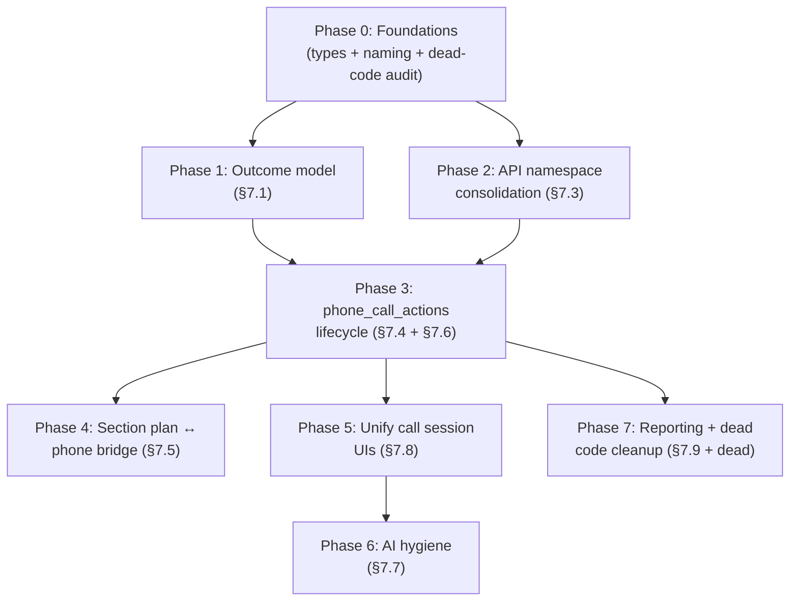

# Phone Call Features — Remediation Plan

> Companion to [`docs/PHONE_CALL_AUDIT.md`](PHONE_CALL_AUDIT.md). Sequenced workstream that resolves the §7 issues in dependency order.
> Generated: May 2026.

This is a **scoping document** — no code is changed by adopting this plan. Each phase lists its goal, work items, files affected, acceptance criteria, risk, and rough effort. Sign-off is recommended at the end of each phase before starting the next.

---

## Phasing rationale

Drift in phone-call code is **layered**: stale generated types break TypeScript safety on every other change, the outcome split-brain corrupts data integrity, the namespace fork blocks consolidation of UI and orchestration, and section-plan/UI duplication can only be resolved once the back-end is consistent. The phases respect that dependency order.

---

## Phase 0 — Foundations (1–2 days)

**Goal**: Restore TypeScript safety and remove obvious dead code/naming noise so subsequent phases can refactor without false positives.

### 0.1 Regenerate Supabase types (§7.2)

| Item | Detail |
|---|---|
| Files | [`packages/db-types/generated.ts`](../packages/db-types/generated.ts), all `*.ts` files using `as never` casts on phone tables |
| Action | Run Supabase type generation against the latest live schema: `supabase gen types typescript --project-id <id> > packages/db-types/generated.ts` |
| Sweep | Search and remove `as never` casts on `phone_call_actions`, `call_share_tokens`, `call_attempt_cta_ratings`, `call_list_items.claimed_*`, `call_attempts.share_*`, `call_script_cta_ambitions.activity_id` |
| Acceptance | `pnpm tsc --noEmit` passes with no `as never` casts remaining for these tables; new tables appear in `Database['public']['Tables']` |
| Risk | New strict types may surface previously hidden type errors. Triage and fix or `// @ts-expect-error` with a tracking ticket. |
| Effort | 4–8 hours including triage |

### 0.2 Dead-code audit (parts of §7.10 + dead wiring)

| Item | Detail |
|---|---|
| Action | Decide whether to **wire** or **delete** the unused props on `CampaignListBuilder` (`variationMode`, `actionId`, `scriptId`). No current call site passes them. |
| Files | [`apps/organising-db/src/components/campaigns/campaign-list-builder.tsx`](../apps/organising-db/src/components/campaigns/campaign-list-builder.tsx), [`apps/organising-db/src/components/campaigns/campaign-comms-section.tsx`](../apps/organising-db/src/components/campaigns/campaign-comms-section.tsx), [`apps/organising-db/src/app/api/campaigns/[id]/call-lists/bulk-create/route.ts`](../apps/organising-db/src/app/api/campaigns/%5Bid%5D/call-lists/bulk-create/route.ts) |
| Acceptance | Either Pathway E variation flow is reachable from the UI, OR the props and bulk-create handler branch are removed. No half-wired props remain. |
| Risk | If the bulk-create endpoint has external callers, a `git log` + `rg` review of consumers must precede deletion. |
| Effort | 2–4 hours to investigate, 2–8 hours to wire (if chosen) |

### 0.3 Naming clarification (§7.10)

| Item | Detail |
|---|---|
| Rename targets | `CallWizardPage` (not a wizard, it's the in-call session) → `CallSessionPage`. `CreatePhoneCallOrchestrator` → keep name but document it is a dialog router, not a wizard. `CallFlowAction` (UI reducer) → `CallFlowEvent` to avoid collision with `phone_call_actions`. |
| Acceptance | New names match function; doc-comment at top of `CreatePhoneCallOrchestrator.tsx` clarifies role; references in `docs/` updated. |
| Risk | Pure rename (low risk if done with project-wide find/replace via TS rename refactor). |
| Effort | 2 hours |

**Phase 0 exit gate**: `pnpm tsc --noEmit` passes; dead-code decision made; naming sweep merged.

---

## Phase 1 — Resolve outcome model split-brain (§7.1) — SEVERE

**Goal**: Pick a single canonical outcome storage path and make UI, API, RPC, and reporting agree.

> A full deep-dive of this issue (root cause, migration timeline, code/data evidence, and decision matrix) is in [`docs/PHONE_CALL_OUTCOME_SPLIT_BRAIN_DEEPDIVE.md`](PHONE_CALL_OUTCOME_SPLIT_BRAIN_DEEPDIVE.md). The deep-dive recommends **Option A: adopt `call_attempt_cta_ratings` + `record_assessment_event` as canonical** and deprecate `call_attempt_outcomes` + `apply_call_outcome_side_effects`. The phase below assumes that decision; revisit if Product chooses otherwise.

### 1.1 Confirm canonical model (decision artifact)

| Item | Detail |
|---|---|
| Action | Product/engineering sign-off on the canonical outcome model. Document the decision in `docs/PHONE_CALL_OUTCOME_SPLIT_BRAIN_DEEPDIVE.md` "Decision" section. |
| Acceptance | Decision recorded with rationale, owner, and date. |
| Effort | 1 meeting + 1 hour of writeup |

### 1.2 Stop emitting `outcome_entries` from the in-call UI

| Files | [`apps/organising-db/src/app/(dashboard)/campaigns/[id]/phone/call/[listId]/page.tsx`](../apps/organising-db/src/app/%28dashboard%29/campaigns/%5Bid%5D/phone/call/%5BlistId%5D/page.tsx) (lines 349–352), [`apps/organising-db/src/app/(dashboard)/campaigns/phone-wizard/call/[listId]/page.tsx`](../apps/organising-db/src/app/%28dashboard%29/campaigns/phone-wizard/call/%5BlistId%5D/page.tsx) |
| Action | Remove the `outcome_entries` field from the request body. Replace any UI that depends on outcome ticks with the equivalent CTA ratings flow (`CtaRatingsPanel`). |
| Acceptance | Network tab shows no `outcome_entries` field on `record_call_attempt` requests. CTA ratings round-trip correctly via `call_attempt_cta_ratings`. |
| Risk | Hidden side-effect: outcome ticks may be the only place a caller reports certain things (e.g. "agreed to email follow-up"). Audit all current `call_outcome_definitions.side_effect` rows and ensure equivalents exist via CTA ambitions. |
| Effort | 1 day |

### 1.3 Remove the `p_outcome_entries` parameter from RPC clients

| Files | [`apps/organising-db/src/app/api/campaigns/[id]/call-attempts/route.ts`](../apps/organising-db/src/app/api/campaigns/%5Bid%5D/call-attempts/route.ts), [`apps/organising-db/src/app/api/phone-wizard/call-attempts/route.ts`](../apps/organising-db/src/app/api/phone-wizard/call-attempts/route.ts), [`apps/organising-db/src/app/api/call-share/[token]/attempt/route.ts`](../apps/organising-db/src/app/api/call-share/%5Btoken%5D/attempt/route.ts) |
| Action | Remove any references to outcome entries in route handlers. Update the request schema (zod) to disallow them. |
| Acceptance | `record_call_attempt` is invoked with only the parameters it accepts; request validation rejects extra outcome fields. |
| Effort | 2 hours |

### 1.4 Deprecate legacy tables in the database

| Item | Detail |
|---|---|
| Migration | New migration file `supabase/migrations/<TS>_deprecate_call_attempt_outcomes.sql` |
| Action | (1) Create a snapshot table or export of `call_attempt_outcomes` (audit trail). (2) Mark `apply_call_outcome_side_effects` as `DEPRECATED` in a comment and remove invocations. (3) Plan a follow-up migration to `DROP TABLE call_attempt_outcomes` after a release window. (4) Drop or replace the `call_outcome_summary` view if no consumer remains. |
| Acceptance | Production data exported, no new writes to `call_attempt_outcomes`, view either rebuilt against `call_attempt_cta_ratings` or marked deprecated. |
| Risk | Reporting consumers may rely on `call_outcome_summary`. Inventory dashboards before dropping. |
| Effort | 1–2 days |

### 1.5 Update `CallOutcomeEditor` to define CTA ambitions only

| Files | [`apps/organising-db/src/components/phone/CallOutcomeEditor.tsx`](../apps/organising-db/src/components/phone/CallOutcomeEditor.tsx), [`apps/organising-db/src/components/phone/setup/CallCtaAmbitionsEditor.tsx`](../apps/organising-db/src/components/phone/setup/CallCtaAmbitionsEditor.tsx) |
| Action | Either fold `CallOutcomeEditor` into `CallCtaAmbitionsEditor` or repurpose it to manage `call_script_cta_ambitions` directly. The two should not coexist as separate "outcome" editors. |
| Acceptance | One editor surface; `call_outcome_definitions` writes are gated to admin-only or removed entirely. |
| Effort | 1 day |

**Phase 1 exit gate**: All `record_call_attempt` calls succeed without `outcome_entries`; CTA ratings reconcile to ambitions; production data audit shows no growth in `call_attempt_outcomes` for ≥1 release.

---

## Phase 2 — API namespace consolidation (§7.3) — HIGH

**Goal**: One canonical set of phone-call API routes; the `/api/phone-wizard/*` namespace is either folded into campaign routes (with nullable campaign) or kept only for genuinely standalone behaviour.

### 2.1 Decide the consolidation target

Two viable shapes:

- **Option A (recommended)**: Single namespace `/api/calls/*` (e.g. `/api/calls/lists`, `/api/calls/lists/[id]/next`, `/api/calls/attempts`). Campaign filter passed as query (`?campaign_id=`) or body. The `/api/campaigns/[id]/call-*` routes become thin proxies for the duration of the deprecation window.
- **Option B**: Make `/api/campaigns/[id]/call-*` accept `[id]=null` (e.g. via `/api/campaigns/standalone/call-*`). Less migration churn but keeps "campaign" in the URL semantics for non-campaign artifacts.

| Acceptance | One option chosen and documented. |
| Effort | 1 design doc, 0.5 day |

### 2.2 Implement chosen namespace

| Files (Option A) | New `apps/organising-db/src/app/api/calls/...` routes; mark old `phone-wizard/*` and campaign-scoped variants as deprecated; both forward to new handlers. |
| Acceptance | New endpoints exist, return identical payloads to current callers, and pass smoke tests. Old endpoints log deprecation warnings. |
| Risk | Auth model differs between wizard (user-owned, `created_by`) and campaign (campaign membership). The new route must accept both authorisation modes. |
| Effort | 3–5 days |

### 2.3 Migrate UI clients

| Files | [`apps/organising-db/src/components/campaigns/phone-wizard/PhoneWizardSteps.tsx`](../apps/organising-db/src/components/campaigns/phone-wizard/PhoneWizardSteps.tsx), [`apps/organising-db/src/lib/hooks/useCallList.ts`](../apps/organising-db/src/lib/hooks/useCallList.ts), [`apps/organising-db/src/lib/hooks/useCallScripts.ts`](../apps/organising-db/src/lib/hooks/useCallScripts.ts), [`apps/organising-db/src/lib/hooks/useCallSession.ts`](../apps/organising-db/src/lib/hooks/useCallSession.ts), all phone components |
| Action | Replace `state.campaignId ? '/api/campaigns/...' : '/api/phone-wizard/...'` switches with a single endpoint call. |
| Acceptance | No conditional URL construction remains in phone client code. |
| Effort | 1–2 days |

### 2.4 Delete the `call-attempts` duplicate

`/api/phone-wizard/call-attempts` and `/api/campaigns/[id]/call-attempts` are byte-equivalent. Once UI uses the consolidated route, delete both.

### 2.5 Reconcile the three `next` endpoints

The campaign and share variants enrich with `worker_campaign_connections`; the wizard variant does not. After consolidation, every `next` response should include the same enrichment shape (move helper into `lib/campaign/call-share-api.ts`'s `enrichCallListItem`).

**Phase 2 exit gate**: One namespace handles all phone API traffic; deprecation period ≥1 release; old routes deleted.

---

## Phase 3 — `phone_call_actions` lifecycle (§7.4 + §7.6) — HIGH

**Goal**: Decide whether `phone_call_actions` is required, optional, or removed; make the lifecycle complete on every pathway.

### 3.1 Decide the action lifecycle

| Option | Description | Recommendation |
|---|---|---|
| Require | Every phone-call creation must produce a `phone_call_actions` row first | Strongest orchestration but biggest UX impact (need to enter orchestrator dialog every time) |
| Optional | Action row only created via orchestrator; non-orchestrator paths leave it null | Status quo, fragile |
| Remove | Drop the table; rely on `call_lists` + `call_scripts` joined on `(campaign_id, created_at)` to reconstruct sessions | Cleanest if no UX/reporting depends on the row |

The deep-dive recommends **Optional but ALWAYS-COMPLETE on the list-first path**: do not require the orchestrator entry, but if `action_id` is passed, every consumer must update `script_id`, `list_ids`, and `status='completed'` correctly.

### 3.2 Fix `lists/new` to update full action lifecycle

| Files | [`apps/organising-db/src/app/(dashboard)/campaigns/[id]/phone/lists/new/page.tsx`](../apps/organising-db/src/app/%28dashboard%29/campaigns/%5Bid%5D/phone/lists/new/page.tsx) lines 342–349 |
| Action | When `action_id` is in query and a list+script combination exists, update `phone_call_actions` with `list_ids`, `script_id`, `status='completed'` (matching wizard behaviour at `PhoneWizardSteps.tsx` 1423–1439). |
| Acceptance | Completing the list-first path closes the orchestration row identically to the script-first path. |
| Effort | 4 hours |

### 3.3 Replace `list_ids` array with FK join table

| Migration | New migration `<TS>_phone_call_action_lists.sql` |
| Action | Create `phone_call_action_lists (action_id FK, list_id FK, position int, PRIMARY KEY (action_id, list_id))`. Migrate data from `phone_call_actions.list_ids[]`. Update consumers. |
| Acceptance | No more orphan list IDs; cascade delete works correctly. |
| Risk | UI updates needed; small data migration. |
| Effort | 1 day |

### 3.4 Type alignment (§7.6)

| Files | [`apps/organising-db/src/types/planner-types.ts`](../apps/organising-db/src/types/planner-types.ts), [`apps/organising-db/src/lib/phone/call-flow-state.ts`](../apps/organising-db/src/lib/phone/call-flow-state.ts), [`apps/organising-db/src/components/phone/setup/types.ts`](../apps/organising-db/src/components/phone/setup/types.ts) |
| Action | Collapse duplicate types: one `CapturedObjection`, one `CapturedIssue`, one `CtaResponse`. Add `activity_id` to `CallOutcomeDefinition`. Make `CallOutcomeSummary.campaign_id` nullable. |
| Acceptance | One canonical type per concept; `pnpm tsc --noEmit` clean. |
| Effort | 4 hours |

**Phase 3 exit gate**: Action row is consistent across all entry pathways; no array-FKs; types match DB.

---

## Phase 4 — Section plan ↔ phone bridge (§7.5) — HIGH

**Goal**: A section plan that includes a `phone_call_list` activity must produce a real `call_lists` row when the user wants to act on it.

### 4.1 Decide the bridge model

| Option | Description |
|---|---|
| Auto-create | When a `phone_call_list` activity is added to a section plan, immediately create a draft `call_lists` row linked via `campaign_activities.section_plan_id` |
| Lazy | Add a "Create call list from this activity" button on `SectionActivitiesPanel` that materialises the list on demand |
| Hybrid | Lazy by default; sequence materialisation auto-creates |

Recommendation: **Lazy** — keeps planning lightweight; one explicit user action creates operational artifacts. Sequences should still be able to auto-materialise via the same RPC path.

### 4.2 Implement the bridge

| Files | [`apps/organising-db/src/components/campaigns/section-planning/SectionActivitiesPanel.tsx`](../apps/organising-db/src/components/campaigns/section-planning/SectionActivitiesPanel.tsx), new RPC `create_call_list_from_activity(p_activity_id)` |
| Schema | Add `call_lists.section_plan_id` (nullable FK), or rely on join through `campaign_activities`. The deep-dive recommends adding the column directly for simpler queries. |
| Action | Button in the section plan activity row → calls RPC → navigates to `/campaigns/[id]/phone/lists/[listId]` |
| Acceptance | Clicking the button on a `phone_call_list` activity creates a list, item-populates from a sensible default filter (workers in the section), and links back to the activity. |
| Effort | 2–3 days |

### 4.3 Wire `materialise_sequence_run` to actually create lists

| File | The `materialise_sequence_run` SQL function (location to confirm). |
| Action | When the function targets a `phone_call_list` activity, it should call the bridge RPC rather than only inserting `campaign_activities` rows. |
| Acceptance | Sequence execution produces operational call lists, observable on `/campaigns/[id]/phone`. |
| Risk | This RPC drives multiple activity kinds; changes require regression testing of email/SMS materialisation too. |
| Effort | 1 day + testing |

**Phase 4 exit gate**: Section plans are no longer a phone silo; users can move from planning to dialling without reentering data.

---

## Phase 5 — Unify call session UIs (§7.8) — MEDIUM

**Goal**: One in-call component, parameterised by source (campaign/wizard/share).

### 5.1 Extract the shared call session

| Files | [`apps/organising-db/src/app/(dashboard)/campaigns/[id]/phone/call/[listId]/page.tsx`](../apps/organising-db/src/app/%28dashboard%29/campaigns/%5Bid%5D/phone/call/%5BlistId%5D/page.tsx), [`apps/organising-db/src/app/(dashboard)/campaigns/phone-wizard/call/[listId]/page.tsx`](../apps/organising-db/src/app/%28dashboard%29/campaigns/phone-wizard/call/%5BlistId%5D/page.tsx), [`apps/organising-db/src/components/phone/CallSessionView.tsx`](../apps/organising-db/src/components/phone/CallSessionView.tsx) |
| Action | Refactor: page-level files become thin wrappers that pass an `apiAdapter` to `CallSessionView`. The adapter has methods `next()`, `recordAttempt()`, `release()`, etc. Three adapters: campaign, wizard (deprecated post-Phase 2), share. |
| Acceptance | Single component renders all three flows; visual regression suite passes. |
| Effort | 2–3 days |

### 5.2 Delete the wizard-scoped dialer route

After Phase 2 collapses APIs and Phase 5.1 unifies the UI, `/campaigns/phone-wizard/call/[listId]` becomes a redirect to `/campaigns/[id]/phone/call/[listId]` (or the consolidated equivalent).

**Phase 5 exit gate**: One in-call code path; tested across all three sources.

---

## Phase 6 — AI hygiene (§7.7) — MEDIUM

### 6.1 Fix the `templates/customise` prompt

| File | [`apps/organising-db/src/app/api/templates/customise/route.ts`](../apps/organising-db/src/app/api/templates/customise/route.ts) lines 10–38 |
| Action | Make the system prompt platform-aware. Either branch on `platform` or split into `customise-email`, `customise-sms`, `customise-phone-script`. |
| Acceptance | Phone script customisation produces phone-appropriate output; smoke test compares before/after on a real template. |
| Effort | 4 hours |

### 6.2 Standardise `ai_model_used` constant

| Action | Centralise the model identifier (e.g. `lib/ai/models.ts` exporting `PHONE_SCRIPT_MODEL = 'claude-sonnet-4-20250514'`). Replace literal strings (`'claude-sonnet'`, `'template-customised'`) with the constant or with a `tag` field that documents the prompt source separately. |
| Acceptance | Reporting on `ai_model_used` returns clean histograms. |
| Effort | 2 hours |

### 6.3 Reconcile variation `custom_instructions`

| Files | [`apps/organising-db/src/components/campaigns/phone-wizard/PhoneWizardSteps.tsx`](../apps/organising-db/src/components/campaigns/phone-wizard/PhoneWizardSteps.tsx) lines 702–742, [`apps/organising-db/src/components/phone/ScriptVariationsPanel.tsx`](../apps/organising-db/src/components/phone/ScriptVariationsPanel.tsx) lines 123–158 |
| Action | Extract the variation prompt builder into `lib/prompts/draft-prompts.ts` (e.g. `buildVariationInstructions`). Both call sites consume it. |
| Acceptance | Single function, single wording, no drift. |
| Effort | 2 hours |

### 6.4 Move `translate-ambitions` out of the `phone-wizard` namespace

After Phase 2, this route should live under the consolidated namespace (e.g. `/api/calls/translate-ambitions` or `/api/ai/translate-ambitions`). Update [`apps/organising-db/src/components/phone/CallOutcomeEditor.tsx`](../apps/organising-db/src/components/phone/CallOutcomeEditor.tsx) lines 151–168.

**Phase 6 exit gate**: AI-touching code is consistent and platform-aware; reporting is clean.

---

## Phase 7 — Reporting + final cleanup (§7.9 + dead code)

### 7.1 Update reporting views

| Files | [`supabase/migrations/<TS>_phone_reporting_per_attempt_script.sql`](#) (new) |
| Action | Rebuild `call_section_funnel` and `vw_call_action_report` to join via `call_attempts.script_id` (per-attempt) instead of `call_lists.script_id` (current wave). Provide a "current wave only" filter for legacy dashboards. |
| Acceptance | Reports correctly attribute attempts to the script in use at the time, even when waves have changed. |
| Effort | 0.5–1 day |

### 7.2 Final dead-code sweep

| Action | After Phase 0–6 land, run a final pass: any `phone-wizard/*` references in UI? Any unused exports in `lib/phone/`? Any zombie components? |
| Tools | `pnpm dlx knip`, `rg "phone-wizard"`, manual review |
| Acceptance | No dead exports remain. |

### 7.3 Documentation refresh

| Files | [`docs/PHONE_CALL_AUDIT.md`](PHONE_CALL_AUDIT.md), `apps/organising-db/README.md`, any internal Notion equivalent |
| Action | Update audit to reflect post-remediation state. Note canonical pathways in README. Add deprecation notes for any remaining migrate-only paths. |
| Effort | 4 hours |

---

## Cross-cutting concerns

### Test coverage

There is no comprehensive integration test suite around phone calling. Each phase should add at least:

- A unit test asserting the API contract for `record_call_attempt`.
- An E2E (Playwright/Cypress) test for the script-first pathway and the list-first pathway end-to-end.
- A smoke test for the share-link flow (especially `claim_next_call_list_item` lock behaviour).

Without these, regressions during refactor are likely.

### Data migration safety

Several phases drop or rewrite tables and views. **Do not skip the export step** in 1.4 and 3.3. Production data audit + a one-release deprecation window is the minimum.

### Rollback plan

Each phase should land behind a feature flag where possible (e.g. `enable_unified_call_api`, `enable_call_attempts_v2`). A flag flip is the rollback for client behaviour; database changes need explicit reverse migrations.

---

## Effort summary (rough)

| Phase | Effort (eng-days) | Severity addressed |
|---|---|---|
| 0 — Foundations | 2 | §7.2, §7.10 |
| 1 — Outcome model | 4–5 | §7.1 |
| 2 — API namespace | 5–8 | §7.3 |
| 3 — Action lifecycle | 2–3 | §7.4, §7.6 |
| 4 — Section plan bridge | 3–4 | §7.5 |
| 5 — Unified UI | 2–3 | §7.8 |
| 6 — AI hygiene | 1 | §7.7 |
| 7 — Reporting + cleanup | 1–2 | §7.9 + dead code |
| **Total** | **20–28** | All §7 issues |

This excludes design review meetings, QA, and any production data migration windows.

---

## Sign-off checklist

- [ ] Phase 0 — types regenerated, dead code resolved, naming sweep merged
- [ ] Phase 1 — outcome model decision, UI/API/RPC aligned, legacy tables snapshotted
- [ ] Phase 2 — single API namespace live; old routes deprecated
- [ ] Phase 3 — `phone_call_actions` lifecycle complete; `list_ids` replaced with FK
- [ ] Phase 4 — section plan → call list bridge live
- [ ] Phase 5 — single in-call component
- [ ] Phase 6 — AI prompts platform-aware; model constants centralised
- [ ] Phase 7 — reporting views fixed; final cleanup pass; docs updated

Ownership and dates to be filled in at planning time.
