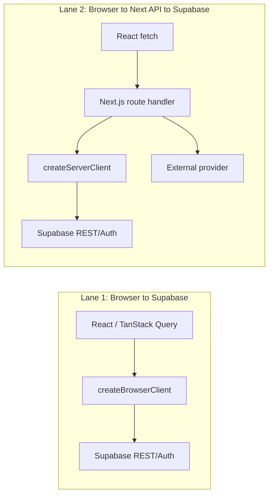

# Supabase Connection Issue Summary

> **Purpose:** One-file handoff summary of the recurring Supabase connection-loss work: context, diagnostics, relevant documents, attempted fixes, and current understanding.
>
> **Scope:** Supabase Auth/session persistence, client/server refresh behaviour, Next.js/Vercel routing, diagnostics, and user-facing connection-loss symptoms in `apps/organising-db`.
>
> **Last updated:** 2026-06-10.

---

## Executive Summary

The recurring "connection loss" reports were not a single Supabase outage. They were a cluster of related failure modes around Supabase Auth session refresh, browser sleep/background behaviour, Next.js SSR cookies, Vercel API routes, and React Query recovery.

The most important shift in understanding was that the visible symptom `lock_timeout` covered at least two different mechanisms:

1. **H7 auth-lock deadlock:** an orphaned in-tab `processLock` / auth-js lock state caused every later `getSession()` to wait indefinitely.
2. **H8 client-side token-refresh hang:** after a tab was idle/hidden, `getSession()` found a stale token and performed a blocking client-side refresh; that network refresh stalled after wake, even on a fresh client.

The initial fixes stopped the worst behaviour: users being forced to log out. Later diagnostics showed the app was still losing responsiveness because the recovery probe itself used `getSession()`, which re-triggered the same hanging client-side refresh.

The H8 design moved background refresh (visibility/heartbeat/query-cache) to the **server-side cookie refresh path** and stopped using client `getSession()` as a heartbeat probe.

**June 2026 follow-up (H9):** the user-facing recovery paths — the menu/banner "Refresh connection" button, the SIGNED_OUT recovery, and the pre-mutation guard — were never migrated and still ran the client-side `refreshSession()`/`getSession()` pipeline. The recovery tool itself therefore hung for ~27 s and failed in exactly the post-wake situations users clicked it (14 of 31 attempts failed in 10 days; worse on Edge, whose sleeping tabs stall the client network path after wake). Users escalated to manual sign-out — the recurring "return to login" pain. All remaining client-side refresh/rotation paths have now been removed (single-writer model completed), user-initiated recovery is server-first with a soft-reload escalation (cookies preserved, no logout), and `online`/`pageshow` listeners cover laptop-sleep wakes that fire no `visibilitychange`. See `SUPABASE_DROPOUT_INVESTIGATION.md` §N.

---

## Relevant Documents

Primary documents:

- [`docs/SUPABASE_DROPOUT_INVESTIGATION.md`](./SUPABASE_DROPOUT_INVESTIGATION.md) — main operational runbook, hypothesis labels, incident intake, diagnostics spec, and resolved H7/H8 incident notes.
- [`docs/NEXTJS_SUPABASE_VERCEL_TROUBLESHOOTING_REPORT.md`](./NEXTJS_SUPABASE_VERCEL_TROUBLESHOOTING_REPORT.md) — historical consolidated report covering Supabase Auth, Vercel API route hangs, RLS/client selection, and cross-subdomain cookies.

Related context:

- [`docs/REPO_ORIENTATION_AND_SAFETY_GAPS.md`](./REPO_ORIENTATION_AND_SAFETY_GAPS.md) — architecture overview and auth fragility notes.
- [`docs/DEVELOPMENT_WORKFLOW.md`](./DEVELOPMENT_WORKFLOW.md) — branch/deployment/Supabase project mapping. Important distinction: `main` maps to Vercel Production / Supabase PROD (`gteygwfgjvczanmrwgbr`), while `develop` maps to Vercel Preview / Supabase DEV (`dpnnmkhabysfdogllsyh`).
- [`docs/VERCEL_API_ROUTE_TIMEOUT_ISSUE.md`](./VERCEL_API_ROUTE_TIMEOUT_ISSUE.md), if present in the working tree — historical API route timeout/DNS/middleware investigation referenced by the main reports.

Useful code touchpoints:

- `apps/organising-db/src/lib/supabase/client.ts` — browser Supabase client, auth op timeout, `processLock`, server-refresh helper, known-expiry tracking.
- `apps/organising-db/src/lib/supabase/server.ts` — server component / route Supabase client.
- `apps/organising-db/src/lib/supabase/middleware.ts` — page-navigation cookie refresh.
- `apps/organising-db/src/lib/supabase/cookie-options.ts` — cookie domain and maxAge config.
- `apps/organising-db/src/lib/supabase/session-recovery.ts` — graduated recovery, hard logout, circuit breaker.
- `apps/organising-db/src/lib/supabase/connection-monitor.ts` — in-browser connection event log, Sentry breadcrumbs, PostHog event forwarding.
- `apps/organising-db/src/components/providers.tsx` — visibility handling, heartbeat, query-cache recovery.
- `apps/organising-db/src/lib/supabase/auth-context.tsx` — initial session load, auth state changes, user attribution.
- `apps/organising-db/src/app/api/auth/refresh/route.ts` — server-side session refresh endpoint added for H8.
- `apps/organising-db/src/lib/hooks/useAuthAwareMutation.ts` — pre-mutation session guard.
- `apps/organising-db/src/lib/api/fetch-api.ts` — bounded same-origin API fetch wrapper.

---

## Architecture Context

The app has two important request paths:

This distinction matters because Lane 1 and Lane 2 can fail independently:

- Lane 1 failures often show as Supabase REST/Auth errors, stale browser tokens, or auth-client lock hangs.
- Lane 2 failures can be Vercel route hangs, middleware/cookie issues, server `getUser()` failures, provider stalls, or RLS behaviour under a different JWT context.

The browser client intentionally has `autoRefreshToken: false` to avoid "Invalid Refresh Token: Already Used" races between multiple refresh consumers. That decision reduces one class of corruption but makes explicit refresh orchestration critical.

---

## Symptoms Seen

User-facing symptoms:

- "Connection issues detected" banner.
- Pages continuing to render but later queries/mutations silently failing or returning no data.
- Infinite loading spinners.
- Required manual refresh or "Full Reset" in earlier versions.
- Earlier versions sometimes forced logout or made the user reauthenticate.
- Safari login could hang with timeout/recovery popups.
- After later fixes, logout stopped but connection stalls remained after idle/hidden periods.

Console / diagnostic symptoms:

- `[connection-monitor] lock_timeout auth-op-timeout: getSession:heartbeat after 12000ms`
- `[lock_timeout] heartbeat-getSession-timeout (consecutive=1/2)`
- `[recovery_start] lock-deadlock (...)`
- `[recovery_end] client reset insufficient (...) — escalating to soft reload`
- `[network_error] auth init: refresh fallback also timed out`
- `ProcessLockAcquireTimeoutError` / `isAcquireTimeout` from auth-js in Safari-specific cases.
- `127.0.0.1:7485/ingest/... ERR_CONNECTION_REFUSED` from leftover debug instrumentation, later confirmed unrelated.
- `A listener indicated an asynchronous response... message channel closed`, attributed to a browser extension, not the app.

---

## Diagnostics Used

### In-App Diagnostics

- `connection-monitor.ts` keeps a rolling in-memory event log and emits browser console warnings.
- `ConnectionStatusBanner` exposes recent connection diagnostics to the user.
- Event types include:
  - `token_refresh_ok`
  - `token_refresh_fail`
  - `api_error`
  - `api_ok`
  - `visibility_change`
  - `session_lost`
  - `session_recovered`
  - `lock_timeout`
  - `lock_contended`
  - `network_error`
  - `recovery_start`
  - `recovery_end`
  - `deployment_mismatch`

### Sentry

Sentry was used to inspect grouped warning/error issues and session replay context.

Key findings from the investigation:

- Main issue: `[supabase-connection] lock_timeout`, Sentry issue `OFFSHORE_ALLIANCE-7`.
- Secondary issue: `[supabase-connection] network_error`, Sentry issue `OFFSHORE_ALLIANCE-H`.
- Lock timeout events were associated with `/campaigns/37?tab=workforce&sub=wall-chart`.
- Sentry showed user attribution after the PostHog/Sentry identify fix.
- Recent forced logout / `circuit_breaker` behaviour stopped after the H7 fixes.

### PostHog

PostHog receives `supabase_connection_event`.

Important discovery:

- Earlier PostHog forwarding silently no-oped because code looked for `window.posthog`; the npm `posthog-js` import did not populate that object. Fixing this made connection telemetry queryable.

Observed six-day breakdown during the June investigation:

- `lock_timeout`: high volume.
- `visibility_change`: frequent around incidents.
- `recovery_start` and `recovery_end`: recovery ladder firing often.
- `session_lost` and forced logout/circuit-breaker events stopped after the May fixes.
- Very few `lock_contended` events, which helped prove many `lock_timeout` events were not true lock contention.

### Supabase Auth Data

The refresh-token chain in `auth.refresh_tokens` was inspected for the affected user.

Key finding:

- There was a multi-hour gap between refreshes before an incident.
- Access-token lifetime was initially inferred to be roughly one hour. **Correction (2026-06-10): the dashboard setting was checked — access token expiry is 86400s (24 hours), matching the `cookie-options.ts` comment.** The H8 mechanism (stale token → blocking client-side refresh on wake) still applies, but only after longer idle gaps than first thought.
- The incident token was stale, so `getSession()` performed a blocking refresh.
- Server-side refresh path remained healthy, explaining why a full reload recovered.

### Auth-JS Internals

The installed `@supabase/auth-js` source was inspected.

Key behaviour:

- `getSession()` calls `__loadSession()`.
- If the token has more than `EXPIRY_MARGIN_MS` left, it returns from local storage/cookies.
- If the token is within the expiry margin, it calls `_callRefreshToken()`.
- `EXPIRY_MARGIN_MS = 3 * 30s = 90s`.
- Therefore `getSession()` is not a cheap heartbeat near token expiry; it can make a blocking network refresh call.

---

## Root-Cause Timeline

### Early Cluster: Session Refresh Races

Likely mechanisms:

- Multiple refresh consumers:
  - Supabase browser auto-refresh.
  - Middleware refresh.
  - Visibility handler.
  - Pre-mutation guard.
  - Manual recovery.
- Supabase refresh tokens are single-use.
- Concurrent refreshes could rotate/reuse a token and corrupt auth state.

Attempted/implemented mitigations:

- Disable browser `autoRefreshToken`.
- Centralize client refresh through `coordinatedRefreshSession()`.
- Add browser fetch timeout.
- Add auth operation timeout.
- Add robust logout / cookie cleanup.
- Add diagnostics.

### H7: Auth-Lock Deadlock

Mechanism:

- Browser timer throttling or backgrounding can orphan an auth operation.
- auth-js `processLock` / internal state can leave `lockAcquired = true`.
- Later `getSession()` calls take the re-entrant path and can wait forever.
- App-level dedupe promises stayed pinned to dead promises.

Evidence:

- Repeating `lock_timeout` every ~12s.
- No Supabase REST failure or 401/403.
- Heartbeat repeatedly joined a dead in-flight session promise.
- Full reset/logout previously cleared the state, which made it look like a session problem.

Fixes:

- Use `processLock` rather than default `navigator.locks`.
- Add zero-await `instrumentedLock` for `lock_contended` diagnostics.
- Ensure `coordinatedGetSession()` and `coordinatedRefreshSession()` unpin promises after timeout.
- Make `resetClient()` clear pinned promises.
- Stop forcing logout on pure auth op timeout.
- Add reset-then-soft-reload recovery ladder.
- Gate heartbeat while hidden.
- Quiet the UI for self-healing lock timeouts.
- Correctly detect `ProcessLockAcquireTimeoutError` with `isAcquireTimeout` / `isAuthLockTimeout`.
- Harden login to timeout-wrap sign-in, reset client, retry once, then show friendly message.

Result:

- Forced logout/circuit-breaker events stopped after these fixes.
- Users stayed signed in.
- However, stalls still occurred because the recovery probe still called client `getSession()`.

### H8: Client-Side Token-Refresh Hang

Mechanism:

- `autoRefreshToken: false` means hidden/idle tabs do not refresh in the background.
- After a hidden/idle period, the token is stale.
- The first client `getSession()` on wake detects stale/near-expiry token and calls `_callRefreshToken()`.
- That client-side network refresh stalls after wake / cold network.
- The app logs this as `auth-op-timeout: getSession... after 12000ms`.
- A fresh client still reads the same stale cookie and repeats the same hanging refresh.

Evidence:

- The recovery probe `getSession:lock-deadlock-recovery` timed out on a fresh client.
- Very few `lock_contended` events, so not primarily lock contention.
- Refresh-token history showed a stale token.
- Server-side refresh path continued to work; full page reload recovered through middleware.

Fixes:

- Add `POST /api/auth/refresh` server-side refresh endpoint.
- Add `refreshSessionViaServer()` with an 8s timeout and tagged results.
- Track known token expiry in `client.ts`.
- Visibility handler checks known expiry and refreshes via server when needed instead of calling client `getSession()`.
- Heartbeat checks known expiry and refreshes via server when needed instead of calling client `getSession()`.
- Recovery ladder is now server-first: `resetClient()` + server refresh, soft reload only if server path also fails.
- Auth init timeout fallback uses server refresh.
- Remove leftover `127.0.0.1:7485` debug fetches.

Expected result:

- Fewer `lock_timeout` events.
- More `token_refresh_ok` events with server-refresh details.
- No 24-second stall from 12s heartbeat timeout + 12s futile reset probe.
- Soft reload becomes rare and reserved for server-refresh failure.

### H9: Recovery Paths Left on the Client Pipeline (June 2026)

Mechanism:

- The H8 fix covered background refresh, but `recoverSessionConnection` (menu/banner "Refresh connection", SIGNED_OUT recovery) still ran client `refreshSession()` then `getSession()` — a guaranteed 12 s + 15 s hang after wake.
- `ensureValidSession` (pre-mutation guard) still called client `getSession()` and rotated tokens client-side, violating the single-writer model.
- `getSessionWithTimeout`'s timeout side-effect fired another client refresh, re-poisoning the lock.
- A laptop-sleep wake with the tab visible fires no `visibilitychange`, so the visibility refresh never ran in that scenario; Edge's sleeping tabs / efficiency mode make the post-wake client network stall more frequent and longer.

Evidence:

- PostHog: `recovery_start menu-hard-refresh` → ~27 s → `recovery_end fail: session_check_timeout` → `session_lost signout: auth-context` (Chrome Jun 5, Edge Jun 9); 14/31 attempts failed in 10 days, all successes pre-June 4.
- Sentry: last remaining real-user `lock_timeout` was `getSession:ensureValidSession` (Jun 4). (HeadlessChrome `lock_timeout`s on `/employers` are video-automation noise.)
- Supabase `auth.refresh_tokens`: zero rotations during the broken Edge session — no recovery path ever refreshed the token; only manual sign-out/sign-in "fixed" it.

Fixes:

- `recoverSessionConnection` rewritten server-first: `refreshSessionViaServer()` → `resetClient()` → bounded local session read → DB probe; redirect to login only when the server confirms `no_session`.
- User-initiated recovery escalates transient failures to a guarded soft reload (cookies preserved, no logout) instead of soft-failing and stranding the user.
- `ensureValidSession` uses known expiry + server refresh; mutation/session-guard retries refresh via the server; `coordinatedRefreshSession()` deleted — the client never rotates tokens.
- `online` + `pageshow (persisted)` listeners run the wake check when no `visibilitychange` fires.
- `cookie-diagnostics` hardened against a malformed-cookie `URIError` killing the visibility handler.

Expected result:

- `recovery_end fail: session_check_timeout` and post-recovery manual sign-outs stop.
- Healthy pattern: `recovery_start … (server-first)` → `token_refresh_ok server refresh via recovery` → `recovery_end success`, or a single soft reload with the user still signed in.

---

## Attempted Resolution Inventory

### Auth / Supabase Client

- Set `autoRefreshToken: false`.
- Added `fetchWithTimeout` for Supabase SDK fetches.
- Added `withAuthOpTimeout()` around auth operations.
- Replaced default Web Locks with `processLock`.
- Added `instrumentedLock` to log slow lock acquire/hold.
- Added `isAuthLockTimeout()` for both app-level auth op timeout and auth-js acquire timeout.
- Added `resetClient()` to clear singleton and pinned promises.
- Added `refreshSessionViaServer()` and known-expiry tracking.

### Session Recovery

- Added graduated recovery logic in `session-recovery.ts`.
- Added circuit breaker to prevent recovery loops.
- Added `forceLogoutToLogin()` and nuclear reset for confirmed auth failure only.
- Changed behaviour so transient auth timeouts do not force logout.
- Added reset-then-soft-reload ladder for H7.
- Replaced futile client `getSession` recovery probe with server refresh for H8.

### Visibility / Heartbeat

- Visibility handler initially called `getSession()` and optionally refreshed.
- Heartbeat initially called `getSession()` every 60 seconds.
- Later heartbeat was disabled while hidden and deduped after visibility checks.
- Latest design avoids client `getSession()` for both and uses known expiry + server refresh.

### Login Page

- Wrapped `signInWithPassword` in auth op timeout.
- On lock timeout, reset client and retry once.
- Show friendly lock-busy message rather than hanging or dumping raw timeout errors.

### Observability

- Added connection monitor event log.
- Added Sentry breadcrumbs / warning events.
- Fixed PostHog forwarding to use imported `posthog-js`.
- Added user attribution to Sentry and PostHog from `AuthProvider`.
- Split UI health summary into `hardErrors` vs `lockTimeouts`.
- Added quieter "Reconnecting..." state for lock timeout sequences.

### Vercel / API Path

- Documented two-lane architecture.
- Excluded `/api/*` from page middleware.
- Added `fetchApi()` wrapper with client-side request timeouts and `X-Request-Id`.
- Documented need for stage markers in API routes.
- Ensured server/client Supabase clients use shared cookie options.

### Cleanup

- Removed hardcoded debug POSTs to `http://127.0.0.1:7485/ingest/...` from:
  - `useCampaignCurrentStats.ts`
  - `useAssessmentDistributions.ts`

---

## Current Working Theory

The platform-wide Supabase connection issue is best understood as a sequence of fixed or mitigated auth/session orchestration failures:

1. Early failures were caused by refresh races and Web Lock / auth lock problems.
2. The H7 fix stopped forced logouts and true lock deadlocks.
3. H8: stale-token `getSession()` triggering a client-side refresh hang after idle/wake. Fixed for background paths (visibility/heartbeat/query-cache).
4. H9: the user-facing recovery paths (menu "Refresh connection", SIGNED_OUT recovery, pre-mutation guard) were left on the client pipeline and kept failing — the dominant remaining cause of "return to login". Now server-first with soft-reload escalation; the client no longer rotates tokens at all.
5. Server-side refresh is the reliable path; everything refresh/recovery-related is now server-first.

This is not currently best explained as:

- A broad Supabase outage.
- A broad database permissions/RLS problem.
- A browser extension issue, except for the unrelated message-channel console warning.
- The `127.0.0.1:7485` console error, which was debug noise.

RLS and permissions remain important for other symptoms, especially silent empty results, but they were not the dominant cause of the recent `lock_timeout` / recovery cascade.

---

## Remaining Risks / Follow-Ups

- **Confirm deployment branch:** `docs/DEVELOPMENT_WORKFLOW.md` says `main` deploys production and `develop` deploys preview. Connection fixes must land on the branch Vercel uses for the target environment.
- **Watch the H9 fix after deployment:** `recovery_end fail: session_check_timeout` and `session_lost signout: auth-context` (manual sign-outs right after a failed recovery) should stop. New healthy markers: `recovery_start … (server-first)`, `token_refresh_ok server refresh via recovery`.
- **Supabase JWT expiry confirmed (2026-06-10):** dashboard access token expiry is 86400s (24h) — consistent with the June 9 Edge session showing no rotation and no 401s for hours, and with the `cookie-options.ts` comment.
- **Supabase JWT expiry — CONFIRMED (2026-06-10):** dashboard access token expiry is 86400s (24 hours). The earlier ~1h inference was wrong; `cookie-options.ts` is accurate. Refreshes are therefore legitimately rare. Open product/security question only: whether a 24h access token is acceptable for revocation responsiveness.
- **Watch PostHog after deployment:** expected healthy pattern is fewer `lock_timeout` / `recovery_start` events and more successful server refresh events.
- **Watch Sentry issue `OFFSHORE_ALLIANCE-7`:** should stop receiving recent `lock_timeout` events if H8 is fixed.
- **Keep incident log current:** append new events to `SUPABASE_DROPOUT_INVESTIGATION.md` §F.
- ~~Review stale comments / JWT expiry trade-off~~ — resolved 2026-06-10: the `cookie-options.ts` 24h comment matches the confirmed dashboard setting; cookie `maxAge` and JWT expiry are aligned at 86400s.
- **Add lightweight server refresh telemetry:** if needed, include duration and reason in `supabase_connection_event`.

---

## Quick Runbook For Future Reports

1. Capture timestamp, user, route, browser, whether tab was hidden/asleep, and exact diagnostics panel entries.
2. Identify lane:
   - Direct Supabase REST/Auth = Lane 1.
   - Same-origin `/api/*` = Lane 2.
3. Check console for `[connection-monitor]` events.
4. Check PostHog `supabase_connection_event` around the timestamp.
5. Check Sentry issue/event around the same timestamp.
6. If `auth-op-timeout: getSession` appears:
   - If it also appears on a fresh/recovery client, suspect H8.
   - If `lock_contended` is high or acquire timeout appears, suspect H7.
7. If `/api/*` requests are pending, check Vercel logs with request ID and route stage markers.
8. Do not force logout for pure timeout signals. Only redirect/logout on confirmed `no_session` or auth failure.

---

## Glossary

- **`lock_timeout`:** Application diagnostic event meaning an auth operation exceeded the app timeout. It can indicate true lock deadlock (H7) or blocking token refresh hang (H8).
- **`lock_contended`:** Diagnostic emitted by `instrumentedLock` when acquiring/holding auth-js `processLock` is slow.
- **`ProcessLockAcquireTimeoutError`:** auth-js error tagged with `isAcquireTimeout`; means auth-js could not acquire the process lock within its budget.
- **`withAuthOpTimeout`:** App-level wrapper that tags long auth calls with `isAuthOpTimeout`.
- **`refreshSessionViaServer`:** App helper that calls `/api/auth/refresh` so cookies are refreshed by the server path.
- **Known expiry:** Lightweight in-memory timestamp used to avoid calling client `getSession()` as a probe.
- **Soft reload:** `window.location.reload()` preserving auth cookies; used only after less disruptive recovery fails.
- **Nuclear reset / forced logout:** Clears auth cookies/storage and redirects to login; reserved for confirmed auth loss, not transient timeouts.
