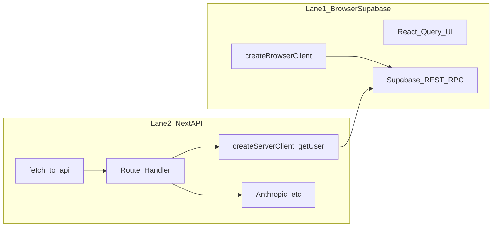

# Supabase “dropouts”, hung flows, and silent failures

> **Purpose:** Evidence-first procedures to tell **session/API skew** from **true Supabase outages**, classify incidents, and instrument future hangs.  
> **Audience:** Anyone responding to “the app feels disconnected” or “Analyse never finishes.”  
> **Related:** [REPO_ORIENTATION_AND_SAFETY_GAPS.md](REPO_ORIENTATION_AND_SAFETY_GAPS.md) §8 (auth fragility), [VERCEL_API_ROUTE_TIMEOUT_ISSUE.md](VERCEL_API_ROUTE_TIMEOUT_ISSUE.md) (historical API vs page split).

---

## A. Quick runbook — when someone reports disconnect / hang

1. **Classify the path**
   - **Lane 1 — Browser → Supabase** (React Query, `createBrowserClient`): data loads from `*.supabase.co` in DevTools Network.
   - **Lane 2 — Browser → `/api/*` → Supabase + providers** (e.g. email import `POST …/analyse`): first hop is same-origin `oa.uconstruct.app/api/...`.

2. **If Lane 2 hangs with a spinner and no console error:** open **Network**, find the pending `fetch` to `/api/...`. Note whether it stays `(pending)` forever (server stall) vs `401`/`500` (handled error).

3. **Collect Phase 0 intake** (copy [§B](#b-phase-0--incident-intake-fields) into a ticket or the [§F incident log](#f-incident-log-template)).

4. **Check platforms (same UTC window)**
   - [Supabase status](https://status.supabase.com)
   - Vercel project → deployment → **Functions** / logs for the route
   - Sentry → **Performance** / **Replays** (if user consented to replay)

5. **Assign a hypothesis** using [§D](#d-hypothesis-labels). If unclear, run [§C](#c-phase-1--reproduction-matrix) before changing code.

---

## B. Phase 0 — Incident intake fields

Record these for every report. *Where:* column points to concrete UI or logs.

| Field | Description | Where to get it |
|--------|-------------|-----------------|
| Timestamp (UTC) | When the issue started / was noticed | User report + system clock |
| User / role | Account experiencing issue | Auth / support context |
| URL / route | Exact path (e.g. `/email-imports`) | Browser address bar |
| Browser / OS | Version matters for sleep/throttle | User agent |
| Tab background? | Tab unfocused or laptop slept before failure? | Ask user |
| **Lane** | Lane 1 (direct Supabase) vs Lane 2 (`/api/*`) | Network tab: host `supabase.co` vs same-origin `/api/` |
| Pending request | URL, method, status, time pending | DevTools → Network |
| Supabase REST | Any failed/red slow calls to project API | Network filter `supabase` |
| Console | `[connection-monitor]` warnings (`token_refresh_fail`, `session_lost`, etc.) | DevTools → Console ([`connection-monitor.ts`](../apps/organising-db/src/lib/supabase/connection-monitor.ts)) |
| Recovery | Did sign-out/sign-in or hard refresh fix it? | User |
| Deployment | Vercel deployment ID / git SHA | Vercel dashboard |
| Function log | Log lines for the API route around the time | Vercel → deployment → Logs |
| Supabase side | Auth / API errors in dashboard for project `gteygwfgjvczanmrwgbr` | [Supabase Dashboard](https://supabase.com/dashboard) → Logs / Reports |

**Exit criterion:** Enough to pick a primary hypothesis from §D, or mark “unresolved — need replay / more data.”

---

## C. Phase 1 — Reproduction matrix

Execute in **staging** or **production** only with consent. Tick boxes and note session age (time since login).

| # | Scenario | Steps | Compare | Record |
|---|----------|--------|---------|--------|
| 1 | Cold start | Fresh login → immediately open Email Imports → Analyse | Baseline | Pass / Fail / Hang |
| 2 | Long idle | Login → leave tab focused **45–60 min** → Analyse | vs #1 | Hang? Session age |
| 3 | Background tab | Login → switch away **30+ min** → return → Analyse | vs visibility refresh | Hang? |
| 4 | Multi-tab | Two tabs on app → actions in both → Analyse | Token race? | Hang? |
| 5 | After sleep | Laptop sleep **≥15 min** → wake → Analyse | Network resume | Hang? |
| 6 | Lane contrast | Load a list page using **only** Supabase client (e.g. workers list) | Then Analyse (Lane 2) | Only Lane 2 fails? |

**Optional:** Repeat **Analyse** alongside another AI route (e.g. employer wizard analyse) to see if stalls are **route-family** specific.

**Exit criterion:** At least one deterministic or high-probability repro; otherwise record flakiness and **session age** at failure.

---

## D. Hypothesis labels

Use one **primary** label per incident for the log (§F).

| ID | Label | Meaning | Typical evidence |
|----|--------|--------|------------------|
| H1 | Session skew | Browser session OK for Lane 1; server `getUser()` / cookies inconsistent for Lane 2 | Hang or 401 on `/api/*`; **fixed by re-login** |
| H2 | API route hang | Handler or runtime stuck before response completes | Pending fetch forever; Vercel duration spikes or no completion |
| H3 | Provider stall | Anthropic / Resend / other external call no upper bound | Logs would show long gap before/after provider (once instrumented) |
| H4 | Supabase degraded/outage | Auth or DB unhealthy platform-wide | status.supabase.com, project 5xx, broad failures |
| H5 | RLS / JWT surprise | Row rules or claims differ from expectation | Same query OK with service role, fails empty as user |
| H6 | Browser / edge | Sleep, extensions, DNS split | Correlates with visibility, not backend logs |
| H7 | **Auth-lock deadlock** | auth-js `processLock` orphaned (background-tab throttle) → `GoTrueClient.lockAcquired` stuck `true` → every `getSession()` waits forever | Repeating `lock_timeout` every ~12s in console + `[connection-monitor]`, **no** Supabase REST/Network errors, no 401/403. **Resolved — see §L.** |
| H8 | **Client-side token-refresh hang** | token stale after idle (`autoRefreshToken: false`) → first `getSession()` on wake fires a blocking client refresh that stalls past 12s; a fresh client hangs identically | `auth-op-timeout: getSession:…` **including on `lock-deadlock-recovery`** (fresh client), after a hidden period; server refresh path healthy. **Resolved — see §M.** |
| H9 | **Recovery paths left on the client pipeline** | The H8 fix migrated background refresh (visibility/heartbeat/query-cache) to the server, but the *user-facing* recovery paths (menu "Refresh connection", SIGNED_OUT recovery, pre-mutation guard) still ran client `refreshSession()` → `getSession()` — the exact H8 hang — so the recovery tool itself failed after wake and users escalated to manual sign-out | `recovery_start menu-hard-refresh` → ~27s → `recovery_end fail: session_check_timeout`, then `session_lost signout: auth-context`; `lock_timeout getSession:ensureValidSession`; refresh-token chain shows **zero rotations** during the broken session. Worse on Edge (sleeping tabs / efficiency mode stall the client network path after wake). **Resolved — see §N.** |

**Note:** Re-login fixing the issue **suggests H1 or H2 involving cookies**, not necessarily H4. A pure `lock_timeout` cascade with no network errors is **H7**, not a session loss — do not force a logout.

---

## E. Two-lane architecture (data flow)



**Code touchpoints**

- Lane 1: [`apps/organising-db/src/lib/supabase/client.ts`](../apps/organising-db/src/lib/supabase/client.ts) — `fetchWithTimeout` **20s**; `autoRefreshToken: false`.
- Lane 2 examples: [`fetch-api.ts`](../apps/organising-db/src/lib/api/fetch-api.ts) — **`fetchApi()`** for bounded `/api` calls + `X-Request-Id`; [`useEmailImports.ts`](../apps/organising-db/src/lib/hooks/useEmailImports.ts); [`analyse/route.ts`](../apps/organising-db/src/app/api/email-import/[id]/analyse/route.ts) — server `createClient` + `getUser` + DB + Anthropic.
- Pre-mutation: [`apps/organising-db/src/lib/hooks/useAuthAwareMutation.ts`](../apps/organising-db/src/lib/hooks/useAuthAwareMutation.ts) — `ensureValidSession()` (~**5 min** before expiry refresh).

**Middleware:** [`apps/organising-db/src/middleware.ts`](../apps/organising-db/src/middleware.ts) matcher **excludes** `/api/*`; API routes do not pass through session-refresh middleware.

---

## F. Incident log template

Append rows as incidents occur.

| Date (UTC) | User | Route / feature | Lane | Symptom | Primary H | Evidence summary | Ruled out | Notes |
|------------|------|-----------------|------|---------|-----------|------------------|-----------|-------|
| YYYY-MM-DD | | e.g. Email import Analyse | 2 | Spinner, no console error | H1? | Pending POST `/api/email-import/.../analyse` | H4 status green | Fixed after sign-out |
| 2026-05 | (multiple) | App-wide after tab background | 1 | Repeating `lock_timeout` every ~12s, banner, forced logout on Full Reset | **H7** | `[connection-monitor] lock_timeout … getSession:heartbeat after 12000ms`; no REST errors, no 401/403 (Sentry `OFFSHORE_ALLIANCE-7/-8`) | H1/H4 (no cookie/network errors) | **Resolved — see §L.** Unpin dead promises + reset-then-reload ladder + visibility-gated heartbeat + no-logout-on-lock-timeout |
| 2026-06-05 / 06-09 | 2 users (Chrome + Edge) | "Refresh connection" menu action after idle/wake | 1 | Recovery itself hung ~27s then `fail: session_check_timeout`; users manually signed out | **H9** | PostHog: 14/31 `menu-hard-refresh` attempts failed in 10 days, all successes pre-June 4; `auth.refresh_tokens` shows zero rotations during the broken Edge session; Jun 4 `lock_timeout getSession:ensureValidSession` | H4 (Supabase healthy), H7 (fresh client, no contention) | **Resolved — see §N.** Server-first recovery + soft-reload escalation; client-side rotation removed |
| 2026-06-10 | troyburton | Navigate to /campaigns after wake; rating save | 1 | Infinite loading (no console error); separate 400 on rating upsert | **H9 residual** | Post-refresh `getSession` timed out on a fresh client (module-global processLock); Postgres log: `car_rating_or_binary_chk` violation 04:33 UTC | H4 (DB healthy) | **Resolved — see §N.1.** Lock acquire clamp + focus gate + refresh dedupe; rating popover canSave guards |

---

## G. Observability specification

Partial **implementation** (client): [`apps/organising-db/src/lib/api/fetch-api.ts`](../apps/organising-db/src/lib/api/fetch-api.ts) exports **`fetchApi()`** — same-origin `/api` calls with **`X-Request-Id`**, merged `AbortSignal`, and configurable **`timeoutMs`** (`API_FETCH_TIMEOUT_MS` 60s default, **`API_FETCH_TIMEOUT_LLM_MS`** 120s, **`API_FETCH_TIMEOUT_STREAM_MS`** 10m for SSE, **`API_FETCH_TIMEOUT_UPLOAD_MS`** 120s). Most client `fetch('/api/…')` sites were migrated to use it so hung serverless handlers surface as **`AbortError`** instead of infinite spinners.

Remaining / server-side items below are still useful for full attribution.

### G.1 Request correlation

- Client: each `fetchApi` call sends **`X-Request-Id`** (UUID) by default.
- Server: log **start** immediately with `requestId`, **stage markers** with monotonic timestamps:
  - `auth_ok` (after `getUser` succeeds)
  - `db_fetch_ok` (after `email_imports` read)
  - `anthropic_start` / `anthropic_end` (or provider name)
  - `response_sent` + total `durationMs`
- Vercel: filter logs by `requestId` to locate “empty” invocations.

### G.2 Client fetch budgets

**Done:** `fetchApi` enforces timeouts; tune via `timeoutMs` / named constants in `fetch-api.ts`.

Optional improvements: map **`AbortError`** to clearer user copy where a generic message is shown; add per-route **Sentry spans**.

### G.3 Sentry

- Confirm **transactions** cover API routes (see [SENTRY_SETUP.md](SENTRY_SETUP.md)).
- Add breadcrumb: `X-Request-Id`, route name, import id.
- For repro: link **Session Replay** to the same timestamp as Vercel logs.

### G.4 Supabase dashboard checks

- **Authentication → Logs** for refresh failures / rate limits.
- **Database → Query performance** for slow queries during incident.
- Compare **JWT expiry** (project settings) with client **5 min** preemptive window and **10 min** visibility threshold in [`providers.tsx`](../apps/organising-db/src/components/providers.tsx).

---

## H. Platform baselines *(record measurements over time)*

Values below are **from codebase + platform defaults** unless noted. Replace “TBD” with measured p50/p95 from Vercel / Supabase.

| Topic | Baseline | Source / action |
|--------|----------|------------------|
| Lane 2 `/api` fetch (`fetchApi`) | **60000 ms** default; **120000 ms** LLM/upload; **600000 ms** SSE | [`fetch-api.ts`](../apps/organising-db/src/lib/api/fetch-api.ts) |
| Supabase browser fetch | **20000 ms** timeout on SDK fetch | [`client.ts`](../apps/organising-db/src/lib/supabase/client.ts) `SUPABASE_FETCH_TIMEOUT_MS` |
| Pre-mutation refresh | Refresh if access token expires within **5 min** | `TOKEN_REFRESH_BUFFER_MS` in [`useAuthAwareMutation.ts`](../apps/organising-db/src/lib/hooks/useAuthAwareMutation.ts) |
| Visibility refresh | **10 min** before expiry → proactive refresh | [`providers.tsx`](../apps/organising-db/src/components/providers.tsx) `TOKEN_NEAR_EXPIRY_MS` |
| Vercel `maxDuration` | **`email-import` analyse:** **120s** (`export const maxDuration = 120`); some routes **60s** | [`analyse/route.ts`](../apps/organising-db/src/app/api/email-import/[id]/analyse/route.ts); grep `maxDuration` |
| Email import analyse | DB read + **Anthropic** completion | Bounded by Vercel function timeout; long prompts increase tail latency **TBD** |
| Cron | Weekly `POST /api/snapshots` Mon 09:00 UTC | [`vercel.json`](../apps/organising-db/vercel.json) |

**Action:** In Vercel → Project → Settings, note **Serverless Function Region** and **maximum duration** for the deployment tier. Paste into the table in your internal wiki when known.

---

## I. Phase 4 — Conditional deep dives

Trigger only after §D points somewhere specific:

- **H1:** Trace `coordinatedRefreshSession`, middleware `updateSession`, and server cookie `setAll` behavior; map all refresh token consumers (reason for `autoRefreshToken: false` in client).
- **H2:** Add §G.1 stage logs to see whether stall is **before** `auth_ok`, between DB and provider, or **on** provider.
- **H4:** Collect Supabase `sb-request-id` response headers for support tickets; compare REST vs SQL editor.

---

## J. Recommendation memo (prioritized)

1. **Implement §G.1–G.2** — Highest leverage to turn “silent spinner” into **actionable** errors and log segments.
2. **Document Vercel max duration** and align `email-import` analyse `maxDuration` with Anthropic p95 + safety margin (separate product decision).
3. **Keep §F incident log** — Patterns across rows validate H1 vs H3 vs H4 without argument.
4. **Re-run §C** after any auth refactor — Regression matrix from [REPO_ORIENTATION §11](REPO_ORIENTATION_AND_SAFETY_GAPS.md).

---

## L. Resolved incident — auth-lock deadlock cascade (H7, May 2026)

**Symptom.** After leaving a tab backgrounded (or laptop asleep), returning produced a
repeating console cascade every ~12s with **no** Supabase REST errors and no 401/403:

```
[connection-monitor] lock_timeout auth-op-timeout: getSession:heartbeat after 12000ms
[connection-monitor] lock_timeout heartbeat-getSession-timeout
[connection-monitor] api_ok getSession-deduplicated: heartbeat joined in-flight session check
[connection-monitor] token_refresh_ok refresh-deduplicated: getSession-timeout:heartbeat joined in-flight refresh
```

The "Connection issues detected" banner then appeared and users typically hit **Full
Reset**, which logged them out — the painful part of the bug.

**Root cause.** Browser timer throttling in a hidden tab can orphan an in-flight auth
operation mid-`processLock`. auth-js (`@supabase/auth-js` `GoTrueClient`) leaves
`lockAcquired = true`, so every subsequent `getSession()` takes the **re-entrant lock
path which has no acquire timeout** and waits forever. Two app-level wrappers then
amplified it:

1. `coordinatedGetSession` / `coordinatedRefreshSession` pinned the **dead promise** in a
   module-level ref (the `.finally` unpin never ran because the promise never settled), so
   every later caller deduped onto the corpse — even after `resetClient()`.
2. The 60s heartbeat kept firing **while the tab was hidden**, manufacturing fresh stuck
   `getSession` calls.

**Fix (shipped).**

- **Unpin dead promises** — `coordinatedGetSession`/`coordinatedRefreshSession` now clear
  their module ref when the call settles **or** after the auth-op budget, and `resetClient()`
  clears both refs. ([`client.ts`](../apps/organising-db/src/lib/supabase/client.ts))
- **Reset-then-reload recovery ladder** — after `LOCK_TIMEOUT_ESCALATION_THRESHOLD` (2)
  consecutive `lock_timeout`s, `providers.tsx` calls `resetClient()` + one bounded
  `getSession`; if still stuck it does a **single guarded soft reload** (sessionStorage
  cooldown) which re-inits the JS context and **preserves the auth cookies (no logout)**.
  ([`providers.tsx`](../apps/organising-db/src/components/providers.tsx))
- **Never force-logout on a pure lock timeout** — `forceLogoutToLogin`/`nuclearReset` are
  reserved for confirmed auth failure; a `lock_timeout` is H7, not a session loss.
- **Visibility-gated heartbeat** — the heartbeat no-ops while `document.visibilityState !==
  "visible"` and skips its probe if a visibility-triggered `getSession` ran in the last 10s.
- **Quiet UI** — `getHealthSummary()` now separates `hardErrors` from `lockTimeouts`; the
  banner shows a calm "Reconnecting…" pill for self-healing lock timeouts and reserves the
  loud banner for `hardErrors >= 3`. ([`connection-status-banner.tsx`](../apps/organising-db/src/components/connection-status-banner.tsx))
- **Observability** — `lock` passed to the Supabase client is wrapped with a **zero-await**
  `instrumentedLock` that emits `lock_contended` for slow acquire/long hold; PostHog
  forwarding now uses the imported `posthog-js` module (the old `window.posthog` lookup
  silently dropped every `supabase_connection_event`); Sentry/PostHog identify the user in
  [`auth-context.tsx`](../apps/organising-db/src/lib/supabase/auth-context.tsx).

**Responsiveness note.** All of the above acts only on the *already-broken* path. The
healthy path is unchanged: the lock wrapper adds no awaits, the unpin `setTimeout` is a
guarded no-op when calls settle normally, and recovery only runs after 2 real timeouts.

**How to recognise a regression.** Repeating `lock_timeout` with no REST/Network errors →
H7. Confirm in PostHog via `supabase_connection_event` (`event_type = lock_timeout`) and in
Sentry (`lock_timeout` / `lock_contended`). Expected post-fix behaviour: at most ~2 minutes
of "Reconnecting…" then auto-recovery (in-place reset, or one soft reload) with the user
still logged in.

---

## M. Resolved incident — client-side token-refresh hang (H8, June 2026)

**Symptom.** After the §L fix shipped, the forced-logout cascade stopped (PostHog
confirms: every `circuit_breaker` / `force-logout` event is from 29 May only). But a
*distinct* stall remained — most often after the tab was hidden a while (e.g. 16 min):

```
01:32:46 [visibility_change] visible
01:33:38 [lock_timeout] auth-op-timeout: getSession:heartbeat after 12000ms
01:34:38 [lock_timeout] heartbeat-getSession-timeout (consecutive=2)
01:34:38 [recovery_start] lock-deadlock (heartbeat): in-place client reset
01:34:51 [lock_timeout] auth-op-timeout: getSession:lock-deadlock-recovery after 12000ms
01:34:51 [recovery_end] lock-deadlock: client reset insufficient — escalating to soft reload
```

**Root cause (different from H7).** The `auth-op-timeout` here is **not** lock
contention — it's `getSession()` performing a **blocking network token refresh**.
`@supabase/auth-js` `__loadSession()` returns instantly *only* while the access token has
more than `EXPIRY_MARGIN_MS` (= `3 × 30s` = **90s**) of life left; otherwise it calls
`_callRefreshToken()` (network, with an internal retry loop). Because we set
`autoRefreshToken: false`, **nothing refreshes the token in the background**, so after any
idle/hidden period the token is stale and the first `getSession()` on wake fires a
client-side refresh — exactly when the network is coldest (laptop wake / Wi-Fi reconnect).
That refresh stalls past our 12s `withAuthOpTimeout`.

Evidence it is the *refresh* (not the lock): the recovery probe runs on a **fresh**
client (`resetClient()`, so `lockAcquired = false`), yet it **also** times out at exactly
12000ms — only possible if `getSession` is doing a network refresh, not waiting on a lock.
The `auth.refresh_tokens` chain suggested an access-token lifetime of ~1h, and the incident
token was ~3h stale. **Correction (2026-06-10): the dashboard setting was checked — access
token expiry is actually 86400s (24h), matching the `cookie-options.ts` comment.** The ~1h
inference was wrong; the H8 mechanism is unchanged but the stale-token condition only
arises after longer idle gaps (>24h since last refresh) than first thought. The
**server-side** refresh path stayed healthy throughout (the chain kept rotating; a full
reload recovered precisely because the middleware refreshes server-side).

Consequence of the old recovery ladder: `resetClient()` + a client `getSession` probe is
**futile** for this mode — the fresh client re-reads the same stale cookie and re-fires the
same hanging refresh. Every recent `recovery_end` said *"client reset insufficient →
escalating to soft reload"*, so users waited ~12s (heartbeat) + ~12s (probe) = **~24s**
before the reload that actually fixed it.

**Fix (shipped).** Route refresh and recovery through the **server**, and stop using the
client `getSession()` as a probe:

- **Server refresh endpoint** — [`/api/auth/refresh`](../apps/organising-db/src/app/api/auth/refresh/route.ts)
  runs the cookie-based refresh via `@supabase/ssr` (`getUser()` refresh-on-expiry, plus a
  proactive rotate when <5min to expiry). After it returns, the browser cookie holds a
  fresh token, so the client's next `getSession()`/query needs no network refresh.
- **`refreshSessionViaServer()`** ([`client.ts`](../apps/organising-db/src/lib/supabase/client.ts)) —
  bounded at **8s**, never throws, returns a tagged result (`ok` / `no_session` /
  `timeout` / …). Also a tiny **known-expiry store** (`setKnownExpiry`/`getKnownExpiryMs`)
  so the heartbeat can decide *locally* whether a refresh is even needed.
- **Visibility + heartbeat no longer call client `getSession()`** ([`providers.tsx`](../apps/organising-db/src/components/providers.tsx)) —
  on focus / every 60s, they check the known expiry and only refresh **via the server** when
  the token is within the window (10min on focus, 4min for the heartbeat). A healthy token =
  zero network, zero auth-lock pressure. The old `user_profiles` silent-RLS probe is gone
  (proactive refresh prevents the silent-expiry condition it detected).
- **Server-first recovery ladder** — the recovery probe's futile client `getSession` is
  replaced by `resetClient()` + `refreshSessionViaServer()`; soft reload only if the
  **server** path also fails. Saves ~12s per incident and avoids the full reload in the
  common case.
- **Single-writer model** — only the middleware and `/api/auth/refresh` rotate tokens
  (the client never does), which keeps `autoRefreshToken: false` while removing the stale
  token that made `getSession` hang. This also avoids the "Invalid Refresh Token: Already
  Used" race that motivated disabling auto-refresh in the first place.
- **Cleanup** — removed leftover `127.0.0.1:7485` agent-debug `fetch()` calls in
  `useCampaignCurrentStats.ts` / `useAssessmentDistributions.ts` (the
  `ERR_CONNECTION_REFUSED` console noise; unrelated to the stall).

**How to recognise a regression.** `auth-op-timeout: getSession:…` events returning, or
`network_error: server refresh transient (…)` repeating. Confirm in PostHog
(`supabase_connection_event`): healthy state is mostly `token_refresh_ok` with `server
refresh ok`, few `lock_timeout`, and `recovery_*` only rarely. If `lock_timeout` returns,
check whether the Supabase **JWT expiry** was lowered (shorter tokens = more refreshes =
more hang exposure) and whether `/api/auth/refresh` is reachable/fast.

**Open follow-up — resolved 2026-06-10.** The Supabase JWT expiry was confirmed in the
dashboard as 86400s (24h), already long; no change needed. The only remaining question is
the inverse one (whether 24h is acceptable for revocation responsiveness) — a
product/security decision, not a connectivity issue.

---

## N. Resolved incident — recovery paths left on the client pipeline (H9, June 2026)

**Symptom.** After the §M (H8) fix shipped (~June 3–4), the background `lock_timeout`
cascade stopped, but users were still ending up back at the login page. PostHog showed the
sequence: `recovery_start menu-hard-refresh` → ~27 s → `recovery_end fail:
session_check_timeout` → user manually signs out (`session_lost signout: auth-context`).
14 of 31 menu-hard-refresh attempts failed this way in 10 days; **every success predates
June 4**. Anecdotally worse on Microsoft Edge. One real-user `lock_timeout` remained:
`getSession:ensureValidSession` (pre-mutation guard, June 4).

**Root cause.** The H8 migration moved the *background* refresh paths
(visibility/heartbeat/query-cache) to the server, but the *user-facing* recovery paths were
never migrated:

1. `recoverSessionConnection` (menu "Refresh connection", banner button, SIGNED_OUT
   recovery) still ran client `refreshSession()` (12 s hang after wake — the H8 mode) and
   then `getSession()` which queued behind the same jammed `processLock` (15 s timeout) —
   a guaranteed 27 s failure in exactly the situations users click the button.
2. `ensureValidSession` / `withSessionGuard` / `useAuthAwareMutation` retry still called
   client `getSession()` (12 s hang) and rotated tokens client-side — violating the
   single-writer model and re-exposing the "Invalid Refresh Token: Already Used" race.
3. `getSessionWithTimeout`'s timeout side-effect fired *another* client-side refresh,
   re-poisoning the lock.

The `auth.refresh_tokens` chain for the affected Edge user confirms it: **zero rotations**
during the entire broken session — no recovery mechanism ever refreshed the token; only a
manual sign-out/sign-in "fixed" it.

**Why Edge is worse.** Edge's sleeping tabs + efficiency mode stall the browser↔Supabase
network path after wake more aggressively (and for longer) than Chrome/Safari. Any
*client-side* refresh therefore hangs disproportionately on Edge, while the same-origin
server path (`/api/auth/refresh`, middleware) stays healthy — which is why a full page
reload always recovered. Additionally, a laptop-sleep wake with the tab still visible fires
**no `visibilitychange` event**, so the visibility refresh never ran in that scenario.

**Fix (shipped).** Complete the single-writer model — the client now NEVER rotates tokens:

- **`recoverSessionConnection` is server-first** ([`session-recovery.ts`](../apps/organising-db/src/lib/supabase/session-recovery.ts)):
  `refreshSessionViaServer()` (8 s bound) → on `no_session` only, redirect to login → on
  success, `resetClient()` + bounded local session read + DB probe. Max ~8 s before a
  decision instead of 27 s of hanging.
- **Soft-reload escalation for user-initiated recovery** — when the user clicked the
  button and the server path is transiently failing (or Lane 1 is socket-stalled), do a
  guarded soft reload (cookies preserved, **no logout**) instead of soft-failing and
  stranding them. Shares the 90 s cooldown with the providers.tsx ladder.
- **`ensureValidSession` uses known expiry + server refresh** — no client `getSession()`,
  no client rotation; transient refresh failures no longer block mutations.
- **Mutation/session-guard retries refresh via the server.**
- **`getSessionWithTimeout` timeout side-effect** now pokes `refreshSessionViaServer()`
  instead of a client refresh. `coordinatedRefreshSession()` is deleted entirely.
- **Wake coverage** ([`providers.tsx`](../apps/organising-db/src/components/providers.tsx)) —
  `online` and `pageshow (persisted)` listeners run the same known-expiry check as the
  visibility handler, covering laptop-sleep wakes where the tab stayed visible (the Edge
  scenario with no `visibilitychange`).
- **Hardening** — `cookie-diagnostics.ts` no longer lets a malformed cookie
  (`decodeURIComponent` URIError) kill the visibility handler before the refresh runs;
  the auth-change recovery in `auth-context.tsx` reads the post-recovery session via the
  bounded helper on the fresh client instead of an unbounded `getSession()` on the stale
  pre-reset client reference.

**How to recognise a regression.** `recovery_end fail: session_check_timeout` returning in
PostHog, or `session_lost signout: auth-context` shortly after `recovery_start
menu-hard-refresh`. Healthy post-fix pattern: `recovery_start … (server-first)` →
`token_refresh_ok server refresh via recovery` → `recovery_end success`, or a single
`recovery_end soft reload (cookies preserved…)` with the user still signed in afterwards.

**Note on telemetry noise.** Sentry `lock_timeout` events from `HeadlessChrome` on
`/employers` (June 8) are automation (how-to-video tooling), not real users.

### N.1 Follow-up (2026-06-10 incident) — the global-lock silent hang

The first day live exposed a residual mode. Telemetry (03:26 / 04:11 UTC): the server-first
recovery's step 1 succeeded in ~1.4 s, but the post-refresh `getSession()` on a **fresh
client** still timed out at 12 s before the soft reload recovered. Inspection of the
installed `@supabase/auth-js` shows why: **`processLock`'s queue is module-global** (keyed
by lock name), so it **survives `resetClient()`**. One wedged holder — typically a query's
`_getAccessToken()` → `getSession()` firing an in-line client refresh on a post-wake cold
network — blocks every later auth op AND every data query, with no timeout and no error.
That is the "infinite loading spinner, empty console" report: queries hang while *waiting
to acquire the lock*, before any fetch (so the 20 s fetch timeout never applies).

Fixes (shipped on top of §N):

- **Lock acquire clamp** (`client.ts` `instrumentedLock`): infinite acquire waits
  (`acquireTimeout = -1`) are clamped to **15 s**, converting the silent hang into a
  `ProcessLockAcquireTimeoutError` that every consumer already handles (queries →
  `isLikelyAuthError` → server refresh → retry; recovery → ladder; login → reset+retry).
- **Focus gate** (`providers.tsx`, React Query `focusManager`): the refetch-on-focus burst
  now waits for the token-freshness check. Fresh token → refetch immediately; stale token →
  one server refresh first, then refetch with the fresh cookie — so queries never need the
  in-line client refresh that wedges the lock.
- **Server-refresh dedupe** (`client.ts`): concurrent wake-time callers (visibility, focus
  gate, heartbeat, query-cache, mutation guards) share one POST `/api/auth/refresh`.
- **Faster recovery failover**: the post-refresh local session read in
  `recoverSessionConnection` is budgeted at 5 s (was 12 s) — when the global lock is
  jammed, only a reload clears it, so fail over fast.

**Unrelated bug found in the same incident:** the console 400 on
`campaign_activity_ratings?on_conflict=…` was the DB check constraint
`car_rating_or_binary_chk` (row with both `rating` and `binary_value` null). The wall-chart
`InlineRatingPopover` / `CumulativeRatingPopover` allowed Save with nothing selected. Fixed
with proper `canSave` guards plus a friendly hook-level validation error in
`useSaveActivityRating` / `useBatchSaveActivityRatings`. (The Radix
`Missing Description for DialogContent` console warning is cosmetic and unrelated.)

---

## K. Document maintenance

After major incidents, add one line to this doc’s **Incident log** (§F) and optionally update [VERCEL_API_ROUTE_TIMEOUT_ISSUE.md](VERCEL_API_ROUTE_TIMEOUT_ISSUE.md) if DNS or routing was involved.
