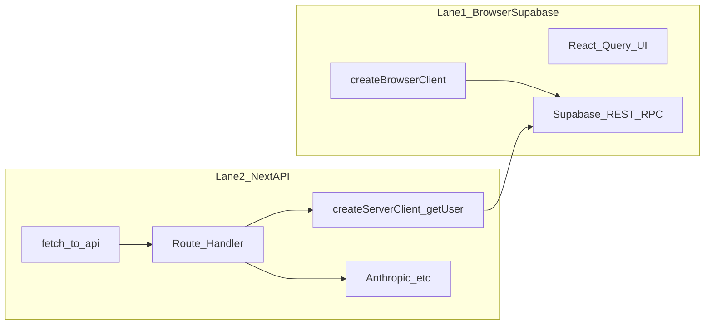

# Supabase “dropouts”, hung flows, and silent failures

> **Purpose:** Evidence-first procedures to tell **session/API skew** from **true Supabase outages**, classify incidents, and instrument future hangs.  
> **Audience:** Anyone responding to “the app feels disconnected” or “Analyse never finishes.”  
> **Related:** [REPO_ORIENTATION_AND_SAFETY_GAPS.md](REPO_ORIENTATION_AND_SAFETY_GAPS.md) §8 (auth fragility), [VERCEL_API_ROUTE_TIMEOUT_ISSUE.md](VERCEL_API_ROUTE_TIMEOUT_ISSUE.md) (historical API vs page split).

---

## A. Quick runbook — when someone reports disconnect / hang

1. **Classify the path**
   - **Lane 1 — Browser → Supabase** (React Query, `createBrowserClient`): data loads from `*.supabase.co` in DevTools Network.
   - **Lane 2 — Browser → `/api/*` → Supabase + providers** (e.g. email import `POST …/analyse`): first hop is same-origin `oa.uconstruct.app/api/...`.

2. **If Lane 2 hangs with a spinner and no console error:** open **Network**, find the pending `fetch` to `/api/...`. Note whether it stays `(pending)` forever (server stall) vs `401`/`500` (handled error).

3. **Collect Phase 0 intake** (copy [§B](#b-phase-0--incident-intake-fields) into a ticket or the [§F incident log](#f-incident-log-template)).

4. **Check platforms (same UTC window)**
   - [Supabase status](https://status.supabase.com)
   - Vercel project → deployment → **Functions** / logs for the route
   - Sentry → **Performance** / **Replays** (if user consented to replay)

5. **Assign a hypothesis** using [§D](#d-hypothesis-labels). If unclear, run [§C](#c-phase-1--reproduction-matrix) before changing code.

---

## B. Phase 0 — Incident intake fields

Record these for every report. *Where:* column points to concrete UI or logs.

| Field | Description | Where to get it |
|--------|-------------|-----------------|
| Timestamp (UTC) | When the issue started / was noticed | User report + system clock |
| User / role | Account experiencing issue | Auth / support context |
| URL / route | Exact path (e.g. `/email-imports`) | Browser address bar |
| Browser / OS | Version matters for sleep/throttle | User agent |
| Tab background? | Tab unfocused or laptop slept before failure? | Ask user |
| **Lane** | Lane 1 (direct Supabase) vs Lane 2 (`/api/*`) | Network tab: host `supabase.co` vs same-origin `/api/` |
| Pending request | URL, method, status, time pending | DevTools → Network |
| Supabase REST | Any failed/red slow calls to project API | Network filter `supabase` |
| Console | `[connection-monitor]` warnings (`token_refresh_fail`, `session_lost`, etc.) | DevTools → Console ([`connection-monitor.ts`](../apps/organising-db/src/lib/supabase/connection-monitor.ts)) |
| Recovery | Did sign-out/sign-in or hard refresh fix it? | User |
| Deployment | Vercel deployment ID / git SHA | Vercel dashboard |
| Function log | Log lines for the API route around the time | Vercel → deployment → Logs |
| Supabase side | Auth / API errors in dashboard for project `gteygwfgjvczanmrwgbr` | [Supabase Dashboard](https://supabase.com/dashboard) → Logs / Reports |

**Exit criterion:** Enough to pick a primary hypothesis from §D, or mark “unresolved — need replay / more data.”

---

## C. Phase 1 — Reproduction matrix

Execute in **staging** or **production** only with consent. Tick boxes and note session age (time since login).

| # | Scenario | Steps | Compare | Record |
|---|----------|--------|---------|--------|
| 1 | Cold start | Fresh login → immediately open Email Imports → Analyse | Baseline | Pass / Fail / Hang |
| 2 | Long idle | Login → leave tab focused **45–60 min** → Analyse | vs #1 | Hang? Session age |
| 3 | Background tab | Login → switch away **30+ min** → return → Analyse | vs visibility refresh | Hang? |
| 4 | Multi-tab | Two tabs on app → actions in both → Analyse | Token race? | Hang? |
| 5 | After sleep | Laptop sleep **≥15 min** → wake → Analyse | Network resume | Hang? |
| 6 | Lane contrast | Load a list page using **only** Supabase client (e.g. workers list) | Then Analyse (Lane 2) | Only Lane 2 fails? |

**Optional:** Repeat **Analyse** alongside another AI route (e.g. employer wizard analyse) to see if stalls are **route-family** specific.

**Exit criterion:** At least one deterministic or high-probability repro; otherwise record flakiness and **session age** at failure.

---

## D. Hypothesis labels

Use one **primary** label per incident for the log (§F).

| ID | Label | Meaning | Typical evidence |
|----|--------|--------|------------------|
| H1 | Session skew | Browser session OK for Lane 1; server `getUser()` / cookies inconsistent for Lane 2 | Hang or 401 on `/api/*`; **fixed by re-login** |
| H2 | API route hang | Handler or runtime stuck before response completes | Pending fetch forever; Vercel duration spikes or no completion |
| H3 | Provider stall | Anthropic / Resend / other external call no upper bound | Logs would show long gap before/after provider (once instrumented) |
| H4 | Supabase degraded/outage | Auth or DB unhealthy platform-wide | status.supabase.com, project 5xx, broad failures |
| H5 | RLS / JWT surprise | Row rules or claims differ from expectation | Same query OK with service role, fails empty as user |
| H6 | Browser / edge | Sleep, extensions, DNS split | Correlates with visibility, not backend logs |

**Note:** Re-login fixing the issue **suggests H1 or H2 involving cookies**, not necessarily H4.

---

## E. Two-lane architecture (data flow)

**Code touchpoints**

- Lane 1: [`apps/organising-db/src/lib/supabase/client.ts`](../apps/organising-db/src/lib/supabase/client.ts) — `fetchWithTimeout` **20s**; `autoRefreshToken: false`.
- Lane 2 examples: [`fetch-api.ts`](../apps/organising-db/src/lib/api/fetch-api.ts) — **`fetchApi()`** for bounded `/api` calls + `X-Request-Id`; [`useEmailImports.ts`](../apps/organising-db/src/lib/hooks/useEmailImports.ts); [`analyse/route.ts`](../apps/organising-db/src/app/api/email-import/[id]/analyse/route.ts) — server `createClient` + `getUser` + DB + Anthropic.
- Pre-mutation: [`apps/organising-db/src/lib/hooks/useAuthAwareMutation.ts`](../apps/organising-db/src/lib/hooks/useAuthAwareMutation.ts) — `ensureValidSession()` (~**5 min** before expiry refresh).

**Middleware:** [`apps/organising-db/src/middleware.ts`](../apps/organising-db/src/middleware.ts) matcher **excludes** `/api/*`; API routes do not pass through session-refresh middleware.

---

## F. Incident log template

Append rows as incidents occur.

| Date (UTC) | User | Route / feature | Lane | Symptom | Primary H | Evidence summary | Ruled out | Notes |
|------------|------|-----------------|------|---------|-----------|------------------|-----------|-------|
| YYYY-MM-DD | | e.g. Email import Analyse | 2 | Spinner, no console error | H1? | Pending POST `/api/email-import/.../analyse` | H4 status green | Fixed after sign-out |

---

## G. Observability specification

Partial **implementation** (client): [`apps/organising-db/src/lib/api/fetch-api.ts`](../apps/organising-db/src/lib/api/fetch-api.ts) exports **`fetchApi()`** — same-origin `/api` calls with **`X-Request-Id`**, merged `AbortSignal`, and configurable **`timeoutMs`** (`API_FETCH_TIMEOUT_MS` 60s default, **`API_FETCH_TIMEOUT_LLM_MS`** 120s, **`API_FETCH_TIMEOUT_STREAM_MS`** 10m for SSE, **`API_FETCH_TIMEOUT_UPLOAD_MS`** 120s). Most client `fetch('/api/…')` sites were migrated to use it so hung serverless handlers surface as **`AbortError`** instead of infinite spinners.

Remaining / server-side items below are still useful for full attribution.

### G.1 Request correlation

- Client: each `fetchApi` call sends **`X-Request-Id`** (UUID) by default.
- Server: log **start** immediately with `requestId`, **stage markers** with monotonic timestamps:
  - `auth_ok` (after `getUser` succeeds)
  - `db_fetch_ok` (after `email_imports` read)
  - `anthropic_start` / `anthropic_end` (or provider name)
  - `response_sent` + total `durationMs`
- Vercel: filter logs by `requestId` to locate “empty” invocations.

### G.2 Client fetch budgets

**Done:** `fetchApi` enforces timeouts; tune via `timeoutMs` / named constants in `fetch-api.ts`.

Optional improvements: map **`AbortError`** to clearer user copy where a generic message is shown; add per-route **Sentry spans**.

### G.3 Sentry

- Confirm **transactions** cover API routes (see [SENTRY_SETUP.md](SENTRY_SETUP.md)).
- Add breadcrumb: `X-Request-Id`, route name, import id.
- For repro: link **Session Replay** to the same timestamp as Vercel logs.

### G.4 Supabase dashboard checks

- **Authentication → Logs** for refresh failures / rate limits.
- **Database → Query performance** for slow queries during incident.
- Compare **JWT expiry** (project settings) with client **5 min** preemptive window and **10 min** visibility threshold in [`providers.tsx`](../apps/organising-db/src/components/providers.tsx).

---

## H. Platform baselines *(record measurements over time)*

Values below are **from codebase + platform defaults** unless noted. Replace “TBD” with measured p50/p95 from Vercel / Supabase.

| Topic | Baseline | Source / action |
|--------|----------|------------------|
| Lane 2 `/api` fetch (`fetchApi`) | **60000 ms** default; **120000 ms** LLM/upload; **600000 ms** SSE | [`fetch-api.ts`](../apps/organising-db/src/lib/api/fetch-api.ts) |
| Supabase browser fetch | **20000 ms** timeout on SDK fetch | [`client.ts`](../apps/organising-db/src/lib/supabase/client.ts) `SUPABASE_FETCH_TIMEOUT_MS` |
| Pre-mutation refresh | Refresh if access token expires within **5 min** | `TOKEN_REFRESH_BUFFER_MS` in [`useAuthAwareMutation.ts`](../apps/organising-db/src/lib/hooks/useAuthAwareMutation.ts) |
| Visibility refresh | **10 min** before expiry → proactive refresh | [`providers.tsx`](../apps/organising-db/src/components/providers.tsx) `TOKEN_NEAR_EXPIRY_MS` |
| Vercel `maxDuration` | **`email-import` analyse:** **120s** (`export const maxDuration = 120`); some routes **60s** | [`analyse/route.ts`](../apps/organising-db/src/app/api/email-import/[id]/analyse/route.ts); grep `maxDuration` |
| Email import analyse | DB read + **Anthropic** completion | Bounded by Vercel function timeout; long prompts increase tail latency **TBD** |
| Cron | Weekly `POST /api/snapshots` Mon 09:00 UTC | [`vercel.json`](../apps/organising-db/vercel.json) |

**Action:** In Vercel → Project → Settings, note **Serverless Function Region** and **maximum duration** for the deployment tier. Paste into the table in your internal wiki when known.

---

## I. Phase 4 — Conditional deep dives

Trigger only after §D points somewhere specific:

- **H1:** Trace `coordinatedRefreshSession`, middleware `updateSession`, and server cookie `setAll` behavior; map all refresh token consumers (reason for `autoRefreshToken: false` in client).
- **H2:** Add §G.1 stage logs to see whether stall is **before** `auth_ok`, between DB and provider, or **on** provider.
- **H4:** Collect Supabase `sb-request-id` response headers for support tickets; compare REST vs SQL editor.

---

## J. Recommendation memo (prioritized)

1. **Implement §G.1–G.2** — Highest leverage to turn “silent spinner” into **actionable** errors and log segments.
2. **Document Vercel max duration** and align `email-import` analyse `maxDuration` with Anthropic p95 + safety margin (separate product decision).
3. **Keep §F incident log** — Patterns across rows validate H1 vs H3 vs H4 without argument.
4. **Re-run §C** after any auth refactor — Regression matrix from [REPO_ORIENTATION §11](REPO_ORIENTATION_AND_SAFETY_GAPS.md).

---

## K. Document maintenance

After major incidents, add one line to this doc’s **Incident log** (§F) and optionally update [VERCEL_API_ROUTE_TIMEOUT_ISSUE.md](VERCEL_API_ROUTE_TIMEOUT_ISSUE.md) if DNS or routing was involved.
