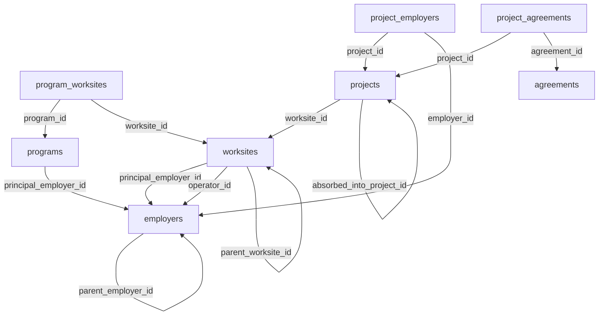

# OffshoreAlliance Relationship Map

This document maps how `worksites`, principal worksites, `projects`, `programs`, principal employers, employers, and parent/child employer relationships currently connect in the live OffshoreAlliance database.

Source of truth used:
- Live Supabase project: `OffshoreAlliance` (`gteygwfgjvczanmrwgbr`)
- App behavior: `apps/organising-db/src/app/(dashboard)/overview/page.tsx`, `apps/organising-db/src/components/overview/projects-tab.tsx`, `apps/organising-db/src/components/overview/employer-groups-tab.tsx`
- Schema types/FKs: `packages/db-types/index.ts`

## 1) Entity Dictionary

- `employers`: core employer records, including `parent_employer_id` for employer hierarchy.
- `worksites`: physical/logical worksites, with:
  - `principal_employer_id` (principal employer for the worksite)
  - `operator_id` (operator employer)
  - `parent_worksite_id` (worksite hierarchy)
- `programs`: program records, each with `principal_employer_id`.
- `program_worksites`: junction linking `programs` to `worksites`, includes `is_primary`.
- `projects`: project records, each linked to a `worksite_id`; can self-link via `absorbed_into_project_id`.
- `project_employers`: junction linking `projects` to `employers`.
- `project_agreements`: junction linking `projects` to `agreements`.

Clarification:
- "Principal worksite" is a derived concept in UI/reporting: a worksite where `worksites.principal_employer_id = employers.employer_id`. It is not a separate table.

## 2) Relationship Inventory (Current Schema)

Primary relationship edges in use:

- `employers.parent_employer_id -> employers.employer_id` (parent/child employer)
- `worksites.principal_employer_id -> employers.employer_id`
- `worksites.operator_id -> employers.employer_id`
- `worksites.parent_worksite_id -> worksites.worksite_id` (parent/child worksite)
- `programs.principal_employer_id -> employers.employer_id`
- `program_worksites.program_id -> programs.program_id`
- `program_worksites.worksite_id -> worksites.worksite_id`
- `projects.worksite_id -> worksites.worksite_id`
- `projects.absorbed_into_project_id -> projects.project_id`
- `project_employers.project_id -> projects.project_id`
- `project_employers.employer_id -> employers.employer_id`
- `project_agreements.project_id -> projects.project_id`
- `project_agreements.agreement_id -> agreements.agreement_id`

## 3) Visual Relationship Graph



## 4) Current Data Profile (Live DB Snapshot)

### Core counts

| Metric | Count |
|---|---:|
| `worksites` | 39 |
| `worksites` with `principal_employer_id` | 31 |
| `worksites` with `parent_worksite_id` | 0 |
| `projects` | 16 |
| `projects` active (`is_active = true`) | 16 |
| `programs` | 3 |
| `programs` with `principal_employer_id` | 3 |
| `program_worksites` rows | 7 |
| `employers` | 69 |
| `employers` with `parent_employer_id` | 9 |
| employers in `Principal_Employer` category | 7 |

### Coverage of links

| Link coverage check | Count |
|---|---:|
| `projects` with `project_employers` rows | 0 |
| `projects` without `project_employers` rows | 16 |
| `projects` with `project_agreements` rows | 0 |
| `projects` without `project_agreements` rows | 16 |
| `worksites` linked to at least one project | 16 |
| `worksites` linked to at least one program | 6 |
| `workers` with non-null `project_id` | 0 |
| `employer_worksite_roles` rows | 64 |

### Integrity checks

All checked FK-style references are currently valid (0 violations):
- employers with missing parent
- employers self-parenting
- worksites with missing principal employer
- programs with missing principal employer
- projects with missing worksite

## 5) Inconsistencies, Overlaps, and Gaps

### Gaps

1. **Projects are structurally present but relationally under-linked**
   - `projects` has 16 rows and all are active.
   - But `project_employers` and `project_agreements` are both empty.
   - This creates an apparent "empty projects" experience when UI cards expect project-level employer/agreement context.

2. **No project-level worker linkage**
   - `workers.project_id` is null for all workers, so project worker counts remain zero.

3. **No current worksite hierarchy**
   - `worksites.parent_worksite_id` is null for all rows; parent/child worksite model exists but has no populated relationships.

### Overlaps

1. **Two ways to connect employers to operational footprint**
   - Via `project_employers` (currently unused) and via `employer_worksite_roles` (populated).
   - In practice, Overview "groups" is currently driven by employer hierarchy + role/agreement joins, not project-specific employer links.

2. **Principal employer appears in multiple contexts**
   - `worksites.principal_employer_id` and `programs.principal_employer_id` both point into `employers`.
   - This is valid, but should be treated as distinct semantics: site principal vs program principal.

### Inconsistencies

1. **User-observed groups count (4) vs live snapshot parent groups (5)**
   - Live parent-based grouping query currently yields 5 parent groups (`Chevron`, `JADESTONE ENERGY`, `WOODSIDE ENERGY LTD`, `Santos`, `Shell`).
   - If UI shows 4 groups, likely causes include environment mismatch, cached data, or active filters.

Verification query:

```sql
with parent_ids as (
  select distinct parent_employer_id as parent_id
  from public.employers
  where parent_employer_id is not null
)
select count(*) as employer_group_count
from parent_ids;
```

## 6) UI Impact Notes (Overview and Employers Pages)

- Overview page tab model (`projects`, `sectors`, `employer-groups`) is correct and wired.
- Projects tab loads from `projects` and then enriches using `project_employers`, `project_agreements`, workers by `project_id`, and scope/campaign joins.
- Because project junction tables are empty, project cards have minimal linked context and can appear empty/unhelpful depending on active filters.
- Employer Groups tab derives groups directly from `employers.parent_employer_id` references and then enriches via `employer_worksite_roles`, `agreement_employers`, and workers.
- Employers page columns (`Trading Name`, `Category`, `Parent Company`, `ABN`, `Active`) align to stored fields, and parent-child hierarchy is structurally consistent.

## 7) Action Checklist

1. Backfill `project_employers` for all in-scope projects.
2. Backfill `project_agreements` for all in-scope projects.
3. Decide whether `workers.project_id` should be maintained; if yes, backfill and enforce in workflow.
4. Confirm whether worksite hierarchy is intended; if yes, populate `parent_worksite_id` where applicable.
5. Add a lightweight data quality check (scheduled SQL or dashboard card) for:
   - projects missing employers
   - projects missing agreements
   - principal employer links that drift from category expectations
6. Re-verify Overview Projects and Employer Groups counts after backfill.

## 8) Reference Queries Used

```sql
-- High-level counts
select 'worksites' as entity, count(*)::int as total from public.worksites
union all select 'worksites_with_parent_worksite', count(*)::int from public.worksites where parent_worksite_id is not null
union all select 'worksites_with_principal_employer', count(*)::int from public.worksites where principal_employer_id is not null
union all select 'projects', count(*)::int from public.projects
union all select 'programs', count(*)::int from public.programs
union all select 'program_worksites', count(*)::int from public.program_worksites
union all select 'employers', count(*)::int from public.employers
union all select 'employers_with_parent', count(*)::int from public.employers where parent_employer_id is not null;
```

```sql
-- Project and worksite linkage coverage
with project_links as (
  select p.project_id,
         exists(select 1 from public.project_employers pe where pe.project_id = p.project_id) as has_employer,
         exists(select 1 from public.project_agreements pa where pa.project_id = p.project_id) as has_agreement
  from public.projects p
), worksite_links as (
  select w.worksite_id,
         exists(select 1 from public.projects p where p.worksite_id = w.worksite_id) as has_project,
         exists(select 1 from public.program_worksites pw where pw.worksite_id = w.worksite_id) as has_program
  from public.worksites w
)
select
  (select count(*)::int from project_links where has_employer) as projects_with_employers,
  (select count(*)::int from project_links where not has_employer) as projects_without_employers,
  (select count(*)::int from project_links where has_agreement) as projects_with_agreements,
  (select count(*)::int from project_links where not has_agreement) as projects_without_agreements,
  (select count(*)::int from worksite_links where has_project) as worksites_with_projects,
  (select count(*)::int from worksite_links where has_program) as worksites_with_programs;
```
